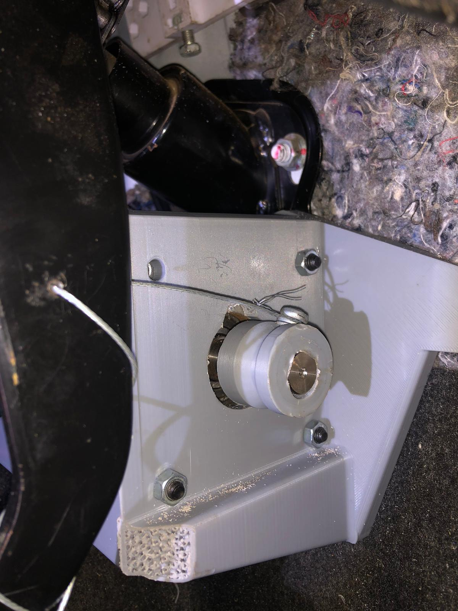
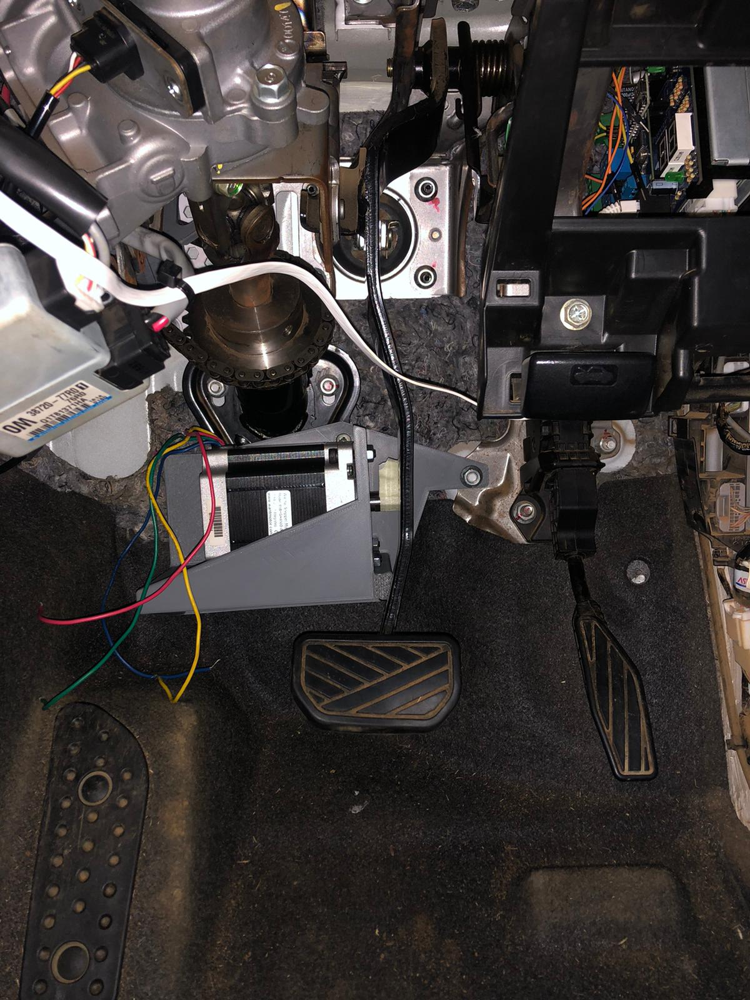

# Autonomous Braking Actuator — NEMA-34 Stepper Motor System

This repository documents the design, hardware setup, wiring, and test software for an autonomous braking actuator developed as part of a self-driving vehicle research project. The system uses a NEMA-34 stepper motor to physically actuate the brake pedal via a cable and coupling mechanism, controlled by an Arduino over CAN bus (production) or directly via Serial (test mode).

---

## Table of Contents

- [Overview](#overview)
- [Mechanical Design](#mechanical-design)
- [Hardware Stack](#hardware-stack)
- [Electrical Wiring](#electrical-wiring)
- [Driver Configuration (DIP switches)](#driver-configuration-dip-switches)
- [Repository Structure](#repository-structure)
- [Arduino — steerbok.ino](#arduino--steerbokino)
- [Arduino — brake_test.ino](#arduino--brake_testino)
- [Python — brake_gui.py](#python--brake_guipy)
- [Python — brake_control.py](#python--brake_controlpy)
- [Test Procedure](#test-procedure)
- [Known Issues and Future Work](#known-issues-and-future-work)
- [Dependencies](#dependencies)

---

## Overview

The actuator is installed inside the vehicle footwell and couples directly to the brake pedal column via a cable-and-drum mechanism. The stepper motor holds a position proportional to the requested braking force — stepper holding torque translates directly to a sustained force on the brake cable. The system is designed to be back-drivable: when the motor is de-energised the pedal returns freely.

In the full system the motor is commanded over CAN bus by a central vehicle controller (the Steerbok board). A separate test interface (`brake_test.ino` + `brake_gui.py`) allows direct bench testing via USB Serial without needing the CAN network.

---

## Mechanical Design

### Mount

The motor bracket was designed in CAD and 3D-printed in PLA. It is an L-shaped enclosure with triangular gussets for rigidity, a circular through-hole on the front face sized for the motor shaft and coupling, four M-bolt holes for the motor face, and two mounting ears at the top for attachment to the vehicle structure.


The design intent is to hold the motor body rigidly perpendicular to the brake column axis so the cable drum on the shaft pulls in-line with the cable run.

### Installed position

The bracket is mounted in the driver footwell, alongside the brake pedal column. The NEMA-34 motor body sits below and behind the pedal assembly, with the shaft pointing upward toward the cable anchor point.



The cable is wrapped around the drum/coupling on the motor shaft. The coupling interfaces with the motor shaft directly — the shaft on this unit has two flat sides (D-cut) which provides positive grip without relying on a set-screw alone.



The motor phase wires (red, green, yellow, blue) are visible routing away from the motor body toward the driver electronics.

### Coupling and cable

The coupling is 3D-printed and serves as both the shaft adapter and the cable drum. The cable wraps around the drum outer diameter and the braking travel of ~0.73 motor revolutions corresponds to the full useful cable pull range.

> **Note from previous intern:** The end-bit (the final cable termination component) needs to be reprinted in a more durable material, or machined, to withstand the forces involved. The coupling also needs a minor revision — the NEMA-34 unit received differs from the original spec sheet in that it has two flat sides on the cylindrical shaft (D-cut). This is actually better for grip but the coupling bore needs to match this geometry exactly.

---

## Hardware Stack

| Component | Part | Spec |
|---|---|---|
| Motor | Wantai 85BYGH450D-008 | NEMA-34, 1.8°/step, 5.6A/phase, 7.7 Nm holding torque, 4-wire |
| Driver | Wantai DQ860HA | 24–80V DC input, up to 7.8A peak output, 8-bit DIP config |
| DC-DC converter | EVEPS DC-DC boost | IN: 9–30V, OUT: 48V 6A max |
| Power source | 12V vehicle battery | 13.8–14.4V with engine running |
| Controller (production) | Arduino (Steerbok board) | CAN bus via MCP2515, AccelStepper |
| Controller (test) | Arduino Uno/Mega | USB Serial, AccelStepper |
| Fuse | Automotive blade | 30A, as close to battery+ as possible |

---

## Electrical Wiring

### Power rail (positive)

```
Battery (+) → 30A fuse → [relay — production only] → DC-DC IN+ → DC-DC OUT+ (48V) → DQ860HA VCC/DC+
```

### Motor connections

| Wire colour | DQ860HA terminal |
|---|---|
| Red | A+ |
| Green | A− |
| Yellow | B+ |
| Blue | B− |

> Verify coil pairs with a multimeter before trusting colours — batch variation exists. Resistance between a coil pair should be ~0.38Ω. Swapping A+ and A− reverses rotation direction.

### Signal connections (Arduino → DQ860HA)

| Arduino pin | DQ860HA terminal |
|---|---|
| Pin 5 | PUL+ |
| Pin 4 | DIR+ |
| Pin 3 | ENA+ |
| GND | PUL−, DIR−, ENA− |

### Ground bus

All negative terminals must share a common ground point (terminal block):

```
Battery (−)
DC-DC IN−          ──── all to same terminal block ────→  single GND bus
DC-DC OUT− (48V)
DQ860HA PUL−/DIR−/ENA−
Arduino GND
```

Use a 5-way screw terminal block. Do not daisy-chain — every wire lands directly in the block.

---

## Driver Configuration (DIP switches)

The DQ860HA has 8 DIP switches. Set these **before** powering on.

### SW1–SW3: Output current

| SW1 | SW2 | SW3 | Peak | RMS |
|---|---|---|---|---|
| ON | ON | ON | 2.8A | 2.0A |
| OFF | ON | ON | 3.5A | 2.5A |
| ON | OFF | ON | 4.2A | 3.0A |
| OFF | OFF | ON | 4.9A | 3.5A |
| ON | ON | OFF | 5.7A | 4.0A |
| **OFF** | **ON** | **OFF** | **6.4A** | **4.6A** ← conservative test setting |
| ON | OFF | OFF | 7.0A | 5.0A |
| OFF | OFF | OFF | 7.8A | 5.6A ← motor rated max |

### SW4: Standstill current

| SW4 | Behaviour |
|---|---|
| OFF | Standstill = 50% of dynamic current (recommended — reduces heat) |
| ON | Standstill = 100% of dynamic current |

> The driver also has a built-in semi-flow function: after 200ms with no step pulses it automatically drops to 40% current regardless of SW4. This is always active.

### SW5–SW8: Microstep resolution

| SW5 | SW6 | SW7 | SW8 | Steps/rev |
|---|---|---|---|---|
| ON | OFF | ON | ON | **1600** ← recommended, matches code default |
| OFF | OFF | ON | ON | 3200 |
| ON | ON | OFF | ON | 6400 |

> The `MICROSTEPS` constant in `brake_test.ino` must match the hardware setting exactly. Default in code: `1600`.

**Recommended test configuration:**
```
SW1=OFF  SW2=ON   SW3=OFF  → 4.6A RMS (conservative)
SW4=OFF                    → 50% standstill current
SW5=ON   SW6=OFF  SW7=ON   SW8=ON  → 1600 steps/rev
```

---

## Repository Structure

```
.
├── steerbok/
│   └── steerbok.ino          # Production CAN-bus steering + brake controller
├── brake_test/
│   ├── brake_test.ino        # Standalone brake test — Serial commands
│   ├── brake_gui.py          # Python GUI (tkinter) for brake test
│   └── brake_control.py      # Python CLI alternative
├── cad/
│   └── Screenshot_2026-03-26_114009.png   # CAD render of motor mount
├── photos/
│   ├── motormount1.jpeg      # Full footwell installation
│   └── motormount2.jpeg      # Close-up of coupling and cable
└── README.md
```

---

## Arduino — steerbok.ino

The production controller. Receives target steering angle over CAN bus (MCP2515, 500kbps) and drives the stepper via PID control. Also handles the braking motor enable/disable via the Steerbok relay.

**CAN IDs:**

| ID | Direction | Content |
|---|---|---|
| `0x01` | IN | Heartbeat from main controller — contains mode and interval |
| `0x11` | OUT | Heartbeat / data log — PID output rate + current angle (two floats) |
| `0x110` | IN | Target steering angle (float, degrees) |

**Key parameters (top of file):**

```cpp
const int pulPin = 5;          // Pulse
const int dirPin = 4;          // Direction
const int enaPin = 3;          // Enable
const int clkPin = A3;         // Encoder CLK
const int dtPin  = A1;         // Encoder DT
const int encoderPPR = 4000;   // Pulses per revolution
const double sprocketGearRatio = 2.5;
double kp = 12.0, ki = 0.5, kd = 0.5;
const int maxStepperSpeed = 800; // steps/sec
```

**Dependencies:** `EnableInterrupt`, `SPI`, `mcp2515`, `AccelStepper`, `ArduPID`

---

## Arduino — brake_test.ino

Standalone test sketch. No CAN required. Receives commands over USB Serial at 115200 baud and moves the stepper to a proportional position, holding it (position hold = braking force).

**Serial commands:**

| Command | Effect |
|---|---|
| `B:0` to `B:100` | Set braking force as percentage of max travel |
| `H` | Home — drive back to position 0, stay energised |
| `OFF` | Disable motor coils — shaft goes free |
| `POS` | Query current step position |

**Key constants:**

```cpp
const int   MICROSTEPS   = 1600;  // must match DIP switch
const float MAX_TURNS    = 0.73;  // maximum cable pull in motor revolutions
const float MAX_SPEED    = 600.0; // steps/sec
const float ACCELERATION = 400.0; // steps/sec²
```

**Feedback:** Every 200ms the sketch prints:
```
POS:584 PCT:50.0 TARGET:584
```

**Dependencies:** `AccelStepper`

---

## Python — brake_gui.py

Graphical interface for `brake_test.ino`. Requires Python 3 and `pyserial`.

```bash
pip install pyserial
python brake_gui.py
```

**Features:**
- Auto-detects serial ports, manual refresh
- Slider (0–100%) for continuous adjustment
- Preset buttons: 0%, 25%, 50%, 75%, 100%
- APPLY BRAKE button sends current slider value
- HOME button — drives motor back to zero
- DISABLE button — cuts motor current
- Live serial log with colour-coded output
- On window close, automatically sends HOME then disconnects

**Optional port argument:**
```bash
python brake_gui.py --port COM3        # Windows
python brake_gui.py --port /dev/ttyACM0  # Linux/Mac
```

---

## Python — brake_control.py

CLI alternative to the GUI. Useful for scripted testing or when a display is not available.

```bash
python brake_control.py --port COM3
```

At the `>` prompt:

| Input | Effect |
|---|---|
| `0`–`100` | Set braking percentage |
| `h` | Home |
| `off` | Disable motor |
| `q` | Quit (homes first) |

---

## Test Procedure

### Before connecting anything

- [ ] DIP switches set correctly (power must be off to change them)
- [ ] Motor has at least 0.73 turns of free mechanical travel
- [ ] All wiring complete, GND bus connected
- [ ] No loose wires near motor body or driver heatsink

### Connect sequence

1. Plug Arduino USB into laptop
2. Upload `brake_test.ino`, confirm success
3. Run `python brake_gui.py`, connect to port — log shows `BRAKE TEST READY`
4. Connect 12V battery (or start engine) — driver PWR LED lights green
5. In GUI: press `0%` preset then `APPLY` — motor clicks on and holds
6. Test at 25%, 50%, 75%, 100% — verify smooth movement and position hold

### Disconnect sequence

1. Click HOME — wait for `POS:0` in log
2. Click DISABLE — motor coils cut
3. Disconnect battery / turn off engine
4. Close GUI window
5. Unplug Arduino USB
6. Remove wiring: motor wires first, then signal wires, then GND block, then power wires

> **Critical:** Never disconnect motor wires while the driver is powered. The inductive spike from the coils will damage or destroy the driver instantly.

---

## Known Issues and Future Work

| Item | Priority | Notes |
|---|---|---|
| End-bit durability | High | Current 3D-printed end-bit is not strong enough for sustained braking forces. Needs reprinting in PETG/Nylon or machining from aluminium. |
| Coupling geometry | High | Coupling bore must be updated to match the D-cut (two flat sides) shaft profile of the received NEMA-34 unit. Original design assumed a fully cylindrical shaft. |
| Relay integration | Medium | Relay on Steerbok board switches the 12V supply to the DC-DC converter. Not used in test mode — re-integrate for production deployment. |
| Closed-loop position | Medium | No encoder on motor shaft. Consider adding encoder or load cell feedback for force-controlled (rather than position-controlled) braking. |
| Homing routine | Low | On power-up the motor assumes position 0. A physical endstop or back-drive detection would make homing reliable after a reset. |
| Wire management | Low | Motor phase wires currently unrestrained in footwell. Need loom and strain relief before road testing. |

---

## Dependencies

### Arduino libraries

```
AccelStepper       — stepper motion control
ArduPID            — PID controller (steerbok.ino only)
mcp2515            — CAN bus transceiver (steerbok.ino only)
EnableInterrupt    — encoder interrupt handling (steerbok.ino only)
SPI                — built-in
```

Install via Arduino IDE Library Manager or PlatformIO.

### Python

```
pyserial >= 3.5
tkinter  — included in standard Python on Windows/Mac; on Linux: sudo apt install python3-tk
```

---

*Documentation written March 2026. Hardware developed over two intern cycles.*
