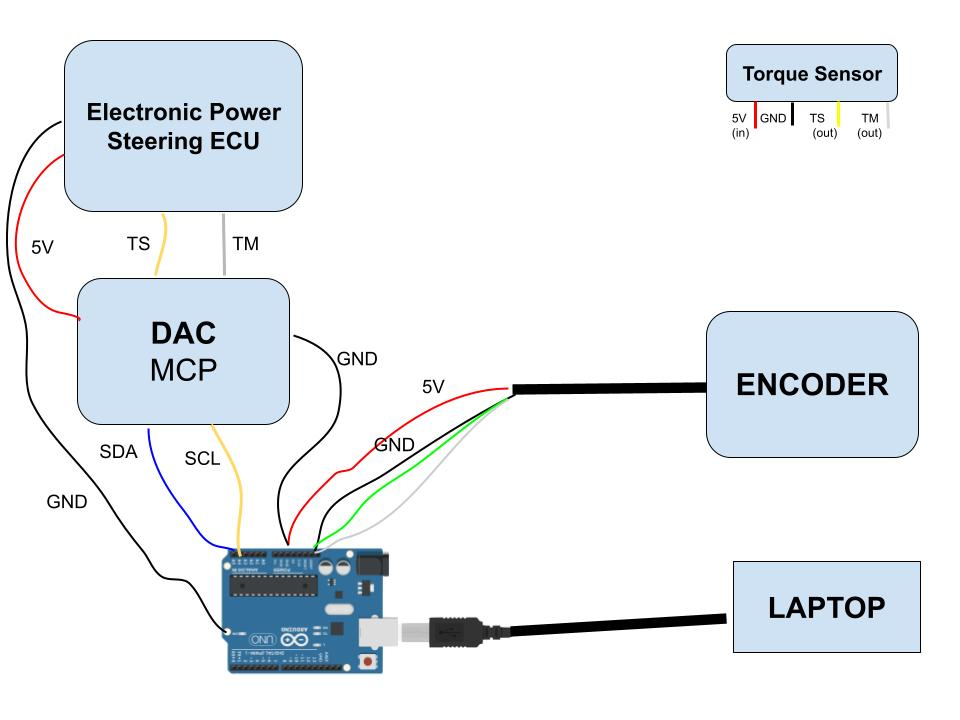

# Steering Control System (Arduino + Python + MCP4728 + Encoder)

## Overview

This project implements a **steering control system** based on:

* Quadrature encoder (angle feedback)
* MCP4728 DAC (dual analog output)
* Differential voltage actuation
* PID closed-loop control
* Python interface for control, logging, and analysis

The system is structured in two layers:

* **Embedded layer (Arduino)** → real-time control and actuation
* **Host layer (Python)** → user interface, supervision, and data analysis

---

# System Architecture

```
User → Python → Arduino (PID) → DAC → Actuator → Encoder → Arduino → Python
```

---

# Arduino Files

## 1. writeDACplusread.ino

### Purpose

Low-level **DAC testing and debugging**.

This is your **first step** when bringing up hardware.

---

### Functionality

* Reads delta voltage from serial
* Applies symmetric differential output:

```
VA = IDLE_A + delta
VB = IDLE_B - delta
```

* Outputs debug data:

```
DATA,t_ms,delta,va,vb,codeA,codeB
```

---

### Use Case

* Validate MCP4728 wiring
* Verify voltage scaling
* Check actuator response

---

## 2. readDACtoCAR.ino

### Purpose

Clean interface for **external control (Python-driven)**.

---

### Functionality

* Receives delta from serial
* Applies DAC output (same differential logic)
* Returns structured feedback:

```
DELTA,<val>,VA,<val>,VB,<val>,CODEA,<val>,CODEB,<val>
```

---

### Use Case

* Hardware-in-the-loop experiments
* Python-based control
* System identification

---

## 3. PIDfirst.ino

### Purpose

Full **closed-loop embedded controller**.

This is the core of the system.

---

### Subsystems

#### Encoder

* Quadrature decoding via interrupts
* Position tracking (counts → angle)

```
angle_deg = 360 * counts / (CPR * gear_ratio)
```

---

#### PID Controller

Runs at ~100 Hz:

```
u = Kp * error + Ki * integral - Kd * d(measurement)/dt
```

Features:

* Anti-windup
* Derivative on measurement
* Output saturation

---

#### DAC Output

Same differential actuation:

```
VA = IDLE_A + delta
VB = IDLE_B - delta
```

---

### Serial Commands

* `s<value>` → set target angle
* `e` → enable PID
* `d` → disable PID
* `z` → reset encoder
* `p` → print status

---

### Data Output

```
DATA,t_ms,target,angle,error,delta,va,vb,codeA,codeB,count,pid_on,p,i,d,isr,invalid
```

---

# Python Files

## 1. DACtoCAR.py

### Purpose

Manual **open-loop DAC control GUI**.

---

### Features

* Keyboard control of voltage delta
* Adjustable step size
* Real-time command sending

---

### Controls

* Right / Left → change delta
* Space → reset
* Up / Down → adjust step

---

### Use Case

* Quick actuator testing
* Open-loop experiments

---

## 2. PIDcommanfd.py

### Purpose

Main **control interface + logger**.

---

### Features

* Real-time target control
* Live telemetry display
* CSV logging
* PID enable/disable

---

### Controls

* Right / Left → change target angle
* Space → reset target
* E / D → enable/disable PID
* Z → zero encoder

---

### Output

Creates log file:

```
pid_log_<timestamp>.csv
```

Contains:

* Target / measured angle
* Error
* DAC outputs
* PID terms
* Encoder diagnostics

---

## 3. pid_post_analysis.py

### Purpose

Offline **data analysis and visualization**.

---

### Usage

```
python pid_post_analysis.py log.csv
```

---

### Outputs

#### Metrics

* Mean absolute error
* RMS error
* Steady-state error
* Overshoot

---

#### Plots

* Target vs measured
* Error
* PID terms
* DAC voltages
* Speed estimation
* Encoder diagnostics
* Step response

---

#### Processed Data

Creates:

```
processed_<log>.csv
```

---

# Recommended Workflow

### Step 1 — Hardware Bring-up

Use:

* `writeDACplusread.ino`

Goal: verify DAC and wiring

---

### Step 2 — Open-loop Testing

Use:

* `DACtoCAR.py`
* `readDACtoCAR.ino`

Goal: understand system response

---

### Step 3 — Closed-loop Control

Use:

* `PIDfirst.ino`
* `PIDcommanfd.py`

Goal: control steering angle

---

### Step 4 — Analysis

Use:

* `pid_post_analysis.py`

Goal: evaluate performance and tune PID

---

# Wiring (Arduino Connections)

Below is the typical wiring reference for the system.

## MCP4728 DAC

| Signal | Arduino Pin    |
| ------ | -------------- |
| VCC    | 5V             |
| GND    | GND            |
| SDA    | A4 (UNO) / SDA |
| SCL    | A5 (UNO) / SCL |

---

## Encoder

| Signal    | Arduino Pin    |
| --------- | -------------- |
| Channel A | D2 (interrupt) |
| Channel B | D3 (interrupt) |
| VCC       | 5V             |
| GND       | GND            |

---

## Actuator / Output

| Signal        | Description      |
| ------------- | ---------------- |
| VA (DAC CH A) | Positive control |
| VB (DAC CH B) | Negative control |

---

## Serial

| Signal | Description               |
| ------ | ------------------------- |
| USB    | Communication with Python |

---

# Schematic

```

```
---
