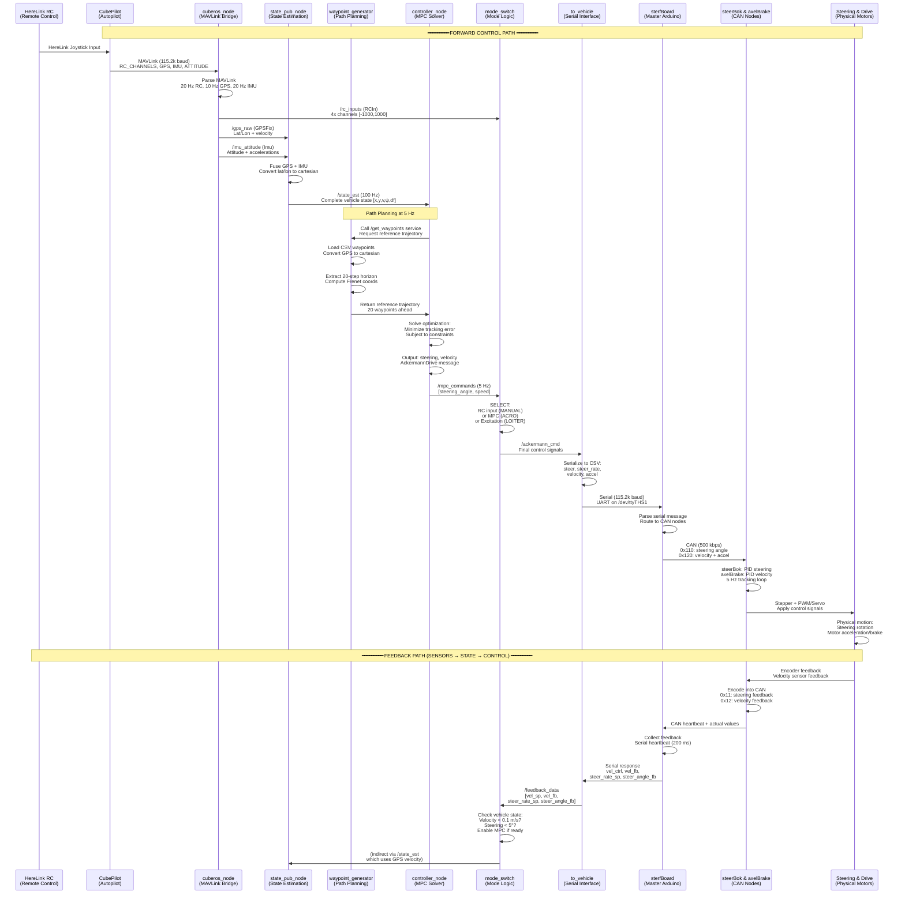

# Jimny Autonomous Vehicle - Complete System Architecture

## Overview

The Jimny vehicle is a ROS2-based autonomous system with a multi-layered control architecture spanning from remote control input through high-level autonomous planning down to low-level hardware control on Arduino microcontrollers.

---

## System Architecture Diagram

### Core Control Flow (Forward Path + Feedback Loop)



---

## Detailed Architecture Layers

### Layer 1: RC Input & Sensor Acquisition (CubePilot + MAVLink Bridge)

**Responsibility**: Convert remote control signals and sensor measurements into ROS messages

**Key Component**: `cuberos_node` - MAVLink Bridge
- **Connection**: Serial port `/dev/ttyACM0` @ 115.2 kbaud to CubePilot autopilot
- **Input**:
  - HereLink RC joystick signals (received by CubePilot and forwarded via MAVLink)
  - Sensor streams: GPS (10 Hz), IMU (20 Hz), attitude (20 Hz)
- **Processing**:
  - Parses binary MAVLink protocol v2.0
  - Extracts RC channel values (5 channels, scaled to [-1000, 1000])
  - Synchronizes multi-rate sensor streams
  - Detects heartbeat for system health monitoring
- **Output**:
  - `/rc_inputs` (RCIn, 20 Hz) - Raw RC channel values
  - `/gps_raw` (GPSFix, 10 Hz) - Raw latitude/longitude + velocity
  - `/imu_attitude` (Imu, 20 Hz) - IMU quaternion + angular rates + accelerations
  - `/heartbeat` (Heartbeat, 1 Hz) - Vehicle mode, armed status, system health

**Data Rates**:
- RC channels: 20 Hz effective
- GPS: 10 Hz (filtered by CubePilot)
- IMU: 20 Hz (accelerometers + gyroscopes)

---

### Layer 2: State Estimation & Sensor Fusion

**Responsibility**: Fuse multiple sensor streams into a coherent vehicle state estimate

**Key Component**: `state_pub_node` - State Estimator
- **Subscriptions**:
  - `/gps_raw` (10 Hz) - Global position and velocity
  - `/imu_attitude` (20 Hz) - Orientation, angular velocity, linear acceleration
- **Processing**:
  - GPS to local tangent plane conversion (WGS-84 to cartesian [x, y])
  - Attitude quaternion → Euler angles (roll, pitch, yaw)
  - Velocity extraction: GPS velocity + optional steering angle feedback
  - Coordinate frame alignment: body-frame accelerations → world frame
  - Resampling to 100 Hz via ROS timer (interpolates between 10 Hz GPS updates)
- **Output**:
  - `/state_est` (StateEst message, 100 Hz) containing:
    ```
    x, y           - Cartesian position in local frame (meters)
    lat, lon       - Global position (degrees)
    psi            - Vehicle yaw angle (radians)
    v              - Forward velocity (m/s)
    v_long, v_lat  - Longitudinal and lateral velocity components
    yaw_rate       - Angular velocity ψ̇ (rad/s)
    a_long, a_lat  - Longitudinal and lateral acceleration (m/s²)
    df             - Front steering angle (radians)
    ```

**State Model**: Kinematic bicycle model
- Front steering angle `df` affects velocity direction
- Yaw rate depends on velocity and steering (ψ̇ = v/L_r * tan(df))
- Position update: ẋ = v cos(ψ), ẏ = v sin(ψ)

---

### Layer 3: Path Planning & Waypoint Generation

**Responsibility**: Generate reference trajectories for MPC controller

**Key Component**: `waypoint_generator_node` - Reference Trajectory Provider
- **Service Interface**: `/get_waypoints` (called by controller at 5 Hz)
- **Input**:
  - CSV file of waypoints (latitude/longitude format)
  - Current vehicle pose: [x₀, y₀, ψ₀]
- **Processing**:
  1. Load waypoint file (typically 50-100+ GPS points)
  2. Convert all waypoints from WGS-84 to local cartesian frame
  3. Compute path curvature and segment lengths
  4. Extract 20-step horizon starting from current position
  5. Calculate Frenet frame coordinates (longitudinal s, lateral e_y, angular e_psi)
  6. Compute reference velocities for each waypoint
- **Output**: `/get_waypoints` service response containing:
  ```
  x_ref[], y_ref[]         - Reference positions (20 points)
  psi_ref[]                - Reference yaw angles
  cdist_ref[]              - Cumulative distance along path
  curv_ref[]               - Path curvature at each point
  v_ref[]                  - Reference velocity at each point
  s0, e_y0, e_psi0         - Initial Frenet frame errors
  stop                     - Boolean: trajectory complete?
  ```

**Coordinate Frames**:
- **Global**: WGS-84 latitude/longitude
- **Local**: tangent plane (origin at first GPS reading)
- **Frenet**: curvilinear coordinates aligned with path (s=distance along path, e_y=lateral error)

---

### Layer 4: Autonomous Control (MPC Solver)

**Responsibility**: Compute optimal steering and velocity commands to track waypoint path

**Key Component**: `controller_node` - Model Predictive Controller
- **Subscriptions**:
  - `/state_est` (100 Hz) - Current vehicle state
  - `/mode` (event) - Operating mode selector
- **Processing Loop** (5 Hz on hardware):
  1. Request reference trajectory from waypoint generator
  2. Optimize over N=20 step horizon (5 seconds @ 0.25 s/step):
     ```
     minimize:  Σ (tracking_error_weights * error²) + Σ (control_weights * control²)

     with error = [e_x, e_y, e_ψ, e_v]
     and control = [a, ȧ, ψ̇_f]
     ```
  3. Apply kinematic bicycle model as constraints
  4. Enforce hardware limits:
     - Steering: ±30° (converted from radians)
     - Velocity: 0 to 15 m/s
     - Acceleration: -3 to +2 m/s²
  5. Extract first control input [steering_angle, velocity] and apply (5 Hz)
  6. Solve using CasADi optimization (Frenet frame MPC or Cartesian frame MPC)
- **Solver Variants**:
  - `KinFrenetMPCPathFollower` - Curvilinear coordinates (more numerically stable for turns)
  - `KinCartMPCPathFollower` - Global cartesian coordinates (simpler, used for straight paths)
- **Output**:
  - `/mpc_commands` (AckermannDrive, 5 Hz): steering_angle, speed, acceleration
  - `/mpc_path` (MpcPath, 5 Hz): complete optimization solution (for visualization)
  - `/mpc_error_state` (Bool, 5 Hz): solver convergence flag

**Cost Function** (Frenet frame):
```
Q = diag([1.0, 1.0, 10.0, 0])     # Weights on: [x_err, y_err, ψ_err, v_err]
R = diag([10, 100, 100])           # Weights on: [accel, accel_rate, steer_rate]
terminal_weight = 1000             # Terminal state cost
```

**Vehicle Parameters**:
- Wheelbase: L = L_F + L_R = 1.035 + 1.265 = 2.3 m
- Reference velocity profile: 2.0 m/s (hardware), 5.0 m/s (simulation)
- Hardware frequency: 5 Hz | Simulation frequency: 2 Hz

---

### Layer 5: Mode Switching & Command Selection

**Responsibility**: Arbitrate between RC manual control and autonomous MPC control

**Key Component**: `mode_switch` node (ModeSwitchNode)
- **Subscriptions**:
  - `/rc_inputs` (20 Hz) - Remote control channels
  - `/heartbeat` (1 Hz) - Vehicle armed/disarmed status
  - `/mpc_commands` (5 Hz) - Autonomous control
  - `/feedback_data` (5 Hz) - Vehicle feedback (velocity, steering)
  - `/mpc_error_state` (5 Hz) - MPC solver status
- **States**:
  1. **MANUAL**: RC joystick directly commands vehicle
     - Channel mapping: CH1=steering ([-1000,1000]→[-30°,30°]), CH4=velocity (→[-10,10] km/h)
     - Always available when vehicle heartbeat received
  2. **ACRO**: Autonomous path-following via MPC
     - Activation guards: Vehicle velocity < 0.1 m/s AND steering angle < 5°
     - Prevents MPC from engaging during manual driving
  3. **LOITER**: Excitation signal mode for system identification
     - Injects test signals for parameter estimation
- **Arbitration Logic**:
  ```
  if (heartbeat_lost for 2s) → publish /signal_error = DISARMED
  if (heartbeat_valid AND armed) → publish /signal_error = ARMED

  if user_selects_MANUAL → pass /rc_inputs to /ackermann_cmd
  if user_selects_ACRO AND vehicle_ready → pass /mpc_commands to /ackermann_cmd
  if user_selects_LOITER → pass /excitation_cmd to /ackermann_cmd

  if (mpc_error_flag OR heartbeat_lost) → safety fallback to RC
  ```
- **Output**:
  - `/ackermann_cmd` (AckermannDrive) - Final command to hardware
  - `/mode` (String) - Current mode ("MANUAL", "ACRO", "LOITER")
  - `/signal_error` (KeyValue) - Error state (0=disarmed, 1=armed_valid, 2=armed_invalid)

**Safety Features**:
- 2-second heartbeat timeout detection
- Velocity/steering guards to prevent unwanted MPC activation
- MPC solver error detection with fallback to RC

---

### Layer 6: Serial Interface & Command Serialization

**Responsibility**: Convert ROS control commands into hardware serial protocol

**Key Component**: `to_vehicle` node (AckermannToVehicleNode)
- **Subscriptions**:
  - `/ackermann_cmd` (variable rate) - Control commands from mode_switch
  - `/gps_raw` (10 Hz) - GPS feedback for velocity measurement
  - `/signal_error` (10 Hz) - Signal validity flag
- **Serial Protocol** (to sterfBoard):
  - **Port**: `/dev/ttyTHS1` @ 115.2 kbaud (Jetson Nano UART)
  - **Format**: CSV text messages
  - **Command Message** (sent to vehicle):
    ```
    <steering_angle_rad, steering_angle_velocity_rad/s, velocity_m/s,
     acceleration_m/s², jerk_m/s³, gps_velocity_m/s>
    ```
  - **Feedback Message** (received from vehicle):
    ```
    <velocity_ctrl_cmd, velocity_feedback, steering_rate_cmd, steering_angle_feedback>
    ```
  - **Heartbeat** (sent every 200 ms):
    ```
    H,<signal_flag>
    signal_flag: 0=disarmed, 1=armed_valid, 2=armed_invalid
    ```
- **Processing**:
  - Serializes Ackermann message to CSV format
  - Monitors signal error state and embeds in heartbeat
  - Parses feedback messages and publishes `/feedback_data`
  - Implements timeout detection (500 ms no messages = error)
- **Output**:
  - `/feedback_data` (Float32MultiArray, 5 Hz): 4-element array
    ```
    [velocity_cmd, velocity_feedback, steer_rate_cmd, steer_angle_feedback]
    ```

**Data Flow**:
```
to_vehicle ←→ sterfBoard (serial)
              ├→ CAN ↔ steerBok (steering)
              └→ CAN ↔ axelBrake (drive/brake)
```

---

### Layer 7: Master Control Arduino (sterfBoard)

**Responsibility**: Centralized hardware command routing and safety monitoring

**Key Component**: `sterfBoard.ino` - Master CAN Coordinator
- **Interfaces**:
  - **Serial In**: Jetson Nano via UART (receives commands, sends feedback)
  - **CAN Bus**: 500 kbps MCP2515 transceiver (controls steerBok and axelBrake)
  - **Buttons**: Emergency stop (pin 5), Auto mode (pin 6)
  - **Relays**: 48V power (pin 3), 9V logic power (pin 4)
- **CAN Message Protocol**:
  ```
  Heartbeat (0x01):         Broadcast every 200 ms
  Steering Target (0x110):  Angle setpoint for steerBok
  Velocity Target (0x120):  Velocity + acceleration for axelBrake
  Steering Feedback (0x11): PID output + current angle from steerBok
  Velocity Feedback (0x12): Control output + velocity from axelBrake
  ```
- **State Machine**:
  ```
  STARTUP → waiting for serial message

  MANUAL mode (auto button):
    - Disable relays
    - Send mode=0 to steerBok and axelBrake
    - No autonomous control

  AUTO mode (normal operation):
    - Enable relays
    - Route serial commands to CAN nodes
    - Monitor heartbeat for validity
    - Send mode=1 to steering/drive controllers

  EMERGENCY (E-button):
    - Disable all relays immediately
    - Send mode=2 (full brake) to axelBrake
    - Send mode=2 to steerBok
    - LED/display signals
  ```
- **Safety Checks**:
  - Validates serial heartbeat from Jetson (2x interval timeout = error)
  - Validates Ackermann message reception (500 ms timeout)
  - Enforces emergency stop if any error detected while armed
- **7-Segment Display**: Shows mode and error codes via shift register

---

### Layer 8A: Steering Control Arduino (steerBok)

**Responsibility**: PID tracking of commanded steering angle

**Key Component**: `steerbok.ino` - Steering Motor Controller
- **Hardware**:
  - AccelStepper library (stepper motor with up to 800 pulses/sec)
  - Rotary encoder feedback: 4000 PPR × 2.5 gear ratio → 10,000 counts/revolution
  - MCP2515 CAN interface
- **CAN Interface**:
  - **Listens to**: 0x110 (target steering angle)
  - **Publishes**: 0x11 (PID output + actual angle)
- **Control Loop** (5 Hz CAN heartbeat):
  1. Receives target angle via CAN
  2. Reads encoder position → current angle
  3. PID controller computes stepper motor speed:
     ```
     error = target_angle - current_angle
     output = Kp*error + Ki*integral(error) + Kd*derivative(error)
     stepper.setSpeed(output)  # ±800 pulses/sec max
     ```
  4. Stepper motor accelerates/decelerates smoothly to setpoint
  5. Sends back PID output + actual angle feedback via CAN
- **PID Parameters**:
  - Kp = 12.0 (proportional gain)
  - Ki = 0.5 (integral gain)
  - Kd = 0.5 (derivative gain)
  - Output range: ±800 pulses/sec
  - Anti-windup: integral saturated at ±10
- **Safety**:
  - Disables stepper if heartbeat missed (2x 200ms = 400 ms timeout)
  - Soft start to prevent jerking

**Angle Conversion**:
```
stepper_counts ↔ degrees
Units: counts per degree (from calibration)
```

---

### Layer 8B: Velocity & Brake Control Arduino (axelBrake)

**Responsibility**: PID tracking of commanded velocity + servo braking

**Key Component**: `axelBrake.ino` - Drive & Brake Controller
- **Hardware**:
  - PWM output for motor acceleration (pin 3)
  - Servo motor for hydraulic brake (pin 4: 1200-1900 µs pulse width)
  - CAN interface for feedback
  - GPS velocity as external feedback
- **CAN Interface**:
  - **Listens to**: 0x120 (target velocity + acceleration), 0x121 (actual velocity)
  - **Publishes**: 0x12 (control output + actual velocity from GPS)
- **Mode Logic**:
  ```
  Mode 0 (MANUAL):
    - Brake servo released (1200 µs = no brake)
    - No acceleration output
    - Freewheel or coast

  Mode 1 (AUTONOMOUS):
    - PID velocity tracking
    - pid_output > 0 → PWM acceleration (0-100%)
    - pid_output < 0 → servo braking (0-100%)
    - Smooth transitions between accel/brake

  Mode 2 (EMERGENCY):
    - Full brake: servo at 1900 µs (maximum braking)
    - Zero acceleration: PWM = 0
    - Park brake engaged
  ```
- **PID Controller**:
  ```
  error = target_velocity - actual_velocity
  output = P*error + I*integral(error) + D*derivative(error)

  Parameters: P=0.5, I=1e-4, D=1e-2
  Output range: -99 to +99 %
  ```
- **Servo/PWM Mapping**:
  ```
  Brake servo: 1200 µs (released) → 1900 µs (full brake)
  Acceleration PWM: 38 (0%) → 225 (100%), center 131
  ```
- **Feedback Loop**:
  - Reads GPS velocity from CAN message 0x121 (every 200 ms)
  - Publishes current velocity + PID output via CAN 0x12
  - Velocity feedback loops back through sterfBoard to Jetson

---

## Complete Data Flow Summary

### Forward Control Path (Command Flow):

```
HereLink RC Joystick
         ↓
    CubePilot (autopilot)
         ↓
   cuberos_node (MAVLink parser)
    ├→ /rc_inputs (20 Hz)
    ├→ /gps_raw (10 Hz)
    └→ /imu_attitude (20 Hz)
         ↓
   state_pub_node (sensor fusion)
         │
         ├→ state_est (100 Hz)
         │   ├→ controller_node (MPC solver)
         │   │   └→ /mpc_commands (5 Hz)
         │   └→ state_est feedback
         │
    mode_switch (mode arbitration)
         │
         ├← /rc_inputs (MANUAL mode)
         ├← /mpc_commands (ACRO mode)
         ├← /excitation_cmd (LOITER mode)
         └→ /ackermann_cmd
                 ↓
          to_vehicle (serialization)
                 ↓
           sterfBoard (routing)
                 ↓
         CAN Bus (500 kbps)
          /     \
    steerBok   axelBrake
       (0x110)    (0x120/0x121)
         ↓          ↓
    Stepper Motor   Motor + Brake Servo
         ↓          ↓
    Steering Angle  Vehicle Motion
```

### Feedback Path (Sensor Flow):

```
Physical Vehicle Motion
    ├→ Steering Encoders (steerBok)
    └→ GPS Speed Sensor (axelBrake)
         ↓
    CAN Heartbeats
    0x11 (steerBok), 0x12 (axelBrake)
         ↓
    sterfBoard
         ↓
  Serial to Jetson
   /dev/ttyTHS1
         ↓
   to_vehicle node
         ↓
  /feedback_data
   (velocity_cmd, velocity_fb,
    steer_rate_cmd, steer_angle_fb)
         ↓
   mode_switch (armed check)
         ↓
   state_est (velocity input)
         ↓
   controller_node (closed loop)
```

---

## Communication Protocols Summary

| Layer | Protocol | Speed | Latency | Direction |
|-------|----------|-------|---------|-----------|
| CubePilot ↔ Jetson | Serial MAVLink 2.0 | 115.2 kbaud | ~50 ms | Bidirectional |
| Jetson ↔ sterfBoard | Serial CSV | 115.2 kbaud | ~8 ms | Bidirectional |
| sterfBoard ↔ Arduinos | CAN 2.0B | 500 kbps | ~2 ms | Bidirectional |

---

## Timing & Real-Time Requirements

### Sensor Input Rates:
- RC channels: **20 Hz** (MAVLink)
- GPS position: **10 Hz** (MAVLink)
- IMU: **20 Hz** (MAVLink)
- State estimate: **100 Hz** (ROS timer)

### Control Loops:
- **Mode arbitration**: ~20 Hz (reactive to inputs)
- **MPC solver**: **5 Hz** (hardware) / 2 Hz (simulation)
- **CAN heartbeat**: **5 Hz** (200 ms interval)
- **Serial heartbeat**: **5 Hz** (200 ms interval)
- **Steering PID**: ~10 kHz (stepper pulse frequency)
- **Velocity PID**: **5 Hz** (CAN sync)

### End-to-End Latency (RC to Motor):
- RC input → CubePilot: ~50 ms
- CubePilot → Jetson: ~50 ms
- Jetson processing: ~20 ms (MPC @ 5 Hz = 200 ms, but feedback-driven)
- Jetson → sterfBoard: ~8 ms
- sterfBoard → Arduino: ~2 ms (CAN)
- **Total**: ~130 ms typical (dominated by MAVLink 20-50 Hz rate limiting)

---

## Key Architectural Insights

1. **Two-Rate Control**:
   - High-rate sensing (100 Hz IMU, 20 Hz RC)
   - Mid-rate optimization (5 Hz MPC)
   - Maintains stability with modest compute budget

2. **Graceful Degradation**:
   - Falls back from MPC → RC if any subsystem fails
   - Heartbeat monitoring at 3 levels: CubePilot, Jetson serial, CAN

3. **Modular Hardware**:
   - Steering and drive independently controlled
   - Each motor has local PID feedback loop (robustness)
   - Master Arduino centralizes coordination

4. **Safety by Default**:
   - Emergency stop button kills power relays
   - Disarmed when no signal
   - All timeouts default to safe state (braking)

5. **Mixed Autonomy**:
   - Supports RC manual, autonomous MPC, and system identification modes
   - Smooth mode transitions with velocity guards

---

## File References

| Component | Location |
|-----------|----------|
| Main Launch | `jimny_ws/src/to_vehicle/launch/do_jimny.launch.py` |
| MAVLink Bridge | `jimny_ws/src/cuberos/scripts/cuberos_node.py` |
| State Estimator | `jimny_ws/src/mpc_driving_controller/scripts/state_pub_node.py` |
| MPC Controller | `jimny_ws/src/mpc_driving_controller/scripts/controller_node.py` |
| Waypoint Generator | `jimny_ws/src/mpc_driving_controller/scripts/waypoint_generator_node.py` |
| Mode Switch | `jimny_ws/src/mode_switching/mode_switching/mode_switch.py` |
| Serial Interface | `jimny_ws/src/to_vehicle/to_vehicle/to_vehicle.py` |
| Steering Arduino | `arduino_sketches/steerbok/steerbok.ino` |
| Drive Arduino | `arduino_sketches/axelBrake/axelBrake.ino` |
| Master Arduino | `arduino_sketches/sterfBoard/sterfBoard.ino` |
