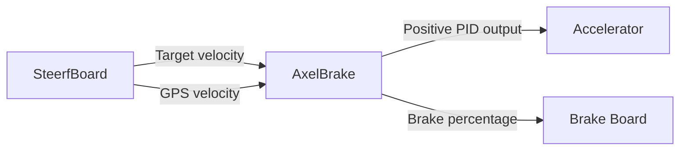

# AxelBrake — Longitudinal Velocity Controller

This README briefly describes the current **AxelBrake** firmware and its role in the vehicle-control architecture.

AxelBrake was already part of the previous vehicle design. The current version keeps the same general purpose but includes several updates to improve braking behavior, startup stability and CAN supervision.

Its main role is simple:

```text
Target velocity
      +
GPS velocity
      ↓
Velocity PID
      ↓
Longitudinal control effort
      │
      ├── positive → accelerator
      │
      └── negative → brake percentage
                         ↓
                    Brake Board
```

AxelBrake therefore decides **how much throttle or braking is required**, while the dedicated Brake Board handles the physical brake actuator.

---

## Quick Navigation

- [1. Role in the System](#role-in-the-system)
- [2. Inputs and Outputs](#inputs-and-outputs)
- [3. Velocity PID](#velocity-pid)
- [4. Throttle and Brake Logic](#throttle-and-brake-logic)
- [5. Parking Brake Logic](#parking-brake-logic)
- [6. Modes and Safety](#modes-and-safety)
- [7. CAN Communication](#can-communication)
- [8. Main Parameters](#main-parameters)
- [9. Summary](#summary)

---

<a id="role-in-the-system"></a>

# 1. Role in the System

AxelBrake is the **longitudinal controller**.

It receives the desired vehicle velocity and the measured GPS velocity from SteerfBoard over CAN.

It then calculates a control output using a PID controller.



AxelBrake does not directly drive the physical brake motor.

Instead it sends:

```text
CAN_BRAKE_PCT
```

to the Brake Board.

---

<a id="inputs-and-outputs"></a>

# 2. Inputs and Outputs

## Inputs

AxelBrake receives three main CAN messages.

### SteerfBoard heartbeat

```text
CAN_HB_STERFBOARD
```

Provides:

```text
heartbeat interval
global operating mode
```

Modes are:

```text
0 = MANUAL
1 = AUTO
2 = EMERGENCY
```

### Velocity target

```text
CAN_VELOCITY_TARGET
```

Contains:

```text
target velocity
target acceleration
```

### GPS velocity

```text
CAN_GPS_VELOCITY
```

Contains the actual vehicle speed used as PID feedback.

---

## Outputs

AxelBrake produces:

```text
PWM accelerator command
CAN brake percentage
AxelBrake heartbeat
local display information
```

The accelerator output is connected to:

```cpp
accelPin = D3;
```

and the board enable output is:

```cpp
enablePin = D6;
```

---

<a id="velocity-pid"></a>

# 3. Velocity PID

The controller compares:

```text
targetVelocity
```

with:

```text
actualGPSVelocity
```

Current PID gains are:

```cpp
P = 4.50;
I = 0.40;
D = 0.0;
```

The PID output is limited to:

```text
-99 ... +99
```

The sign of this value determines which actuator is used.

```text
controlOutput > 0
    → accelerate

controlOutput < 0
    → brake
```

The derivative term is currently zero, so the controller effectively behaves as a PI controller.

---

## GPS update behavior

The PID is calculated only when a new GPS velocity sample is received.

The code contains a configurable low-pass filter:

```cpp
gpsFilterAlpha = 0.0;
```

With the current value:

```text
GPS filtering is effectively disabled.
```

The filtered infrastructure remains available if stronger smoothing is required later.

---

## Arm warm-up

The current firmware ignores the first:

```cpp
armWarmupSamples = 5;
```

GPS samples after entering the active control state.

During these samples:

```text
controlOutput = 0
```

This prevents an immediate throttle or brake spike when the system is armed and gives the velocity feedback a short time to settle before PID control begins.

---

<a id="throttle-and-brake-logic"></a>

# 4. Throttle and Brake Logic

The PID output is divided into two regions.

---

## Positive PID output — Accelerator

For:

```text
controlOutput >= 0
```

the output is mapped to the accelerator PWM range:

```cpp
minPWM = 38;
maxPWM = 225;
```

Conceptually:

```text
PID 0
 ↓
minimum throttle PWM

PID 99
 ↓
maximum configured throttle PWM
```

When acceleration is requested:

```text
accelerator → active
brake request → 0%
```

---

## Negative PID output — Brake

For:

```text
controlOutput < 0
```

AxelBrake stops commanding throttle and calculates:

```cpp
brakePct = -controlOutput * brakeGain;
```

Current gain:

```cpp
brakeGain = 3.0;
```

The result is constrained to:

```text
0 ... 100%
```

and sent to the Brake Board.

Example:

```text
PID output = -10
brakeGain  = 3

brake request = 30%
```

A sufficiently large negative PID output reaches the 100% clamp.

---

<a id="parking-brake-logic"></a>

# 5. Parking Brake Logic

The current firmware includes a dedicated standstill behavior.

Main values:

```cpp
stopTargetThreshold = 0.05 m/s;
nearStandstillSpeed = 0.15 m/s;
parkingBrakePct     = 60%;
```

When:

```text
target velocity ≈ 0
```

the accelerator is kept at minimum.

If the measured GPS speed is also close to standstill:

```text
|GPS speed| <= 0.15 m/s
```

AxelBrake requests:

```text
60% brake
```

to hold the vehicle stationary.

This avoids relying on a very small PID output to keep the vehicle stopped.

---

<a id="modes-and-safety"></a>

# 6. Modes and Safety

AxelBrake follows the global mode received from SteerfBoard.

---

## MANUAL — Mode 0

```text
accelerator enable → LOW
accelerator PWM → minimum
brake request → 0%
```

The longitudinal controller does not actively drive the vehicle.

---

## AUTO — Mode 1

```text
accelerator system enabled
velocity PID active
```

The PID determines whether to command:

```text
throttle
or
brake
```

---

## EMERGENCY — Mode 2

AxelBrake immediately commands:

```text
accelerator → minimum
brake request → 100%
```

The PID state is also reset.

---

## SteerfBoard heartbeat watchdog

AxelBrake independently checks that the SteerfBoard heartbeat is still arriving.

The timeout is:

```text
4 × heartbeat interval
```

With the normal 200 ms heartbeat:

```text
approximately 800 ms
```

If the heartbeat is lost:

```text
accelerator → minimum
brake → 100%
```

This means AxelBrake can enter its own safe longitudinal state even if SteerfBoard stops communicating completely.

---

<a id="can-communication"></a>

# 7. CAN Communication

The board uses:

```text
MCP2515
500 kbit/s
8 MHz oscillator
```

with shared identifiers from:

```cpp
can_ids.h
```

---

## CAN messages received

| Message | Purpose |
|---|---|
| `CAN_HB_STERFBOARD` | Mode + heartbeat timing |
| `CAN_VELOCITY_TARGET` | Target velocity + acceleration |
| `CAN_GPS_VELOCITY` | Measured GPS speed |

---

## CAN messages transmitted

### Brake percentage

```text
CAN_BRAKE_PCT
```

Contains:

```text
float brake percentage
0 ... 100%
```

and is consumed by the Brake Board.

### AxelBrake heartbeat

```text
CAN_HB_AXELBRAKE
```

Contains two floats:

```text
controlOutput
actualGPSVelocity
```

SteerfBoard uses this message to confirm that AxelBrake is alive.

---

## Brake CAN anti-spam

The current firmware avoids repeatedly sending almost identical brake commands.

Main thresholds:

```cpp
brakeCanMinInterval = 50 ms;
brakeCanMinDelta    = 1%;
```

A new brake frame is suppressed only when:

```text
less than 50 ms has passed
AND
the requested change is smaller than 1%
```

Larger brake changes can therefore be sent immediately.

---

<a id="main-parameters"></a>

# 8. Main Parameters

| Parameter | Current value | Purpose |
|---|---:|---|
| `P` | 4.50 | PID proportional gain |
| `I` | 0.40 | PID integral gain |
| `D` | 0.0 | PID derivative gain |
| PID output | −99 to +99 | Longitudinal control effort |
| `minPWM` | 38 | Minimum accelerator PWM |
| `maxPWM` | 225 | Maximum accelerator PWM |
| `brakeGain` | 3.0 | Converts negative PID output to brake % |
| `parkingBrakePct` | 60% | Standstill holding brake |
| `nearStandstillSpeed` | 0.15 m/s | Vehicle considered nearly stopped |
| `armWarmupSamples` | 5 | GPS samples ignored after arm |
| `gpsFilterAlpha` | 0.0 | Current GPS filtering |
| Heartbeat timeout | 4× interval | Supervisor watchdog |

These values are implementation/tuning parameters and should be changed only with appropriate vehicle testing.

---

<a id="summary"></a>

# 9. Summary

AxelBrake is the intermediate controller between the high-level velocity command and the physical longitudinal actuators.

Its logic is:

```text
SteerfBoard
    ↓
target velocity + GPS velocity
    ↓
AxelBrake PID
    │
    ├── positive output
    │       ↓
    │   accelerator PWM
    │
    └── negative output
            ↓
        brake percentage
            ↓ CAN
        Brake Board
```

The most important current behaviors are:

1. AxelBrake receives velocity and GPS information from SteerfBoard.
2. A local PID determines the longitudinal control effort.
3. Positive PID output controls the accelerator.
4. Negative PID output generates `CAN_BRAKE_PCT`.
5. A 60% parking brake is used near standstill when zero velocity is requested.
6. The first five GPS samples after arming are ignored to reduce startup spikes.
7. Brake CAN traffic includes simple anti-spam logic.
8. MANUAL releases longitudinal control.
9. EMERGENCY commands minimum throttle and 100% brake.
10. Loss of the SteerfBoard heartbeat also produces 100% braking.
11. AxelBrake sends its own heartbeat back to SteerfBoard for system supervision.

