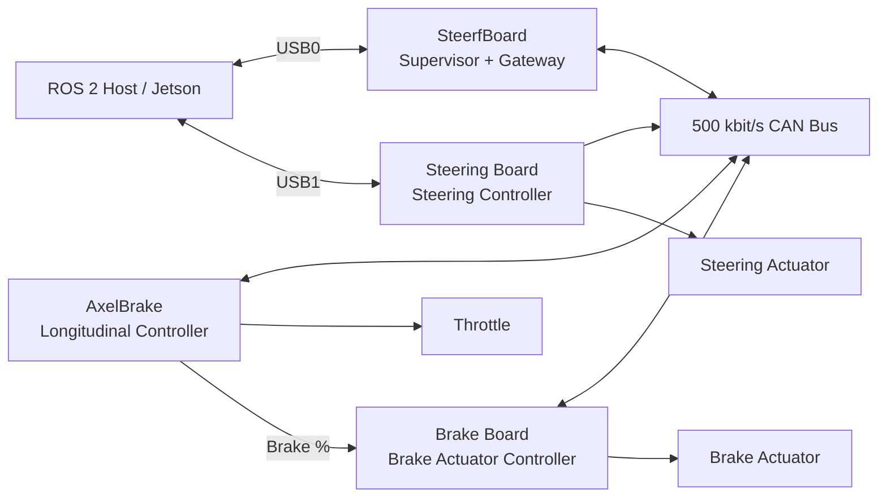
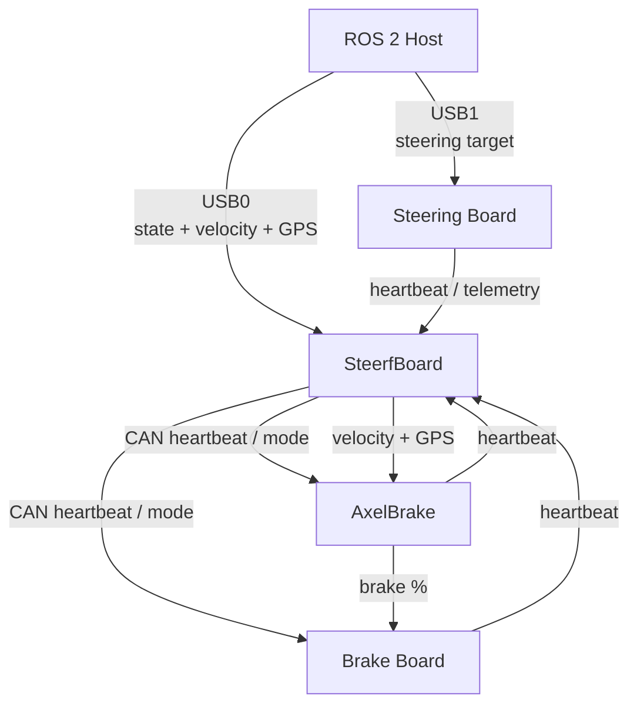
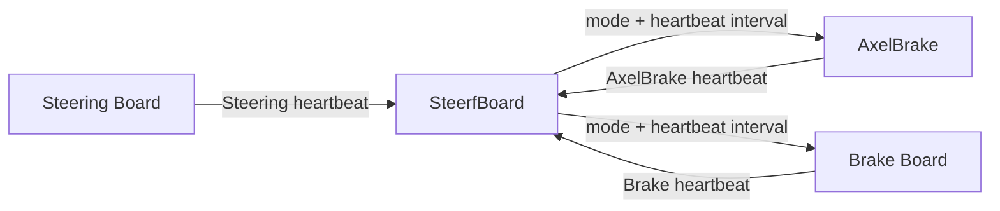
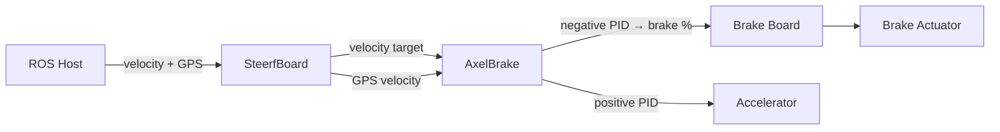
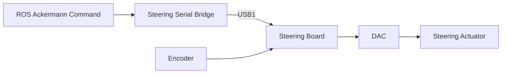
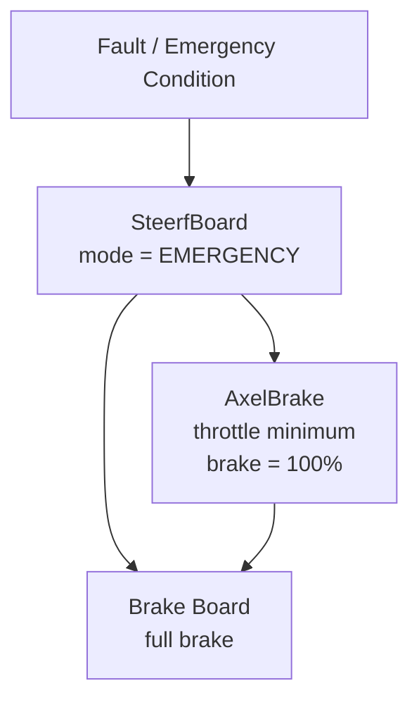
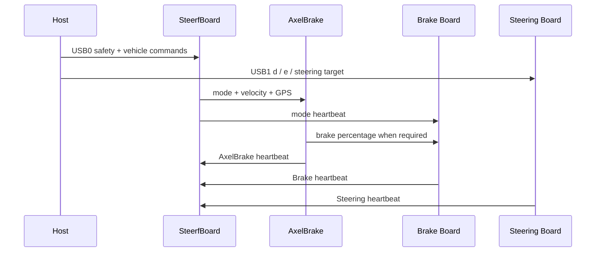

# Arduino Vehicle-Control Architecture

## SteerfBoard, AxelBrake, Steering Board and Brake Board

This document describes the **system-level architecture** of the Arduino-based vehicle control network.

Its purpose is to explain:

- which boards are present;
- what each board is responsible for;
- how the boards communicate;
- how the CAN and USB links are divided;
- how heartbeats and operating modes propagate through the system;
- how longitudinal and steering commands reach the actuators;
- how the main emergency and fault paths work.

Board-specific implementation details, PID tuning, low-level diagnostics, pin-by-pin explanations, maintenance commands and actuator-specific calibration belong in the README of each individual board.

The current architecture is a **hybrid 2-USB + CAN system**.

```text
USB0:
Host ↔ SteerfBoard

USB1:
Host ↔ Steering Board

CAN:
SteerfBoard ↔ AxelBrake ↔ Brake Board
          ↘ Steering heartbeat
```

The most important architectural change from the previous design is that **steering commands no longer travel through SteerfBoard and CAN**.

---

<a id="quick-navigation"></a>

## Quick Navigation

| Topic | Section |
|---|---|
| Overall system | [1. Architecture Overview](#architecture-overview) |
| Role of each board | [2. Board Responsibilities](#board-responsibilities) |
| USB and CAN links | [3. Communication Architecture](#communication-architecture) |
| CAN messages | [4. CAN Message Overview](#can-message-overview) |
| Heartbeats | [5. Heartbeat Topology](#heartbeat-topology) |
| MANUAL / AUTO / EMERGENCY | [6. Global Operating Modes](#global-operating-modes) |
| Longitudinal control | [7. AxelBrake and Brake Chain](#axelbrake-and-brake-chain) |
| Steering control | [8. Steering Architecture](#steering-architecture) |
| Relay and power logic | [9. Relay and Power-State Logic](#relay-and-power-state-logic) |
| Fault behavior | [10. Fault and Emergency Logic](#fault-and-emergency-logic) |
| Startup | [11. Startup Sequence](#startup-sequence) |
| Full system summary | [12. Architecture Summary](#architecture-summary) |

---

<a id="table-of-contents"></a>

## Table of Contents

1. [Architecture Overview](#architecture-overview)
2. [Board Responsibilities](#board-responsibilities)
3. [Communication Architecture](#communication-architecture)
4. [CAN Message Overview](#can-message-overview)
5. [Heartbeat Topology](#heartbeat-topology)
6. [Global Operating Modes](#global-operating-modes)
7. [AxelBrake and Brake Chain](#axelbrake-and-brake-chain)
8. [Steering Architecture](#steering-architecture)
9. [Relay and Power-State Logic](#relay-and-power-state-logic)
10. [Fault and Emergency Logic](#fault-and-emergency-logic)
11. [Startup Sequence](#startup-sequence)
12. [Architecture Summary](#architecture-summary)

---

<a id="architecture-overview"></a>

# 1. Architecture Overview

The vehicle-control system is distributed across four Arduino-based boards and one Linux host running the ROS 2 software.



The responsibilities are intentionally separated.

### Longitudinal path

```text
ROS 2 Host
    ↓
USB0
    ↓
SteerfBoard
    ↓
CAN
    ↓
AxelBrake
    ├── throttle output
    └── brake percentage
             ↓
             CAN
             ↓
        Brake Board
             ↓
        Brake actuator
```

### Steering path

```text
ROS 2 Host
    ↓
USB1
    ↓
Steering Board
    ↓
Steering PID
    ↓
Vehicle steering actuator
```

The Steering Board remains connected to CAN for telemetry/heartbeat, but **normal steering commands are sent directly over USB**.

---

## 1.1 Main architectural principle

SteerfBoard is the **system supervisor**, but it is no longer the steering-command gateway.

It handles:

```text
mode
host safety state
velocity target
GPS velocity
CAN supervision
relay state
```

The Steering Board is now directly connected to the host.

---

## 1.2 Main control split

```text
LATERAL CONTROL
Host → Steering Board → Steering actuator

LONGITUDINAL CONTROL
Host → SteerfBoard → AxelBrake
                     ├→ throttle
                     └→ Brake Board → brake actuator
```

This split is the central idea of the current architecture.

---

<a id="board-responsibilities"></a>

# 2. Board Responsibilities

## 2.1 SteerfBoard

SteerfBoard is the central supervisory board.

Its main responsibilities are:

- receive the host safety/armed state over USB0;
- receive velocity, acceleration and GPS speed from the host;
- determine the global operating mode;
- monitor the physical emergency button;
- broadcast the global mode through CAN;
- send velocity and GPS information to AxelBrake;
- receive heartbeats from the other boards;
- monitor critical CAN nodes;
- manage the main relay output;
- send compact feedback to the host.

SteerfBoard **does not command steering in the current architecture**.

---

## 2.2 AxelBrake

AxelBrake is the longitudinal controller.

It receives:

```text
target velocity
actual GPS velocity
global operating mode
```

and computes the required longitudinal control effort.

Its output is split into:

```text
positive PID output
    → accelerator command

negative PID output
    → brake percentage
    → CAN_BRAKE_PCT
    → Brake Board
```

AxelBrake is therefore the board that decides **how much braking is requested** during normal AUTO operation.

---

## 2.3 Brake Board

The Brake Board is the low-level brake actuator controller.

It receives:

```text
global operating mode
brake percentage
```

and converts the brake percentage into stepper travel.

Its main system-level functions are:

- automatic homing at startup;
- release in MANUAL;
- brake-percentage tracking in AUTO;
- full braking in EMERGENCY;
- full braking after SteerfBoard heartbeat loss;
- transmission of its own heartbeat.

The Brake Board controls actuator position, not vehicle deceleration directly.

---

## 2.4 Steering Board

The Steering Board controls the lateral actuator.

Its active command source is USB1.

It performs:

```text
target angle
    ↓
encoder feedback
    ↓
PID
    ↓
DAC output
    ↓
steering actuator
```

It also transmits steering telemetry on CAN.

The CAN steering-command path is still present in the firmware but is not the active path in the current `serialDirectMode` configuration.

---

<a id="communication-architecture"></a>

# 3. Communication Architecture

The architecture uses two USB serial channels and one shared CAN network.

---

## 3.1 USB0 — Host ↔ SteerfBoard

Typical connection:

```text
/dev/ttyUSB0
115200 baud
```

The host sends:

```text
safety / armed state
velocity
acceleration
jerk
GPS velocity
```

SteerfBoard then distributes the information required by the CAN-side longitudinal system.

The host still uses the historical six-field command packet, but the two steering fields are now forced to zero because steering no longer passes through SteerfBoard.

Conceptually:

```text
<0.0,0.0,velocity,acceleration,jerk,gps_velocity>
```

The host also sends:

```text
<H,0>
<H,1>
<H,2>
```

to communicate the safety state.

---

## 3.2 USB1 — Host ↔ Steering Board

Typical connection:

```text
/dev/ttyUSB1
115200 baud
```

The host sends steering commands directly to the Steering Board.

Main command:

```text
s<target_angle>
```

Example:

```text
s120.00
```

The current host also performs the startup sequence:

```text
d
e
```

to disable and then enable the steering PID in a controlled way.

---

## 3.3 CAN bus

All current Arduino CAN nodes use:

```text
500 kbit/s
MCP2515
8 MHz oscillator
```

The main CAN participants are:

```text
SteerfBoard
AxelBrake
Brake Board
Steering Board
```

The CAN bus is primarily responsible for:

```text
global mode
velocity target
GPS velocity
brake request
board heartbeats
steering telemetry
```

---

## 3.4 Current communication map



---

<a id="can-message-overview"></a>

# 4. CAN Message Overview

All boards include the shared:

```cpp
can_ids.h
```

This header is the authoritative source for the numeric identifiers.

Only the IDs explicitly confirmed in the supplied source are shown numerically here.

---

## 4.1 CAN message table

| CAN symbol | Known ID | Producer | Consumer | Main content |
|---|---:|---|---|---|
| `CAN_HB_STERFBOARD` | `0x01` | SteerfBoard | AxelBrake, Brake Board | heartbeat interval + global mode |
| `CAN_HB_AXELBRAKE` | `0x12` | AxelBrake | SteerfBoard | longitudinal controller status |
| `CAN_HB_STEERING` | `0x14` | Steering Board | SteerfBoard | steering command/angle telemetry |
| `CAN_HB_BRAKE` | `0x13` | Brake Board | SteerfBoard | step position + last brake % |
| `CAN_VELOCITY_TARGET` | `0x120` | SteerfBoard | AxelBrake | target velocity + acceleration |
| `CAN_GPS_VELOCITY` | `0x121` | SteerfBoard | AxelBrake | GPS speed |
| `CAN_BRAKE_PCT` | `0x130` | AxelBrake | Brake Board | brake percentage |
| `CAN_STEERING_TARGET` | legacy/current header | legacy path | Steering Board | steering angle + rate |

---

## 4.2 SteerfBoard heartbeat

`CAN_HB_STERFBOARD` contains:

```text
heartbeat interval
global mode
```

The global mode uses:

```text
0 = MANUAL
1 = AUTO
2 = EMERGENCY
```

This heartbeat is the main supervisory message for the CAN-side boards.

---

## 4.3 Velocity target

SteerfBoard sends AxelBrake:

```text
target velocity
target acceleration
```

using:

```text
CAN_VELOCITY_TARGET
```

---

## 4.4 GPS velocity

SteerfBoard forwards GPS speed using:

```text
CAN_GPS_VELOCITY
```

AxelBrake uses this as the measured velocity for its PID.

---

## 4.5 Brake percentage

AxelBrake generates:

```text
CAN_BRAKE_PCT
```

The payload contains a brake percentage:

```text
0 ... 100%
```

This is consumed by the Brake Board.

---

## 4.6 Brake heartbeat

The Brake Board sends:

```text
CAN_HB_BRAKE
```

containing:

```text
software stepper position
last requested brake percentage
```

This allows SteerfBoard to monitor whether the Brake Board is alive.

---

## 4.7 Steering heartbeat

The Steering Board sends:

```text
CAN_HB_STEERING
```

containing its steering telemetry.

SteerfBoard receives this heartbeat, but the Steering Board is not currently included in the critical-board fault decision.

---

<a id="heartbeat-topology"></a>

# 5. Heartbeat Topology

Heartbeat supervision is one of the main safety mechanisms in the architecture.

---

## 5.1 Main topology



---

## 5.2 Default heartbeat timing

SteerfBoard uses approximately:

```text
200 ms
```

which corresponds to:

```text
5 Hz
```

---

## 5.3 Downstream watchdogs

AxelBrake and Brake Board independently monitor the SteerfBoard heartbeat.

Typical timeout:

```text
4 × heartbeat interval
```

With a 200 ms heartbeat:

```text
timeout ≈ 800 ms
```

If SteerfBoard disappears:

```text
AxelBrake
    → throttle minimum
    → brake request 100%

Brake Board
    → local EMERGENCY
    → brake target 100%
```

---

## 5.4 SteerfBoard board supervision

SteerfBoard monitors the heartbeat of:

```text
AxelBrake
Brake Board
Steering Board
```

However, the current critical-board logic uses:

```text
AxelBrake
Brake Board
```

as the boards capable of forcing a system emergency.

The Steering Board heartbeat remains useful for diagnostics, but its loss does not currently trigger the same CAN-side fault latch.

---

## 5.5 Bidirectional supervision

The architecture therefore has two directions of monitoring:

```text
SteerfBoard watches:
    AxelBrake
    Brake Board

AxelBrake watches:
    SteerfBoard

Brake Board watches:
    SteerfBoard
```

This means a complete failure of the main supervisor can still produce local braking behavior.

---

<a id="global-operating-modes"></a>

# 6. Global Operating Modes

The entire CAN-side control system uses three global states.

```text
MANUAL    = 0
AUTO      = 1
EMERGENCY = 2
```

SteerfBoard is responsible for broadcasting this state.

---

## 6.1 Mode origin

The host sends a compact safety heartbeat:

```text
<H,0>
<H,1>
<H,2>
```

Conceptually:

| Host value | Meaning | SteerfBoard mode |
|---:|---|---|
| 0 | disarmed | MANUAL |
| 1 | armed + valid | AUTO |
| 2 | armed + error | EMERGENCY |

The physical emergency button can override the host state and force EMERGENCY.

---

## 6.2 MANUAL

### SteerfBoard

```text
mode = MANUAL
relay48v output = LOW
```

### AxelBrake

```text
accelerator disabled/minimum
brake request = 0%
```

### Brake Board

```text
release to 0%
disable motor after release
```

### Steering

Steering remains controlled by the independent USB path.

---

## 6.3 AUTO

### SteerfBoard

```text
mode = AUTO
relay48v output = HIGH
velocity / GPS messages active
```

### AxelBrake

```text
velocity PID active
```

### Brake Board

```text
follows CAN_BRAKE_PCT
```

### Steering Board

```text
follows USB steering commands
```

---

## 6.4 EMERGENCY

### SteerfBoard

```text
mode = EMERGENCY
relay48v output = LOW
```

### AxelBrake

```text
accelerator minimum
brake request = 100%
```

### Brake Board

```text
full brake
```

### Steering Board

The current steering firmware does not independently react to the SteerfBoard CAN emergency while `serialDirectMode` is active.

This is a consequence of the current two-USB architecture.

---

## 6.5 Mode overview

| Subsystem | MANUAL | AUTO | EMERGENCY |
|---|---|---|---|
| SteerfBoard | mode 0 | mode 1 | mode 2 |
| AxelBrake | no drive | PID active | full braking request |
| Brake Board | release | follow brake % | full brake |
| Steering Board | USB control | USB control | USB control unless host disables/changes it |
| `relay48v` output | LOW | HIGH | LOW |

---

<a id="axelbrake-and-brake-chain"></a>

# 7. AxelBrake and Brake Chain

The longitudinal system is split between two boards.

AxelBrake decides **how much longitudinal effort is required**.

The Brake Board decides **how to physically move the brake actuator**.

---

## 7.1 Complete longitudinal flow



---

## 7.2 AxelBrake PID behavior

AxelBrake compares:

```text
target velocity
actual GPS velocity
```

The PID output can be positive or negative.

```text
positive
    → accelerator

negative
    → braking
```

The output is therefore a shared longitudinal effort variable rather than two completely separate controllers.

---

## 7.3 Brake generation

For negative PID output, AxelBrake converts the magnitude into a brake percentage.

That value is constrained to:

```text
0 ... 100%
```

and transmitted to the Brake Board using:

```text
CAN_BRAKE_PCT
```

---

## 7.4 Parking behavior

When the requested velocity is approximately zero and the vehicle is effectively stationary, AxelBrake can request a minimum parking brake level.

Current value:

```text
60%
```

This helps hold the vehicle stopped without relying on a tiny PID output around zero speed.

---

## 7.5 Emergency redundancy

When EMERGENCY is active:

```text
SteerfBoard → AxelBrake mode 2
SteerfBoard → Brake Board mode 2
```

AxelBrake sends:

```text
brake = 100%
```

while the Brake Board also locally commands:

```text
100%
```

Therefore full braking does not depend only on the normal `CAN_BRAKE_PCT` control chain.

---

<a id="steering-architecture"></a>

# 8. Steering Architecture

The steering path is independent from the longitudinal CAN command path.

---

## 8.1 Current path



---

## 8.2 Command source

The Steering Board receives:

```text
s<target_angle>
```

from the host.

The target is limited by the firmware.

The board then closes the angle loop internally using encoder feedback.

---

## 8.3 CAN role in the current steering system

The firmware still contains a CAN steering-command implementation.

However, the board starts in:

```cpp
serialDirectMode = true;
```

Therefore:

```text
normal steering control = USB
CAN steering command = dormant
CAN steering heartbeat = still transmitted
```

A better description of the current design is:

```text
USB steering control + CAN steering telemetry
```

---

## 8.4 Steering heartbeat

The Steering Board reports its state on CAN.

SteerfBoard receives this data and can determine whether the heartbeat is present.

The board is currently not part of the critical CAN board list.

---

## 8.5 Important architecture note

The host normally disables the PID during a clean shutdown.

However, the current Steering Board firmware does not implement a dedicated serial-command timeout.

Therefore an unexpected USB/process loss is not identical to a controlled shutdown.

This behavior should be considered in the steering-specific safety documentation.

---

<a id="relay-and-power-state-logic"></a>

# 9. Relay and Power-State Logic

SteerfBoard controls:

```text
relay48v
relay9v
```

At architecture level, the important active logic is the state of `relay48v`.

---

## 9.1 Runtime relay state

The firmware applies:

```text
AUTO      → relay48v HIGH
MANUAL    → relay48v LOW
EMERGENCY → relay48v LOW
```

The physical meaning of HIGH/LOW depends on the installed relay interface.

Therefore the electrical documentation must explicitly confirm:

```text
relay48v HIGH = physical power state ?
relay48v LOW  = physical power state ?
```

This should not be inferred only from the variable name.

---

## 9.2 Emergency button

The physical emergency button has priority.

When pressed, SteerfBoard:

```text
forces EMERGENCY heartbeat
sets relay48v LOW
```

This bypasses the normal host-mode logic.

---

## 9.3 Why relay polarity matters

The Brake Board is designed to request full braking during EMERGENCY.

At the same time SteerfBoard sets:

```text
relay48v LOW
```

The hardware documentation must confirm that this relay state does not remove power required by the brake actuator.

This is a wiring-level question, not something that can be determined safely from the firmware alone.

---

<a id="fault-and-emergency-logic"></a>

# 10. Fault and Emergency Logic

The main safety architecture is distributed across the host, SteerfBoard, AxelBrake and Brake Board.

---

## 10.1 Main emergency sources

EMERGENCY can result from:

```text
host reports invalid armed state
host communication timeout
physical emergency button
critical CAN board missing
SteerfBoard heartbeat loss at downstream boards
```

---

## 10.2 Host timeout

SteerfBoard expects continued host communication while the vehicle is armed.

Current main timeout:

```text
500 ms
```

If the host path stops updating during valid armed operation:

```text
SteerfBoard → EMERGENCY
```

---

## 10.3 Critical boards

The current SteerfBoard critical-board list is:

```text
AxelBrake
Brake Board
```

If one of these boards disappears while AUTO is required:

```text
SteerfBoard → board fault
SteerfBoard → EMERGENCY
```

---

## 10.4 Fault latching

SteerfBoard uses a board-fault latch.

Once a critical board fault occurs during AUTO, the checked mode remains in the emergency path until the relevant recovery condition is satisfied.

The latch can clear when the system is disarmed or when the required board health returns.

This prevents a brief heartbeat loss from being ignored as a one-loop transient.

---

## 10.5 Supervisor loss

AxelBrake and Brake Board do not rely only on SteerfBoard to detect every problem.

If the SteerfBoard heartbeat disappears:

```text
AxelBrake
    → throttle minimum
    → brake request 100%

Brake Board
    → full brake locally
```

This provides an independent downstream fallback.

---

## 10.6 Main emergency propagation



---

## 10.7 Steering exception

The Steering Board is outside this CAN emergency-control path while operating in direct serial mode.

The steering host is therefore responsible for the normal direct steering command stream and for clean PID disable during controlled shutdown.

---

<a id="startup-sequence"></a>

# 11. Startup Sequence

The boards boot independently, but the system becomes operational as communication links are established.

---

## 11.1 SteerfBoard startup

SteerfBoard:

1. starts Serial;
2. initializes CAN;
3. configures relays and emergency input;
4. starts receiving host packets;
5. begins sending CAN heartbeat;
6. sends velocity and GPS values to AxelBrake;
7. monitors board heartbeats.

---

## 11.2 AxelBrake startup

AxelBrake:

1. initializes accelerator output;
2. initializes PID;
3. initializes CAN;
4. waits for SteerfBoard heartbeat and velocity/GPS data;
5. begins sending its heartbeat.

Without a valid supervisor heartbeat, the board moves to its safe longitudinal behavior.

---

## 11.3 Brake Board startup

Brake Board:

1. initializes stepper control;
2. initializes CAN;
3. performs automatic homing;
4. begins processing mode and brake commands;
5. sends Brake heartbeat.

An emergency or supervisor-heartbeat loss can interrupt homing and force the emergency brake behavior.

---

## 11.4 Steering Board startup

Steering Board:

1. initializes encoder and DAC;
2. starts in serial direct mode;
3. initializes CAN telemetry;
4. waits for USB1;
5. receives the host `d/e` startup sequence;
6. begins following steering targets.

---

## 11.5 Combined sequence



---

<a id="architecture-summary"></a>

# 12. Architecture Summary

The current architecture can be summarized as:

```text
                         ROS 2 HOST
                             │
              ┌──────────────┴──────────────┐
              │                             │
            USB0                          USB1
              │                             │
              ▼                             ▼
       ┌───────────────┐            ┌───────────────┐
       │  SteerfBoard  │            │ Steering Board│
       │               │            │               │
       │ mode/safety   │            │ encoder + PID │
       │ CAN gateway   │            │ DAC output    │
       │ relay logic   │            └───────┬───────┘
       └───────┬───────┘                    │
               │                            ▼
               │                      Steering actuator
               │
               │ CAN 500 kbit/s
               │
       ┌───────┴───────────────┐
       │                       │
       ▼                       ▼
┌──────────────┐        ┌──────────────┐
│  AxelBrake   │        │ Brake Board  │
│              │        │              │
│ velocity PID │ brake% │ stepper ctrl │
│ throttle     ├───────►│ homing       │
│ brake demand │  CAN   │ watchdog     │
└──────┬───────┘        └──────┬───────┘
       │                       │
       ▼                       ▼
 Accelerator               Brake pedal
```

The key system rules are:

1. **SteerfBoard is the global supervisor.**
2. **SteerfBoard broadcasts MANUAL / AUTO / EMERGENCY.**
3. **The host communicates with SteerfBoard through USB0.**
4. **The host communicates directly with the Steering Board through USB1.**
5. **Steering commands no longer pass through SteerfBoard.**
6. **SteerfBoard sends velocity and GPS data to AxelBrake through CAN.**
7. **AxelBrake controls throttle and generates brake percentage.**
8. **Brake percentage is sent from AxelBrake to the Brake Board through CAN.**
9. **The Brake Board owns the physical brake actuator.**
10. **AxelBrake and Brake Board independently monitor SteerfBoard heartbeat.**
11. **SteerfBoard monitors AxelBrake and Brake Board as critical CAN nodes.**
12. **The Steering Board still sends CAN telemetry but is not currently a critical CAN board.**
13. **The physical relay polarity must be confirmed from the wiring documentation.**
14. **The shared `can_ids.h` remains the authoritative CAN-ID definition.**

---
