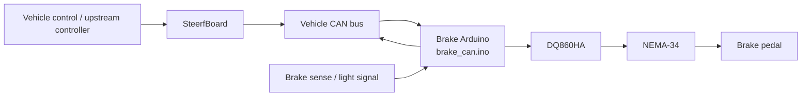

# Autonomous Braking Actuator — CAN-Controlled NEMA-34 Stepper System

This repository documents the current autonomous braking actuator used on the vehicle. The system uses a NEMA-34 stepper motor, a DQ860HA stepper driver, a cable-and-drum transmission, and a dedicated Arduino brake controller connected to the vehicle CAN bus. The current implementation is intended to operate as part of the vehicle control architecture. Serial commands still exist inside the Arduino firmware, but they are treated here only as a **maintenance and debug interface**.

The brake controller receives the global vehicle mode from the SteerfBoard heartbeat, accepts brake-percentage commands over CAN while in AUTO mode, automatically applies full braking in EMERGENCY mode or after heartbeat loss, performs an automatic brake-light-based homing routine at startup, and periodically sends its own status heartbeat back onto the CAN bus.

> **Important terminology:** in this firmware, a brake percentage is a **stepper travel percentage**. It is not a calibrated brake force, pedal force, hydraulic pressure, or vehicle deceleration percentage.

---

<a id="quick-navigation"></a>
## Quick Navigation

| Topic | Go to |
|---|---|
| System purpose and operating principle | [Overview](#overview) |
| Mechanical actuator and cable system | [Mechanical Design](#mechanical-design) |
| Hardware components | [Hardware Stack](#hardware-stack) |
| Power and signal wiring | [Electrical Wiring](#electrical-wiring) |
| DQ860HA DIP-switch settings | [Driver Configuration](#driver-configuration) |
| Current software architecture | [Software Architecture](#software-architecture) |
| Brake Arduino firmware | [Brake Controller Firmware](#brake-controller-firmware) |
| CAN messages | [CAN Interface](#can-interface) |
| MANUAL / AUTO / EMERGENCY behavior | [Operating Modes](#operating-modes) |
| Startup homing | [Automatic Homing](#automatic-homing) |
| Safety and watchdog behavior | [Safety Logic](#safety-logic) |
| SteerfBoard integration | [SteerfBoard Integration](#steerfboard-integration) |
| Serial maintenance commands | [Serial Maintenance Interface](#serial-maintenance-interface) |
| LEDs | [Status LEDs](#status-leds) |
| Software parameters | [Configuration Parameters](#configuration-parameters) |
| Startup sequence | [Power-Up and Runtime Sequence](#power-up-and-runtime-sequence) |
| Limitations / future work | [Known Limitations and Future Work](#known-limitations-and-future-work) |

---

<a id="table-of-contents"></a>
## Table of Contents

1. [Overview](#overview)
2. [Mechanical Design](#mechanical-design)
3. [Hardware Stack](#hardware-stack)
4. [Electrical Wiring](#electrical-wiring)
5. [Driver Configuration](#driver-configuration)
6. [Software Architecture](#software-architecture)
7. [Brake Controller Firmware](#brake-controller-firmware)
8. [Pin Assignment](#pin-assignment)
9. [Motion Model](#motion-model)
10. [CAN Interface](#can-interface)
11. [Operating Modes](#operating-modes)
12. [Automatic Homing](#automatic-homing)
13. [Safety Logic](#safety-logic)
14. [Brake Heartbeat and Feedback](#brake-heartbeat-and-feedback)
15. [SteerfBoard Integration](#steerfboard-integration)
16. [Serial Maintenance Interface](#serial-maintenance-interface)
17. [Status LEDs](#status-leds)
18. [Configuration Parameters](#configuration-parameters)
19. [Power-Up and Runtime Sequence](#power-up-and-runtime-sequence)
20. [Dependencies](#dependencies)
21. [Known Limitations and Future Work](#known-limitations-and-future-work)
22. [Implementation Summary](#implementation-summary)

---

<a id="overview"></a>
## 1. Overview

The autonomous brake actuator is installed in the driver footwell and mechanically connected to the brake pedal assembly through a cable-and-drum mechanism.

The NEMA-34 stepper motor rotates a cable drum. Increasing the commanded stepper position pulls the cable and changes the brake pedal position. The Arduino therefore controls braking by commanding a target motor position rather than directly controlling torque or hydraulic pressure.

The current production-oriented control path is:

```text
Vehicle control system (ACCELERATION BOARD WITH PID)
        │
        │ brake percentage command over CAN
        ▼
┌──────────────────────────┐
│ Dedicated Brake Arduino  │
│ brake_can.ino            │
│                          │
│ - receives vehicle mode  │
│ - receives brake %       │
│ - watchdog / emergency   │
│ - startup homing         │
│ - stepper trajectory     │
└────────────┬─────────────┘
             │
             │ PUL / DIR / ENA
             ▼
┌──────────────────────────┐
│ Wantai DQ860HA Driver    │
└────────────┬─────────────┘
             │
             ▼
┌──────────────────────────┐
│ NEMA-34 Stepper Motor    │
└────────────┬─────────────┘
             │
             │ cable + drum
             ▼
         Brake pedal
```

The brake board is also connected to the vehicle CAN bus. It receives the SteerfBoard heartbeat and sends a brake heartbeat containing its software position and the most recently commanded brake percentage.

---

<a id="mechanical-design"></a>
## 2. Mechanical Design

### 2.1 Motor mount

The motor bracket was designed in CAD and 3D-printed. It is an L-shaped support with triangular gussets for stiffness, a central opening for the motor shaft/coupling, four motor-face mounting holes, and mounting features for installation in the vehicle.


The design goal is to hold the NEMA-34 motor rigidly relative to the brake pedal assembly so that the cable drum pulls along the intended cable direction.

### 2.2 Installed position

The actuator is mounted in the driver footwell close to the brake pedal column.


The motor shaft drives a cable drum/coupling. The cable is routed from this drum to the brake mechanism so that motor rotation produces brake-pedal displacement.


### 2.3 Coupling and cable

The coupling acts both as a shaft adapter and as the cable drum.

The NEMA-34 shaft used on the vehicle has two flat sides. The coupling bore must therefore match the actual shaft geometry rather than assuming a perfectly cylindrical shaft.

The current firmware limits the normal 100% brake target to:

```cpp
cfgMaxTurns = 0.40;
```

With 1600 configured steps per motor revolution:

```text
maximum commanded travel
= 1600 steps/rev × 0.40 rev
= 640 steps
```

This travel must correspond to a mechanically safe cable travel on the installed vehicle.

> **Mechanical note:** the cable end termination and printed coupling are safety-critical components. Their material, geometry, retention, and wear should be inspected regularly before vehicle operation.

---

<a id="hardware-stack"></a>
## 3. Hardware Stack

| Component | Part / Type | Current role |
|---|---|---|
| Motor | Wantai 85BYGH450D-008 | NEMA-34 stepper motor driving the brake cable |
| Motor nominal specification | 1.8°/step, 5.6 A/phase, 7.7 Nm holding torque | Mechanical actuation |
| Stepper driver | Wantai DQ860HA | Generates motor phase currents from PUL/DIR/ENA commands |
| DC-DC converter | EVEPS boost converter | Vehicle-voltage input to approximately 48 V driver supply |
| Vehicle supply | 12 V automotive electrical system | Primary power source |
| Brake controller | Arduino + MCP2515 | CAN interface, safety state machine, homing, stepper commands |
| CAN transceiver/controller | MCP2515 | 500 kbit/s vehicle CAN interface |
| Position reference input | Brake-light/sense signal on Arduino A0 | Used by startup homing logic |
| Supervisory controller | SteerfBoard | Broadcasts system mode/heartbeat and monitors brake-board feedback |
| Fuse | Automotive blade fuse | Supply protection near battery |

The current firmware does not use a Python application in the normal control path.

---

<a id="electrical-wiring"></a>
## 4. Electrical Wiring

### 4.1 Main power path

The previous hardware design uses the following high-level power chain:

```text
Vehicle battery (+)
        │
        ▼
      Fuse
        │
        ▼
 Vehicle relay / power control
        │
        ▼
   DC-DC converter
        │
   approximately 48 V
        ▼
    DQ860HA driver
        │
        ▼
   NEMA-34 motor
```
.jpeg
)

The SteerfBoard firmware contains a `relay48v` output as part of the vehicle power/safety architecture. The exact active-high/active-low electrical behavior depends on the installed relay interface and should be verified against the vehicle wiring.

### 4.2 Motor phase connections

The previously documented motor wiring is:

| Motor wire | DQ860HA terminal |
|---|---|
| Red | A+ |
| Green | A− |
| Yellow | B+ |
| Blue | B− |

> Verify the actual motor coil pairs with a multimeter before relying only on wire colours. Motor batches and harnesses can differ.

### 4.3 Arduino to DQ860HA

The current `brake_can.ino` pin assignment is:

| Arduino pin | Firmware name | DQ860HA signal |
|---|---|---|
| D5 | `PUL_PIN` | Pulse |
| D4 | `DIR_PIN` | Direction |
| D3 | `ENA_PIN` | Enable |

The firmware configures the AccelStepper enable signal as inverted:

```cpp
stepper.setPinsInverted(false, false, true);
```

This is part of the current driver-enable behavior and should remain consistent with the physical wiring.

### 4.4 CAN interface

The MCP2515 chip-select pin is:

```cpp
MCP2515 mcp2515(10);
```

The CAN controller is configured for:

```text
500 kbit/s
8 MHz MCP2515 oscillator
normal mode
```

### 4.5 Brake reference / homing input

The brake controller reads:

```cpp
BRAKE_SENSE_PIN = A0
BRAKE_ON_THRESHOLD = 300
```

The analog input is used by the automatic homing state machine to detect a transition in the brake-light/sense signal.

### 4.6 Common ground

The controller, CAN interface, stepper driver signal ground, DC-DC system, and vehicle electrical system must be wired according to the vehicle grounding design. For the stepper control signals, the DQ860HA signal reference must be electrically compatible with the Arduino outputs.

---

<a id="driver-configuration"></a>
## 5. Driver Configuration

The DQ860HA uses eight DIP switches.

These settings must be checked **with power removed** before changing the switches.

### 5.1 SW1–SW3 — output current

The previous documented DQ860HA current table is:

| SW1 | SW2 | SW3 | Peak current | RMS current |
|---|---|---|---:|---:|
| ON | ON | ON | 2.8 A | 2.0 A |
| OFF | ON | ON | 3.5 A | 2.5 A |
| ON | OFF | ON | 4.2 A | 3.0 A |
| OFF | OFF | ON | 4.9 A | 3.5 A |
| ON | ON | OFF | 5.7 A | 4.0 A |
| **OFF** | **ON** | **OFF** | **6.4 A** | **4.6 A** |
| ON | OFF | OFF | 7.0 A | 5.0 A |
| OFF | OFF | OFF | 7.8 A | 5.6 A |

The 4.6 A RMS configuration was previously used as a conservative setting relative to the nominal 5.6 A/phase motor rating. **The braking was good in the testing, but still can be improved**

Current selection must still be validated against motor temperature, driver temperature, required brake force, power-supply capability, and the final vehicle safety assessment.

### 5.2 SW4 — standstill current

| SW4 | Behavior |
|---|---|
| OFF | Reduced standstill current |
| ON | Full configured standstill current |

Reduced standstill current is generally desirable for temperature management, provided the required holding behavior remains adequate.

### 5.3 SW5–SW8 — microstep setting

The software currently assumes:

```cpp
const int MICROSTEPS = 1600;
```

Therefore the DQ860HA hardware must be configured for **1600 steps per motor revolution**.

The previously documented switch combination is:

```text
SW5 = ON
SW6 = OFF
SW7 = ON
SW8 = ON
```

If the DIP switches are changed, `MICROSTEPS` in the firmware must be changed accordingly or the physical brake travel will no longer match the software percentage.

---

<a id="software-architecture"></a>
## 6. Software Architecture

The brake subsystem now centers on one dedicated production firmware:

```text
brake_can.ino
```

The supplied SteerfBoard firmware is relevant only as a supervisory part of the wider vehicle network.

### 6.1 High-level data flow



### 6.2 Responsibilities of the brake board

The brake board is responsible for:

- configuring and driving the stepper motor;
- converting a brake percentage to a step target;
- accepting brake commands only in AUTO mode over CAN;
- forcing 100% braking in EMERGENCY mode;
- forcing 100% braking after SteerfBoard heartbeat timeout;
- releasing the brake when the system returns to MANUAL;
- performing automatic homing at startup;
- disabling the motor after a completed manual release;
- transmitting a periodic brake heartbeat;
- providing local LEDs;
- retaining a Serial debug/maintenance interface.

---

<a id="brake-controller-firmware"></a>
## 7. Brake Controller Firmware

Main file:

```text
brake_can.ino
```

The firmware uses:

```cpp
#include <SPI.h>
#include <mcp2515.h>
#include <AccelStepper.h>
#include "can_ids.h"
```

### 7.1 `recalcMaxSteps()`

Calculates the maximum normal brake travel in steps:

```cpp
maxSteps = MICROSTEPS * cfgMaxTurns;
```

Current values:

```text
MICROSTEPS = 1600
cfgMaxTurns = 0.40

maxSteps = 640
```

### 7.2 `enableMotor()`

Calls:

```cpp
stepper.enableOutputs();
```

only when the motor is not already considered enabled.

The `motorEnabled` flag prevents unnecessary repeated enable calls.

### 7.3 `disableMotor()`

Calls:

```cpp
stepper.disableOutputs();
```

and clears `motorEnabled`.

The firmware uses this after a completed release to MANUAL/0% when `disableWhenReleased` is active.

### 7.4 `commandBrakePct()`

This is the main brake-position command function.

It:

1. constrains the requested percentage to 0–100%;
2. stores the request in `lastBrakePct`;
3. converts the percentage into a step target;
4. decides whether the motor should be disabled after reaching zero;
5. enables the motor;
6. sends the target to AccelStepper with `moveTo()`.

The conversion is:

```text
targetSteps = maxSteps × brakePct / 100
```

With the current 640-step maximum:

| Brake command | Target |
|---:|---:|
| 0% | 0 steps |
| 25% | 160 steps |
| 50% | 320 steps |
| 75% | 480 steps |
| 100% | 640 steps |

This is a **position/travel mapping**, not a force calibration.

### 7.5 `enterEmergencyBrake()`

Emergency behavior is intentionally simple:

```cpp
commandBrakePct(100.0, false);
```

The motor remains enabled after reaching the full-brake target.

This function is used for:

- explicit EMERGENCY mode;
- SteerfBoard heartbeat watchdog timeout.

### 7.6 `releaseBrakeForManual()`

Commands:

```cpp
commandBrakePct(0.0, true);
```

The `true` argument requests motor disable after the zero target is reached.

This allows the mechanical brake system to return to its released state without continuing to energize the stepper after the move is complete.

### 7.7 `sendHeartbeat()`

Builds the brake-board CAN heartbeat.

Two `float` values are packed into the eight data bytes:

```text
bytes 0–3: currentPosition()
bytes 4–7: lastBrakePct
```

This heartbeat is sent periodically at the interval received from SteerfBoard.

### 7.8 `runHomingStateMachine()`

Implements the startup reference-finding sequence using the A0 brake-sense signal.

This routine is described in detail in [Automatic Homing](#automatic-homing).

### 7.9 `setup()`

Initializes:

- Serial at 115200 baud;
- LED pins;
- AccelStepper;
- enable inversion;
- initial software position;
- speed and acceleration;
- maximum travel;
- MCP2515 CAN at 500 kbit/s;
- heartbeat timestamps;
- automatic homing.

The motor outputs are disabled before homing begins.

### 7.10 `loop()`

The main loop continuously performs:

1. automatic homing;
2. CAN reception;
3. mode handling;
4. brake command handling;
5. SteerfBoard heartbeat watchdog;
6. stepper motion;
7. motor-disable-on-release logic;
8. brake heartbeat transmission;
9. Serial maintenance command handling;
10. LED updates;
11. periodic Serial position/status reporting.

This keeps all safety and stepper behavior inside the microcontroller rather than relying on a PC application.

---

<a id="pin-assignment"></a>
## 8. Pin Assignment

### 8.1 Brake Arduino

| Pin | Function | Firmware symbol |
|---|---|---|
| D3 | Stepper enable | `ENA_PIN` |
| D4 | Stepper direction | `DIR_PIN` |
| D5 | Step pulse | `PUL_PIN` |
| D6 | Brake-active LED | `LED_BRAKE` |
| D7 | AUTO/ready LED | `LED_READY` |
| D8 | CAN-activity LED | `LED_CAN` |
| D10 | MCP2515 chip select | `mcp2515(10)` |
| A0 | Brake-light / reference sense | `BRAKE_SENSE_PIN` |

### 8.2 Important pin interaction

The pin numbering above is specific to `brake_can.ino`.

Do not copy pin assignments from the SteerfBoard firmware into the brake Arduino. The two boards have different responsibilities and different pin maps.

---

<a id="motion-model"></a>
## 9. Motion Model

### 9.1 Brake percentage to motor travel

The firmware models braking as a percentage of configured motor travel.

Current configuration:

```cpp
float cfgMaxTurns = 0.40;
const int MICROSTEPS = 1600;
```

Therefore:

```text
100% brake command → 0.40 motor revolutions → 640 step units
```

### 9.2 Speed and acceleration

Current defaults are:

```cpp
cfgMaxSpeed = 600.0;  // steps/s
cfgAccel    = 400.0;  // steps/s²
```

These values are passed directly to AccelStepper:

```cpp
stepper.setMaxSpeed(cfgMaxSpeed);
stepper.setAcceleration(cfgAccel);
```

### 9.3 Position control

Normal commands use:

```cpp
stepper.moveTo(targetSteps);
```

and motion is advanced non-blockingly by repeated calls to:

```cpp
stepper.run();
```

This allows CAN handling, watchdog logic, heartbeat transmission, LEDs, and Serial processing to continue while the motor is moving.

### 9.4 Open-loop limitation

`AccelStepper::currentPosition()` is a software step count.

The current firmware does **not** contain a motor-shaft encoder or cable-position sensor that verifies the physical actuator position.

A missed step, cable slip, coupling slip, or mechanical obstruction is therefore not directly detected by the position value reported in the heartbeat. **For this reason the automatic homing was thinked to be also added at every N brake**

---

<a id="can-interface"></a>
## 10. CAN Interface

The brake firmware uses `can_ids.h` for CAN identifiers.

The following numeric IDs are explicitly identifiable from the supplied brake firmware comments and previous system documentation.

### 10.1 SteerfBoard heartbeat — receive

```text
CAN_HB_STERFBOARD
ID: 0x01
Direction: SteerfBoard → Brake board
```

Relevant payload:

| Byte(s) | Content |
|---|---|
| 0–1 | Heartbeat interval in milliseconds |
| 2 | Operating mode |
| 3 | Reserved in the supplied SteerfBoard heartbeat |

Mode values:

```text
0 = MANUAL
1 = AUTO
2 = EMERGENCY
```

The brake controller records reception time in `lastHbReceived`.

### 10.2 Brake percentage command — receive

```text
CAN_BRAKE_PCT
ID: 0x130
Direction: CAN network → Brake board
Payload: float brake percentage in bytes 0–3
```

The brake command is applied **only when `mode == 1` (AUTO)**.

Outside AUTO, the CAN percentage command is ignored.

> **Integration note:** the supplied `sterfBoard_new_setup.ino` does not transmit `CAN_BRAKE_PCT`. Therefore, the exact upstream producer of the brake-percentage frame is outside the files supplied with this README. This documentation intentionally does not guess which controller generates it.

### 10.3 Brake heartbeat — transmit

```text
CAN_HB_BRAKE
ID: 0x13
Direction: Brake board → CAN network
DLC: 8
```

Payload:

| Bytes | Type | Value |
|---|---|---|
| 0–3 | `float` | `stepper.currentPosition()` |
| 4–7 | `float` | `lastBrakePct` |

SteerfBoard reads these values as:

```text
brakePositionFeedback
brakePctFeedback
```

and uses heartbeat reception to decide whether the brake board is alive.

### 10.4 CAN bitrate

Both supplied boards use:

```cpp
mcp2515.setBitrate(CAN_500KBPS, MCP_8MHZ);
mcp2515.setNormalMode();
```

All connected CAN nodes must use a compatible bitrate and physical bus configuration.

---

<a id="operating-modes"></a>
## 11. Operating Modes

The brake board does not determine the vehicle mode locally. It receives the mode from the SteerfBoard heartbeat.

### 11.1 Mode 0 — MANUAL

```text
mode = 0
```

When the firmware detects a transition into MANUAL:

```cpp
releaseBrakeForManual("ENTER MANUAL");
```

This commands:

```text
brake target = 0%
```

Once the stepper reaches zero, the motor outputs are disabled.

CAN brake-percentage commands are ignored in this mode.

### 11.2 Mode 1 — AUTO

```text
mode = 1
```

AUTO is the only mode in which normal `CAN_BRAKE_PCT` frames are accepted.

For example:

```text
CAN_BRAKE_PCT = 50.0
→ target = 50% of configured travel
→ current configuration = 320 steps
```

If the received percentage is effectively zero:

```cpp
rxPct <= 0.01
```

the firmware requests motor disable after the release motion is complete.

### 11.3 Mode 2 — EMERGENCY

```text
mode = 2
```

Entering EMERGENCY immediately cancels startup homing and requests:

```text
100% brake
```

The motor remains enabled at the emergency target.

The command is not repeatedly re-issued every loop unless required; the code checks the previous mode and current requested percentage before re-entering the emergency command.

### 11.4 Mode transition summary

| Mode | CAN brake % accepted? | Brake behavior |
|---|---|---|
| MANUAL (`0`) | No | Release to 0%; disable motor after release |
| AUTO (`1`) | Yes | Follow received brake percentage |
| EMERGENCY (`2`) | No normal percentage control | Force 100% brake |

---

<a id="automatic-homing"></a>
## 12. Automatic Homing

The current firmware starts a homing routine automatically during `setup()`.

```cpp
isHoming = true;
homingState = 0;
```

Unlike the old manual GUI-based home-setting workflow, the current system derives its reference from the analog brake-sense input.
.jpeg)

### 12.1 Sensor condition

The firmware reads:

```cpp
int lightVal = analogRead(BRAKE_SENSE_PIN);
bool isLightOn = (lightVal > BRAKE_ON_THRESHOLD);
```

with:

```cpp
BRAKE_ON_THRESHOLD = 300;
```

### 12.2 Homing state machine

#### State 0 — initialize homing

The motor is enabled and constant speed is configured:

```cpp
stepper.setSpeed(200);
```

The firmware then enters state 1.

#### State 1 — move until the sense signal becomes OFF

The motor runs with:

```cpp
stepper.runSpeed();
```

When:

```text
isLightOn == false
```

the controller pauses and advances to state 2.

#### State 2 — 200 ms pause

The controller waits approximately 200 ms.

It then reverses the homing direction using:

```cpp
stepper.setSpeed(-100);
```

and enters state 3.

#### State 3 — reverse until the sense signal becomes ON

The motor continues with `runSpeed()`.

When the signal becomes ON:

1. the current software position is temporarily set to zero;
2. a small negative offset is commanded;
3. the controller enters state 4.

The offset is:

```cpp
targetSteps = -maxSteps * 0.02;
```

With the current `maxSteps = 640`, this is approximately:

```text
-12 steps
```

because the value is converted to a `long`.

#### State 4 — apply offset and define final zero

The controller uses normal accelerated motion with:

```cpp
stepper.run();
```

After reaching the offset:

```cpp
stepper.setCurrentPosition(0);
targetSteps = 0;
lastBrakePct = 0.0;
isHoming = false;
disableMotor();
```

The brake is then considered homed and the stepper is disabled.

### 12.3 Homing sequence diagram

```text
START
  │
  ▼
Enable motor
  │
  ▼
Move at +200 steps/s
  │
  ├── wait until sense = OFF
  ▼
Pause 200 ms
  │
  ▼
Reverse at -100 steps/s
  │
  ├── wait until sense = ON
  ▼
Temporary zero
  │
  ▼
Move ~2% negative offset
  │
  ▼
Set final software zero
  │
  ▼
Disable motor
  │
  ▼
HOMING COMPLETE
```

### 12.4 Interaction with EMERGENCY mode

If EMERGENCY mode is received during homing, or the SteerfBoard heartbeat watchdog expires:

```cpp
isHoming = false;
```

The homing procedure is abandoned and full braking is commanded.

This prioritizes the emergency action over completing the reference routine.

---

<a id="safety-logic"></a>
## 13. Safety Logic

Safety behavior is implemented locally on the brake board and is also supported by the SteerfBoard supervisory logic.

### 13.1 Heartbeat watchdog

The brake board expects periodic `CAN_HB_STERFBOARD` frames.

The SteerfBoard transmits a heartbeat interval in the frame itself. The default is:

```text
200 ms = 5 Hz
```

The brake watchdog threshold is:

```cpp
heartbeatInterval * 4
```

With the default interval:

```text
200 ms × 4 = 800 ms
```

If the brake board does not receive a SteerfBoard heartbeat within this time:

```text
mode → EMERGENCY
homing → cancelled
brake command → 100%
```

### 13.2 Emergency mode

Mode 2 is fail-safe braking behavior from the brake board's point of view:

```text
target brake = 100%
motor remains enabled
```

### 13.3 Manual release behavior

Returning to MANUAL commands a 0% target.

The motor is not disabled immediately; it remains active until the zero target is reached.

Only then does the firmware call `disableMotor()`.

This avoids removing motor torque before the commanded release motion has completed.

### 13.4 CAN command gating

Normal CAN brake percentage commands are accepted only in AUTO:

```cpp
if (mode == 1) {
    commandBrakePct(...);
}
```

This prevents a normal brake setpoint frame from overriding MANUAL or EMERGENCY behavior.

### 13.5 SteerfBoard brake-alive supervision

The supplied SteerfBoard code treats the brake board as a critical CAN participant.

It records the timestamp of `CAN_HB_BRAKE` and computes `brakeAlive`.

The board-health timeout is:

```text
heartbeatInterval × BOARD_TIMEOUT_MULT
```

with:

```cpp
BOARD_TIMEOUT_MULT = 4;
```

At the current 200 ms interval this is also approximately 800 ms.

When board-fault checking is enabled, loss of a critical brake-board heartbeat while AUTO can cause SteerfBoard to latch an EMERGENCY mode.

### 13.6 Two-sided supervision

This creates a useful reciprocal safety relationship:

```text
SteerfBoard heartbeat missing
        ↓
Brake board enters EMERGENCY / 100%

Brake heartbeat missing
        ↓
SteerfBoard detects missing critical board
        ↓
Vehicle mode can be forced to EMERGENCY
```

The two mechanisms are separate and run on different microcontrollers.

### 13.7 Important remaining limitation

The safety logic supervises **communication and commanded software state**.

It does not verify actual physical brake force.

The current brake firmware has no:

- motor encoder;
- cable displacement encoder;
- pedal-force sensor;
- hydraulic pressure sensor;
- inline load cell.

Therefore, a valid heartbeat does not prove that the requested physical brake force was achieved.

---

<a id="brake-heartbeat-and-feedback"></a>
## 14. Brake Heartbeat and Feedback

The brake heartbeat is useful for communication supervision and software-state monitoring.

However, the term "feedback" must be interpreted carefully.

### 14.1 Position field

The first float is:

```cpp
(float)stepper.currentPosition()
```

This is AccelStepper's internal step counter.

It represents the position the software believes it has commanded/reached based on issued step pulses.

It is **not independent physical position feedback**.

### 14.2 Brake percentage field

The second float is:

```cpp
lastBrakePct
```

This is the last requested brake percentage stored by the brake firmware.

It does not independently measure:

- pedal position;
- pedal force;
- cable tension;
- brake pressure;
- vehicle deceleration.

### 14.3 Why the heartbeat is still important

The heartbeat confirms that:

- the brake Arduino is running;
- its CAN interface is transmitting;
- SteerfBoard is receiving the board;
- a software step position is available;
- the most recently requested brake percentage is available.

That makes it useful for system-health supervision even though it is not closed-loop force feedback.

---

<a id="steerfboard-integration"></a>
## 15. SteerfBoard Integration

The supplied `sterfBoard_new_setup.ino` is part of the larger vehicle architecture.

This section intentionally documents **only the pieces relevant to understanding the brake subsystem**.
### 15.1 Heartbeat generation

SteerfBoard sends:

```text
CAN_HB_STERFBOARD
```

every:

```cpp
heartbeatInterval = 200 ms;
```

The heartbeat contains the checked vehicle mode used by the brake board.

### 15.2 Mode values

SteerfBoard uses:

```cpp
enum Mode {
    MANUAL = 0,
    AUTO = 1,
    EMERGENCY = 2
};
```

The heartbeat encodes the same values expected by `brake_can.ino`.

### 15.3 Emergency button

The SteerfBoard firmware monitors an emergency-button input.

When the emergency input is active, SteerfBoard sends an EMERGENCY heartbeat.

The brake board receives mode `2` and commands 100% brake.

### 15.4 Brake-board heartbeat monitoring

SteerfBoard receives:

```text
CAN_HB_BRAKE
```

and stores:

```text
brakePositionFeedback
brakePctFeedback
lastBrakeFeedback
```

The reception timestamp is used to calculate `brakeAlive`.

### 15.5 Critical-board logic

In the supplied two-USB architecture, SteerfBoard defines the critical CAN boards as:

```text
AxelBrake board
Brake board
```

The steering board is explicitly removed from this particular CAN safety check because steering is handled through the separate USB steering architecture.

For the brake README, the key point is:

> **The brake board is still a critical CAN node monitored by SteerfBoard.**

### 15.6 Board-fault latching

If SteerfBoard is in AUTO and a critical board disappears, it can latch a board fault and convert the checked mode to EMERGENCY.

Once that EMERGENCY mode is broadcast, the brake board applies full braking.

### 15.7 Serial command path on SteerfBoard

SteerfBoard receives the six-field host packet:

```text
steering angle,
steering rate,
velocity,
acceleration,
jerk,
GPS velocity
```

In the new architecture it intentionally does **not** command steering over CAN.

This is relevant because the new vehicle architecture separates steering from the CAN path previously used by SteerfBoard.

### 15.8 Brake setpoint source

The provided SteerfBoard firmware sends vehicle velocity and GPS velocity CAN frames, but it does **not** send `CAN_BRAKE_PCT`.

Therefore:

```text
  source of CAN_BRAKE_PCT = PID in the aceleration board
```
---

<a id="serial-maintenance-interface"></a>
## 16. Serial Maintenance Interface

`brake_can.ino` still provides Serial commands at 115200 baud.

These commands are useful for firmware bring-up, maintenance, diagnostics, configuration, and low-level actuator work.


### 16.1 Available commands

| Command | Example | Firmware behavior |
|---|---|---|
| `B:<0-100>` | `B:50` | Directly command a brake percentage |
| `JOG:<steps>` | `JOG:-20` | Relative step move |
| `SPEED:<value>` | `SPEED:600` | Change maximum stepper speed |
| `ACCEL:<value>` | `ACCEL:400` | Change acceleration |
| `TURNS:<value>` | `TURNS:0.40` | Change maximum travel in revolutions |
| `SETHOME` | `SETHOME` | Set current software position to zero |
| `H` | `H` | Command 0% and disable after release |
| `OFF` | `OFF` | Disable stepper outputs immediately |
| `CONFIG` | `CONFIG` | Print motion configuration |
| `POS` | `POS` | Accepted; periodic status output continues |


### 16.2 Runtime setting limits

The firmware validates:

```text
SPEED: > 0 and <= 3000 steps/s
ACCEL: > 0 and <= 5000 steps/s²
TURNS: > 0 and <= 5.0 revolutions
```

Changing these parameters can materially change actuator speed and physical travel.

They should not be modified casually on an installed vehicle.

### 16.4 Periodic Serial report

Approximately every 500 ms the firmware prints:

```text
POS:<position> PCT:<calculated_position_percent> BRK:<last_commanded_percent> MODE:<mode>
```

For example, conceptually:

```text
POS:320 PCT:50.0 BRK:50.0 MODE:1
```

The fields mean:

- `POS`: AccelStepper software position;
- `PCT`: software position divided by configured maximum travel;
- `BRK`: last requested brake percentage;
- `MODE`: current mode received from SteerfBoard.

---

<a id="status-leds"></a>
## 17. Status LEDs

The brake controller defines three status LEDs.

| LED | Pin | Meaning |
|---|---:|---|
| CAN | D8 | Briefly lights when a CAN message is received |
| BRAKE | D6 | ON when `lastBrakePct > 5%` |
| READY | D7 | ON while the board is in AUTO mode |

### 17.1 CAN LED

The CAN LED is activated on message reception and is cleared after approximately:

```text
50 ms
```

This gives visible activity rather than a steady bus-state indicator.

### 17.2 Brake LED

The brake LED indicates a commanded brake level above 5%.

It represents the software command, not measured brake force.

### 17.3 Ready LED

The READY LED is ON only when:

```text
mode == AUTO
```

It indicates that normal CAN brake-percentage commands are eligible to be accepted.

---

<a id="configuration-parameters"></a>
## 18. Configuration Parameters

### 18.1 Core brake parameters

| Parameter | Current value | Meaning |
|---|---:|---|
| `MICROSTEPS` | 1600 | Step units per motor revolution; must match DQ860HA DIP switches |
| `cfgMaxTurns` | 0.40 rev | Travel corresponding to 100% brake |
| `cfgMaxSpeed` | 600 steps/s | Maximum normal stepper speed |
| `cfgAccel` | 400 steps/s² | Normal stepper acHomingceleration |
| `BRAKE_ON_THRESHOLD` | 300 ADC counts | Brake-sense threshold used during homing |
| `CAN_LED_DUR` | 50 ms | CAN LED pulse duration |

### 18.2 Derived maximum travel

```text
maxSteps
= MICROSTEPS × cfgMaxTurns
= 1600 × 0.40
= 640 steps
```

### 18.3 Homing parameters

| Item | Current behavior |
|---|---|
| Initial homing speed | +200 steps/s |
| Reverse homing speed | −100 steps/s |
| Pause before reverse | 200 ms |
| Final offset | −2% of `maxSteps` |
| Motor after homing | Disabled |
| Final position | Reset to software zero |

### 18.4 Heartbeat parameters

Default brake startup assumption:

```cpp
heartbeatInterval = 200;
```

The value is later updated from the SteerfBoard heartbeat.

Watchdog:

```text
4 × heartbeatInterval
```

### 18.5 Configuration ownership

`cfgMaxTurns`, `cfgMaxSpeed`, and `cfgAccel` can also be modified over Serial.


---

<a id="power-up-and-runtime-sequence"></a>
## 19. Power-Up and Runtime Sequence

This section describes system behavior rather than the old bench-test procedure.

### 19.1 Brake-board startup

At reset, `brake_can.ino`:

1. starts Serial;
2. configures LEDs;
3. configures the stepper driver interface;
4. disables stepper outputs;
5. initializes software position to zero;
6. loads speed/acceleration;
7. calculates maximum travel;
8. starts the MCP2515 at 500 kbit/s;
9. initializes heartbeat timestamps;
10. starts the automatic homing state machine.

### 19.2 During homing

The controller searches for the brake-sense transition and applies the software offset described earlier.

At the same time the main loop continues to process CAN messages.

### 19.3 Normal vehicle operation

After homing:

```text
MANUAL
  → brake released
  → motor disabled after reaching zero

AUTO
  → CAN_BRAKE_PCT accepted
  → stepper follows requested travel

EMERGENCY
  → 100% brake
  → motor kept enabled
```

### 19.4 Heartbeat loss

At any point, if SteerfBoard heartbeat reception exceeds the watchdog timeout:

```text
EMERGENCY
→ homing cancelled if active
→ 100% brake commanded
```

### 19.5 Shutdown / service consideration

Before disconnecting motor wiring or stepper-driver wiring, isolate the driver power according to the vehicle electrical procedure.

Do not disconnect motor phase wires from an energized stepper driver.

---

<a id="dependencies"></a>
## 20. Dependencies

### 20.1 Brake Arduino libraries

```text
SPI
mcp2515
AccelStepper
```

### 20.2 Shared project header

```text
can_ids.h
```

The brake firmware depends on the shared CAN-ID definitions in this header.

The header should remain consistent across all CAN nodes.

### 20.3 SteerfBoard libraries relevant to this integration

The supplied SteerfBoard uses:

```text
SPI
mcp2515
can_ids.h
```

This README intentionally does not document the complete SteerfBoard software stack.

### 20.4 Python

No Python package is required for the normal brake control architecture documented here.

---

<a id="known-limitations-and-future-work"></a>
## 21. Known Limitations and Future Work

### 21.1 No independent actuator position sensing

The firmware reports AccelStepper's internal position count.

A future revision could add:

- motor encoder;
- cable-position sensor;
- pedal-position sensor.

This would make position feedback independent from commanded step pulses.

### 21.2 No brake force measurement

The current system does not measure actual cable force or hydraulic pressure.

Possible future sensing options include:

- inline cable load cell;
- brake-pedal load sensor;
- brake-pressure sensor available through the vehicle;
- another validated force/pressure sensing method.

An inline load cell remains a direct way to measure cable force if closed-loop brake-force control is required.

### 21.3 Brake percentage is not force percentage

The firmware assumes a linear mapping:

```text
brake % → motor travel %
```

The resulting relationship between motor travel and actual braking effect is likely vehicle-dependent and should not be assumed linear without measurement.

### 21.4 Homing depends on brake-sense behavior

The automatic zero reference depends on:

```text
A0 analog input
BRAKE_ON_THRESHOLD = 300
```

Any wiring change, sensor-level change, brake-light logic change, or threshold drift can affect homing.

A dedicated endstop or position sensor could provide a more explicit mechanical reference.

### 21.5 Mechanical coupling durability

The cable end, drum, coupling, and motor mount carry real braking loads.

The previously identified printed cable termination/coupling should be validated or replaced with a more durable implementation where required.

### 21.6 Serial commands bypass normal AUTO command gating

The maintenance Serial interface can move the actuator regardless of the CAN mode through `B:` and `JOG:`.

For a final production deployment, consider whether this interface should:

- be compile-time disabled;
- require a dedicated maintenance state;
- be physically inaccessible;
- be protected by an explicit service-mode condition.

### 21.7 Upstream brake-command source should be documented

The supplied files show the brake board receiving `CAN_BRAKE_PCT`, but do not show which controller transmits it.

The final full-vehicle documentation should identify:

- the producer node;
- update rate;
- expected range;
- timeout behavior;
- arbitration ID definition from `can_ids.h`;
- relationship between requested deceleration and brake percentage.

### 21.8 Full Arduino architecture documentation

Only the brake-relevant parts of SteerfBoard are covered here.

A separate Arduino architecture README should document:

- all CAN IDs;
- all boards;
- heartbeat topology;
- relay behavior;
- AxelBrake;
- steering board;
- SteerfBoard;
- brake board;
- fault latching;
- host-to-board serial protocols;
- power-state transitions.

---

<a id="implementation-summary"></a>
## 22. Implementation Summary

The current brake system is no longer centered on a Python testing application.

Its production logic is contained directly in the Arduino/CAN architecture:

```text
1. The brake board starts and homes automatically.
2. SteerfBoard broadcasts the global operating mode.
3. MANUAL releases the actuator to 0% and then disables it.
4. AUTO allows normal CAN brake-percentage commands.
5. EMERGENCY commands 100% brake.
6. Loss of the SteerfBoard heartbeat also commands 100% brake.
7. The brake board reports position count and last requested brake percentage by CAN heartbeat.
8. SteerfBoard monitors that heartbeat and treats the brake board as a critical CAN node.
9. Serial commands remain available only as a low-level maintenance/debug interface.
10. Physical brake force remains open-loop and is not measured by the current firmware.
```

This separation keeps the brake board responsible for actuator-level safety behavior while allowing the wider vehicle controller to determine the requested brake level and global vehicle state.

---

## Final Notes

Before vehicle use, always verify:

- DQ860HA microstep setting matches `MICROSTEPS = 1600`;
- configured 100% travel is mechanically safe;
- brake-sense A0 signal changes correctly during homing;
- CAN bitrate and `can_ids.h` are consistent across boards;
- SteerfBoard heartbeat reaches the brake board;
- brake-board heartbeat reaches SteerfBoard;
- MANUAL, AUTO, and EMERGENCY mode values are consistent;
- watchdog behavior is understood;
- the actuator can physically release the brake;
- the cable, coupling, mount, and electrical connections are secure.

The brake system is a safety-critical actuator. Software state, mechanical installation, electrical behavior, and CAN supervision must be validated together.

The controller searches for the brake-sense transition and applies the software offset described earlier.

At the same time the main loop continues to process CAN messages.

### 19.3 Normal vehicle operation

After homing:

```text
MANUAL
  → brake released
  → motor disabled after reaching zero

AUTO
  → CAN_BRAKE_PCT accepted
  → stepper follows requested travel

EMERGENCY
  → 100% brake
  → motor kept enabled
```

### 19.4 Heartbeat loss

At any point, if SteerfBoard heartbeat reception exceeds the watchdog timeout:

```text
EMERGENCY
→ homing cancelled if active
→ 100% brake commanded
```

### 19.5 Shutdown / service consideration

Before disconnecting motor wiring or stepper-driver wiring, isolate the driver power according to the vehicle electrical procedure.

Do not disconnect motor phase wires from an energized stepper driver.

---

<a id="dependencies"></a>
## 20. Dependencies

### 20.1 Brake Arduino libraries

```text
SPI
mcp2515
AccelStepper
```

### 20.2 Shared project header

```text
can_ids.h
```

The brake firmware depends on the shared CAN-ID definitions in this header.

The header should remain consistent across all CAN nodes.

### 20.3 SteerfBoard libraries relevant to this integration

The supplied SteerfBoard uses:

```text
SPI
mcp2515
can_ids.h
```

This README intentionally does not document the complete SteerfBoard software stack.

### 20.4 Python

No Python package is required for the normal brake control architecture documented here.

---

<a id="known-limitations-and-future-work"></a>
## 21. Known Limitations and Future Work

### 21.1 No independent actuator position sensing

The firmware reports AccelStepper's internal position count.

A future revision could add:

- motor encoder;
- cable-position sensor;
- pedal-position sensor.

This would make position feedback independent from commanded step pulses.

### 21.2 No brake force measurement

The current system does not measure actual cable force or hydraulic pressure.

Possible future sensing options include:

- inline cable load cell;
- brake-pedal load sensor;
- brake-pressure sensor available through the vehicle;
- another validated force/pressure sensing method.

An inline load cell remains a direct way to measure cable force if closed-loop brake-force control is required.

### 21.3 Brake percentage is not force percentage

The firmware assumes a linear mapping:

```text
brake % → motor travel %
```

The resulting relationship between motor travel and actual braking effect is likely vehicle-dependent and should not be assumed linear without measurement.

### 21.4 Homing depends on brake-sense behavior

The automatic zero reference depends on:

```text
A0 analog input
BRAKE_ON_THRESHOLD = 300
```

Any wiring change, sensor-level change, brake-light logic change, or threshold drift can affect homing.

A dedicated endstop or position sensor could provide a more explicit mechanical reference.

### 21.5 Mechanical coupling durability

The cable end, drum, coupling, and motor mount carry real braking loads.

The previously identified printed cable termination/coupling should be validated or replaced with a more durable implementation where required.

### 21.6 Serial commands bypass normal AUTO command gating

The maintenance Serial interface can move the actuator regardless of the CAN mode through `B:` and `JOG:`.

For a final production deployment, consider whether this interface should:

- be compile-time disabled;
- require a dedicated maintenance state;
- be physically inaccessible;
- be protected by an explicit service-mode condition.


---

<a id="implementation-summary"></a>
## 22. Implementation Summary

The current brake system is no longer centered on a Python testing application.

Its production logic is contained directly in the Arduino/CAN architecture:

```text
1. The brake board starts and homes automatically.
2. SteerfBoard broadcasts the global operating mode.
3. MANUAL releases the actuator to 0% and then disables it.
4. AUTO allows normal CAN brake-percentage commands.
5. EMERGENCY commands 100% brake.
6. Loss of the SteerfBoard heartbeat also commands 100% brake.
7. The brake board reports position count and last requested brake percentage by CAN heartbeat.
8. SteerfBoard monitors that heartbeat and treats the brake board as a critical CAN node.
9. Serial commands remain available only as a low-level maintenance/debug interface.
10. Physical brake force remains open-loop and is not measured by the current firmware.
```

This separation keeps the brake board responsible for actuator-level safety behavior while allowing the wider vehicle controller to determine the requested brake level and global vehicle state.

---

## Final Notes

Before vehicle use, always verify:

- DQ860HA microstep setting matches `MICROSTEPS = 1600`;
- configured 100% travel is mechanically safe;
- brake-sense A0 signal changes correctly during homing;
- CAN bitrate and `can_ids.h` are consistent across boards;
- SteerfBoard heartbeat reaches the brake board;
- brake-board heartbeat reaches SteerfBoard;
- MANUAL, AUTO, and EMERGENCY mode values are consistent;
- watchdog behavior is understood;
- the actuator can physically release the brake;
- the cable, coupling, mount, and electrical connections are secure.

The brake system is a safety-critical actuator. Software state, mechanical installation, electrical behavior, and CAN supervision must be validated together.
