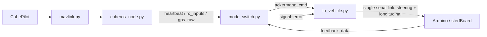
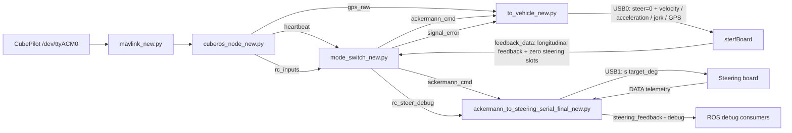
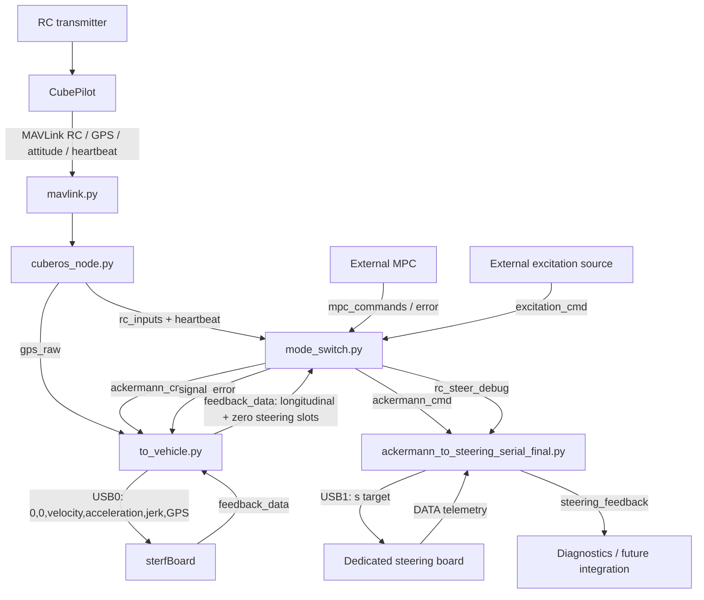

# RO2 NODES REPORT — Complete Comparison Between the Original Code and the New Architecture

This document provides a complete technical description of the supplied ROS 2 / MAVLink / serial-control codebase and a file-by-file comparison between the original implementation and the files marked with the `_new` suffix.

---

## Navigation

### Quick navigation

- [Purpose and analyzed files](#section-1)
- [Main architectural change](#section-3)
- [ROS 2 topic map](#section-4)
- [Serial interfaces](#section-5)
- [`mavlink_classes.py` comparison](#section-6)
- [`mavlink.py` comparison](#section-7)
- [`cuberos_node.py` comparison](#section-8)
- [`mode_switch.py` comparison](#section-9)
- [Manual steering redesign](#section-10)
- [`to_vehicle.py` comparison](#section-15)
- [New dedicated steering node](#section-27)
- [Complete MANUAL / ACRO / LOITER flows](#section-35)
- [Safety chain](#section-38)
- [Important steering-feedback integration note](#section-39)
- [Frequency, unit and limit changes](#section-40)
- [Robustness and diagnostics improvements](#section-42)
- [Old → new summary table](#section-44)
- [Startup commands](#section-46)
- [Validation checklist](#section-47)
- [Known limitations / points to verify](#section-48)
- [Conclusion](#section-49)
- [Textual diff statistics](#section-50)

### Full table of contents

#### System overview
1. [Purpose of this document](#section-1)
2. [Files analyzed](#section-2)
3. [Summary of the main architectural change](#section-3)
4. [ROS 2 topic map in the new architecture](#section-4)
5. [Serial interfaces](#section-5)

#### MAVLink and CubePilot layer
6. [`mavlink_classes.py` / `mavlink_classes_new.py`](#section-6)
7. [`mavlink.py` → `mavlink_new.py`](#section-7)
8. [`cuberos_node.py` → `cuberos_node_new.py`](#section-8)

#### Mode switching, manual control and safety
9. [`mode_switch(1).py` → `mode_switch(1)_new.py`](#section-9)
10. [Fundamental change to manual steering control](#section-10)
11. [Manual speed-control change](#section-11)
12. [Manual-target alignment](#section-12)
13. [RC logging added in `mode_switch_new`](#section-13)
14. [`mode_switch` modes and safety logic](#section-14)

#### sterfBoard / longitudinal channel
15. [`to_vehicle(1).py` → `to_vehicle(1)_new.py`](#section-15)
16. [New purpose of `to_vehicle_new`: longitudinal control only](#section-16)
17. [`to_vehicle_new` serial port and timeout](#section-17)
18. [`to_vehicle` serial read frequency](#section-18)
19. [Heartbeat: `threading.Timer` → ROS timer](#section-19)
20. [More robust safety callback](#section-20)
21. [Serial write: newline, lock and reduced log flooding](#section-21)
22. [New `sterf_debug_*.csv` logging](#section-22)
23. [New sterfBoard serial-read handling](#section-23)
24. [Changed meaning of `feedback_data`](#section-24)
25. [`to_vehicle_new` cleanup](#section-25)
26. [CAN path in `to_vehicle`](#section-26)

#### New dedicated steering channel
27. [`ackermann_to_steering_serial_final_new.py` — new file](#section-27)
28. [Steering-node initialization](#section-28)
29. [Steering-node subscribers](#section-29)
30. [`steering_feedback` publisher](#section-30)
31. [Steering-node `ackermann_callback()`](#section-31)
32. [Steering-board telemetry reading](#section-32)
33. [`steering_test_log_*.csv`](#section-33)
34. [Steering-node shutdown](#section-34)

#### End-to-end behavior
35. [Complete MANUAL flow](#section-35)
36. [Complete ACRO flow](#section-36)
37. [Complete LOITER flow](#section-37)
38. [Safety chain](#section-38)
39. [Important integration note: steering feedback](#section-39)

#### Global comparison and validation
40. [Frequency changes](#section-40)
41. [Unit and limit changes](#section-41)
42. [Robustness and diagnostic improvements](#section-42)
43. [Purely structural / non-functional differences](#section-43)
44. [Old → new summary by file](#section-44)
45. [Most important changes ranked by impact](#section-45)
46. [Startup commands](#section-46)
47. [Expected-behavior validation checklist](#section-47)
48. [Known limitations / points to keep in mind](#section-48)
49. [Conclusion](#section-49)
50. [Appendix — textual diff statistics](#section-50)

---

<a id="section-1"></a>
# 1. Purpose of this document

This README documents in detail how the supplied Python/ROS 2 scripts work and compares each original file with its new counterpart.

The goal is not merely to list changed lines. The document explains:

- the role of every file in the system;
- the complete data flow between CubePilot, ROS 2, `mode_switch`, sterfBoard and the dedicated steering board;
- the purpose of classes, callbacks, timers, ROS topics and serial protocols;
- every significant functional and configuration change introduced in the new versions;
- bug fixes present in the new implementation;
- changes to units, frequencies, serial ports, safety handling and logging;
- the completely new file `ackermann_to_steering_serial_final_new.py`, which has no direct counterpart in the original set;
- integration consequences that become visible only when the new files are analyzed as one complete system.

---

<a id="section-2"></a>
# 2. Files analyzed

- `mavlink_classes.py`
- `mavlink.py`
- `cuberos_node.py`
- `mode_switch.py`
- `to_vehicle.py`
- `ackermann_to_steering_serial_final.py` **(completely new file)**

---

<a id="section-3"></a>
# 3. Summary of the main architectural change

The most important change is the transition from a largely **single-serial-channel vehicle command architecture** to a **two-USB architecture** in which longitudinal control and steering control are separated.

## Original architecture

In the original system, `mode_switch` generated one ROS `AckermannDrive` message on `ackermann_cmd`. `to_vehicle` received that message and forwarded all six relevant command values to the same serial board:

1. steering angle;
2. steering angle velocity;
3. velocity;
4. acceleration;
5. jerk;
6. GPS speed.

Therefore one serial connection handled both **steering** and **longitudinal control**.



## New architecture

In the new architecture, `ackermann_cmd` is consumed by two different nodes, this mainly was done to reduce the jitter present on the steering wheel while we were testing, we noticed that separating into 2 different separated logic result in a jitter reduction. We still think that if we add a i2c noise reduction in the new board we will be able to go back to the single node configuration. The different nodes are:

- `to_vehicle.py` keeps the old sterfBoard interface and longitudinal/safety behavior, but forces both steering-related fields sent to sterfBoard to zero;
- `ackermann_to_steering_serial_final.py` receives the same `ackermann_cmd` and sends the steering target to a separate steering controller.

The intended hardware split is therefore **(using the JETSON will results in a different setting that will be automatically controlled by terminal, so no change to the nodes needs to be made)**:

- `/dev/ttyUSB0` → sterfBoard / longitudinal control and legacy-compatible safety;
- `/dev/ttyUSB1` → dedicated steering board;
- `/dev/ttyACM0` → CubePilot.



This steering/longitudinal split is the central design change around which most of the other modifications make sense.

---

<a id="section-4"></a>
# 4. ROS 2 topic map in the new architecture

| Topic | Message type | Main publisher | Main subscribers | Purpose |
|---|---|---|---|---|
| `gps` | `gps_msgs/GPSFix` | `cuberos_node.py` | none in supplied files | Global position derived from `GLOBAL_POSITION_INT` |
| `gps_raw` | `gps_msgs/GPSFix` | `cuberos_node.py` | `to_vehicle.py` | Raw GPS data, including speed used in the serial command packet |
| `rc_inputs` | `cuberos/RCIn` | `cuberos_node.py` | `mode_switch.py` | RC inputs scaled approximately to `[-1000, 1000]` |
| `imu_attitude` | `sensor_msgs/Imu` | `cuberos_node.py` | none in supplied files | Accelerations, attitude and angular rates |
| `heartbeat` | `cuberos/Heartbeat` | `cuberos_node.py` | `mode_switch.py` | Flight mode, arm state and MAVLink vehicle information |
| `mode` | `std_msgs/String` | `mode_switch.py` | none in supplied files | Republishes the current flight mode |
| `mpc_commands` | `ackermann_msgs/AckermannDrive` | external | `mode_switch.py` | MPC command in `ACRO` mode |
| `mpc_error_state` | `std_msgs/Bool` | external | `mode_switch.py` | MPC failure flag |
| `excitation_cmd` | `ackermann_msgs/AckermannDrive` | external | `mode_switch.py` | Excitation command in `LOITER` mode |
| `ackermann_cmd` | `ackermann_msgs/AckermannDrive` | `mode_switch.py` | `to_vehicle.py`, `ackermann_to_steering_serial_final.py` | Shared command subsequently split into longitudinal and steering paths |
| `signal_error` | `diagnostic_msgs/KeyValue` | `mode_switch.py` | `to_vehicle.py` | Safety state: 0 disarmed, 1 armed/valid, 2 armed/error |
| `feedback_data` | `std_msgs/Float32MultiArray` | `to_vehicle.py` | `mode_switch.py` | Legacy-compatible feedback; steering slots are forced to zero in the new implementation |
| `rc_steer_debug` | `std_msgs/Float32MultiArray` | `mode_switch.py` | `ackermann_to_steering_serial_final.py` | RC debug: raw steering, raw speed, target rate and target angle |
| `steering_feedback` | `std_msgs/Float32MultiArray` | `ackermann_to_steering_serial_final.py` | none in supplied files | Dedicated steering-board telemetry, intentionally separate from `feedback_data` |

---

<a id="section-5"></a>
# 5. Serial interfaces

## Original configuration

The original configuration is not completely uniform between constructor defaults and the values used in `main`:

- `mavlink.py` / `cuberos_node.py`: CubePilot on `/dev/ttyACM1`;
- `to_vehicle.py`: constructor default `/dev/ttyACM2`;
- `to_vehicle.py` in `main`: actual configured port `/dev/ttyTHS1`.

## New configuration

- CubePilot: `/dev/ttyACM0`, 115200 baud;
- sterfBoard / longitudinal Arduino: `/dev/ttyUSB0`, 115200 baud;
- dedicated steering board: `/dev/ttyUSB1`, 115200 baud.

Both `to_vehicle` and the new steering node also allow the serial port to be overridden through the first command-line argument.

---

<a id="section-6"></a>
# 6. `mavlink_classes.py`

## 6.1 File role

This module contains helper classes that convert incoming `pymavlink` messages into simpler Python objects used by the rest of the application.

It does not open serial ports and does not publish ROS topics. Its responsibility is strictly to **interpret, convert and store MAVLink telemetry**.

## 6.2 Functions

### `println(statement)`

Printing helper. When the file is executed directly it prints the message as-is; when imported it prefixes the module name.

### `calc_yaw(q)`

Computes yaw from a quaternion `q = [w, x, y, z]` using `atan2`.

It is used by the `ODOMETRY` helper through `get_yaw()`.

## 6.3 Classes

### `HEARTBEAT`

Extracts:

- flight mode through `mavutil.mode_string_v10`;
- MAV type;
- `base_mode`;
- arm state through `MAV_MODE_FLAG_SAFETY_ARMED`;
- autopilot type.

### `ATTITUDE`

Stores:

- `roll`;
- `pitch`;
- `yaw`;
- `rollspeed`;
- `pitchspeed`;
- `yawspeed`;
- a derived `dip` value computed from pitch and roll.

### `GPS_RAW_INT`

Converts raw GPS data into directly usable units:

- latitude/longitude from integer `1e7` scaling to degrees;
- altitude from millimeters to meters;
- `eph`, `epv`, velocity and course over ground;
- number of visible satellites;
- horizontal, vertical, velocity and heading accuracy when available;
- GPS yaw when available.

It also contains a `fix_type -> status` conversion map compatible with the ROS GPS status representation used later.

### `GPS_RTK`

Stores RTK rate, satellite count and base accuracy information.

### `VFR_HUD`

Stores ground speed, heading and climb rate.

### `GLOBAL_POSITION_INT`

Converts global position and velocity values:

- latitude/longitude to degrees;
- altitude to meters;
- `vx/vy/vz` from cm/s to m/s;
- heading to degrees.

### `HOME_POSITION`

Stores home coordinates, altitude, local `x/y/z` coordinates and quaternion information.

### `SCALED_IMU`

Converts acceleration values to m/s² and stores gyroscope and magnetometer data.

### `RC_CHANNELS_RAW`

Stores the first five raw RC channels, RSSI and an approximate dBm conversion.

### `RC_CHANNELS_SCALED`

Helper for already-scaled RC messages. Present in the module but not used by the main supplied data path.

### `HIGHRES_IMU`

Container for high-resolution IMU data, including pressure and temperature. Not used by the main supplied flow.

### `UTM_GLOBAL_POSITION`

Container for UTM global-position messages. Not used by the main supplied flow.

### `GPS_STATUS`

Stores satellite-by-satellite data such as PRN, used state, elevation, azimuth and SNR.

### `ODOMETRY`

Stores pose, velocity, quaternion, covariance, quality and estimator type.

Additional methods:

- `get_yaw()` → computes yaw from the quaternion;
- `get_abs_vel()` → returns the magnitude of the 3D velocity vector.

### `LOCAL_POSITION_NED`

Stores local NED position and velocity.

## 6.4 Old → new differences

**None.**

---

<a id="section-7"></a>
# 7. `mavlink.py`

## 7.1 File role

`mavlink.py` is the direct CubePilot communication layer built on `pymavlink`.

`CubeSerial`:

1. opens the MAVLink connection;
2. waits for the first heartbeat;
3. receives selected MAVLink messages;
4. converts them through `mavlink_classes.py`;
5. stores the latest received object in attributes such as `heartbeat`, `gps_raw_int`, `attitude`, `rc` and `imu`.

## 7.2 `probably_vehicle_heartbeat(msg)`

Filters heartbeat messages that do not represent the main vehicle. It excludes:

- gimbal components;
- GCS;
- gimbal vehicle types;
- ADS-B;
- onboard controllers;
- invalid autopilots.

## 7.3 `CubeSerial.__init__`

### Original version

After `wait_heartbeat()`, the object initializes message storage and nominal frequencies:

- GPS raw: 10 Hz;
- global position: 10 Hz;
- RC: 20 Hz;
- IMU: 20 Hz.

However, it does not automatically send a MAVLink request that forces `RC_CHANNELS` to the configured 20 Hz.

### New version

Immediately after the first heartbeat:

```text
rc_freq = 50 Hz
set_message_interval(65, rc_freq)
```

MAVLink message ID 65 is `RC_CHANNELS`.

**Effect:** CubePilot is explicitly asked to transmit RC input at 50 Hz.

## 7.4 Fix to `set_message_interval()`

This is a significant functional correction.

### Original code

The old call to `command_long_send` placed:

- `MAV_CMD_SET_MESSAGE_INTERVAL`;
- then `message_id`;
- then `interval_us`.

The `confirmation` argument required by `COMMAND_LONG` was missing, so the following arguments were shifted relative to the expected MAVLink signature.

### New code

The new implementation explicitly passes:

```text
confirmation = 0
param1 = message_id
param2 = interval_us
```

This makes the command consistent with the expected `COMMAND_LONG` argument layout.

## 7.5 MAVLink reception: blocking → non-blocking

### Original

```text
recv_match(..., blocking=True)
```

The callback could block while waiting for the next MAVLink message.

### New

```text
recv_match(..., blocking=False)
```

When no message is available, the function immediately returns `None`.

**ROS impact:** `cuberos_node` calls `get_messages()` using a very fast timer. Non-blocking reception prevents this timer callback from holding the ROS executor while waiting for serial data.

## 7.6 CubePilot port in standalone execution

- original: `/dev/ttyACM1`;
- new: `/dev/ttyACM0`.

The same port change appears in `cuberos_node.py`.

## 7.7 Standalone mode-print fix

### Original

```text
cube.mode
```

`CubeSerial` does not define a direct `mode` attribute.

### New

```text
cube.heartbeat.mode
```

The flight mode is correctly read from the stored `HEARTBEAT` helper object.


## 7.8 Behavior left unchanged

The mapping from MAVLink message type to helper class remains essentially unchanged.

Two pre-existing inconsistencies also remain:

- `VFR_HUD` exists in `message_actions`, but `VFR_HUD` is not included in the normal `recv_match` type list;
- `GPS_STATUS` is included in the `recv_match` type list, but there is no `message_actions` entry assigning it to `self.gps_status`.

Therefore, with the supplied implementation, those two values are not populated through the normal `get_messages()` flow.

---

<a id="section-8"></a>
# 8. `cuberos_node.py` 

## 8.1 File role

This node bridges the MAVLink layer and ROS 2.

It creates a `CubeSerial` object, continuously retrieves CubePilot data and republishes it as ROS messages.

## 8.2 Publishers

### `gps`

Publishes `GPSFix` from `GLOBAL_POSITION_INT`, including:

- latitude;
- longitude;
- altitude;
- heading/track.

### `gps_raw`

Publishes `GPSFix` from `GPS_RAW_INT`, including:

- fix status;
- coordinates;
- visible satellites;
- HDOP/VDOP;
- ground speed;
- course over ground;
- position, track and speed accuracy;
- pitch/roll/dip when attitude data is available.

### `rc_inputs`

Converts raw RC channels from approximately `[1102, 1928]` to `[-1000, 1000]` using `numpy.interp`, then publishes `RCIn`.

### `imu_attitude`

Combines:

- acceleration from scaled IMU;
- roll/pitch/yaw converted to quaternion;
- angular rates from `ATTITUDE`.

### `heartbeat`

Publishes:

- flight mode;
- MAV type;
- base mode;
- arm state;
- autopilot type.

## 8.3 Timers

- MAVLink read: every `0.0001 s`;
- global GPS: `1 / global_position_int_freq`;
- raw GPS: `1 / gps_raw_int_freq`;
- RC: `1 / rc_freq`;
- IMU: `1 / imu_freq`;
- heartbeat: 1 Hz.

## 8.4 Direct old → new difference

Only one direct functional line changes:

- original: `CubeSerial('/dev/ttyACM1', 115200)`;
- new: `CubeSerial('/dev/ttyACM0', 115200)`.

Everything else in the file remains unchanged.

## 8.5 Indirect differences caused by `mavlink_new.py`

Even though this file barely changes directly, its runtime behavior changes because the `CubeSerial` implementation is different:

1. `self.cube.rc_freq` changes from 20 Hz to 50 Hz;
2. therefore `timer_rc` automatically changes from a 50 ms period to a 20 ms period;
3. `get_messages()` becomes non-blocking;
4. ROS timer execution is less likely to be delayed by waiting for MAVLink serial traffic.

---

<a id="section-9"></a>
# 9. `mode_switch.py` 

## 9.1 File role

`mode_switch` is the central command-selection and safety node.

It receives:

- flight mode and arm state from CubePilot;
- RC input;
- vehicle feedback;
- MPC commands;
- MPC error state;
- excitation commands.

It publishes:

- `ackermann_cmd`;
- `mode`;
- `signal_error`;
- and, in the new version, `rc_steer_debug`.

Three operating modes are supported:

- `MANUAL` → RC control;
- `ACRO` → MPC control;
- `LOITER` → excitation-command control.

## 9.2 `JIMNY` class: parameter and unit changes

### Maximum/minimum velocity

#### Original

```text
max_velocity = 10.0   # km/h
min_velocity = -10.0  # km/h
```

#### New

```text
max_velocity = 15.0 / 3.6   # approximately +4.17 m/s
min_velocity = -10.0 / 3.6  # approximately -2.78 m/s
```

This introduces two changes at once:

1. internal velocity is explicitly expressed in **m/s**;
2. the forward limit increases from 10 km/h to 15 km/h, while the reverse limit remains equivalent to -10 km/h.

### Maximum acceleration

- original: `3.0 m/s²`;
- new: `1.5 m/s²`.

## 9.3 `set_des_velocity(dt)`: full conversion to m/s

### Original behavior

The old implementation:

- integrated acceleration;
- multiplied by `3.6` to convert to km/h;
- quantized with `floor` to 0.1 steps;
- applied the `0.95` return/decay factor;
- quantized again.

### New behavior

```text
des_velocity = des_velocity + des_acceleration * dt
```

The code then applies the `0.95` decay factor and min/max limits.

Removed elements:

- the `3.6` conversion factor;
- 0.1-step quantization;
- the velocity `floor` operations.

The result is a continuous value that remains consistent in m/s.

## 9.4 Bug fix in `set_des_steering_angle(dt)`

### Original

```text
if self.set_des_steering_angle != 0:
```

`self.set_des_steering_angle` is the method object itself, not the current steering target. The condition is therefore logically incorrect.

### New

```text
if self.des_steering_angle != 0:
```

The steering return/decay operation now correctly depends on the target value.

## 9.5 Initialization of `mpc_started`

The original code uses `self.mpc_started` in callbacks without explicitly initializing it in the constructor.

The new version adds:

```text
self.mpc_started = False
```

The MPC state is therefore valid and deterministic from node startup.

## 9.6 New `rc_steer_debug` publisher

The new version publishes a `Float32MultiArray` containing:

| Index | Value |
|---:|---|
| 0 | raw RC steering value |
| 1 | raw RC speed value |
| 2 | steering target rate in deg/s |
| 3 | integrated steering target angle in deg |

The dedicated steering node subscribes to this topic for diagnostics and CSV correlation. It is not the command path to the steering board.

---

<a id="section-10"></a>
# 10. Fundamental change to manual steering control

This is one of the most significant behavioral changes in the entire project.

## 10.1 Original logic: stick → absolute position

In the old `_rc_callback`:

1. `channels[3]` is interpolated directly from `[-1000, 1000]` to `[-30°, +30°]` wheel angle;
2. that value is multiplied by `steer_ratio = 14`;
3. the final steering-wheel target is therefore approximately `[-420°, +420°]`;
4. moving the RC stick back to center immediately commands a target near 0°.

The RC-stick position therefore directly represents the **absolute steering position target**.

## 10.2 New logic: stick → steering rate → integrated target

The new version introduces:

```text
RC_RATE_SCALE = 60 deg/s
RC_STICK_DEADBAND = 70
RC_TARGET_LIMIT ≈ 420 deg
```

The control sequence is:

1. compute `dt` since the previous RC message;
2. clamp `dt` to a maximum of `0.05 s`;
3. set the stick to zero when `|stick| < 70`;
4. map the stick to a target rate in `[-60, +60] deg/s`;
5. integrate that rate:
   `manual_target += target_rate * dt`;
6. clamp the integrated target to approximately `[-420°, +420°]`;
7. publish both target angle and target rate in `AckermannDrive`.

### Practical consequence

When the RC stick returns to center:

- `target_rate = 0`;
- the target **remains at the reached angle**;
- steering does not automatically return to zero because the stick is centered.

The manual RC interface therefore behaves like a **steering-velocity command** rather than an absolute-position command.

---

<a id="section-11"></a>
# 11. Manual speed-control change

## Original

The speed channel was mapped symmetrically:

```text
[-1000, +1000] -> [-max_velocity, +max_velocity]
```

with `max_velocity = 10` documented as km/h.

## New

The mapping is:

```text
[-1000, +1000] -> [min_velocity, max_velocity]
```

which corresponds approximately to:

```text
[-2.78 m/s, +4.17 m/s]
```

Additional changes:

- the speed is rounded to two decimal places instead of one;
- the unit is now consistent with the `AckermannDrive.speed` usage in the rest of the new implementation;
- forward and reverse limits can be asymmetric.

---

<a id="section-12"></a>
# 12. Manual-target alignment

The new version adds the state variables:

- `_manual_target_angle`;
- `_last_rc_time`;
- `_steering_angle_fb`.

The manual target is aligned to the current steering feedback:

- when the flight mode changes;
- when the arm/disarm state changes;
- when RC messages arrive while the vehicle is disarmed.

The intended purpose is to avoid a sudden target jump when entering manual control while the steering mechanism is not at zero.

> **Important:** see [Section 39](#section-39). In the supplied two-USB architecture, the steering value read by this alignment path still comes from `feedback_data`, while `to_vehicle` intentionally writes zero into the steering slots of that message.

---

<a id="section-13"></a>
# 13. RC logging added in `mode_switch_new`

The new node prints, at most every 0.10 s:

- raw steering input;
- steering target rate;
- integrated manual steering target;
- velocity in m/s.

Rate limiting the log to roughly 10 Hz prevents terminal flooding while still providing useful live diagnostics.

The same RC state is also published on `rc_steer_debug` for the dedicated steering logger.

---

<a id="section-14"></a>
# 14. `mode_switch` modes and safety logic

## `MANUAL`

Requires:

- `mode == 'MANUAL'`;
- `armed == True`.

The new implementation generates the integrated steering target, steering target rate and manual velocity.

## `ACRO`

Receives `mpc_commands`.

Before the first MPC command is accepted, it requires:

- feedback velocity within `MPC_VEL_TOLERANCE = 0.1 m/s`;
- steering feedback within `MPC_STEER_TOLERANCE = 5°`.

After a successful start, `mpc_started` prevents that initial-neutral-state gate from being applied repeatedly to every subsequent MPC message.

## `LOITER`

Forwards `excitation_cmd` when the vehicle is armed and the active mode is `LOITER`.

## Heartbeat watchdog

A timer runs every 0.2 s and checks how long it has been since the last CubePilot heartbeat.

Timeout: 2 s.

When exceeded:

- `signal_error = True`;
- the error message becomes `Lost cube connection! No heartbeat received`.

## Disarmed behavior

Every 0.2 s, if the mode is known and the vehicle is not armed, the node publishes an all-zero `AckermannDrive` command.

## `signal_error`

Published every 0.1 s as `diagnostic_msgs/KeyValue`:

- key `0` → disarmed;
- key `1` → armed and command valid;
- key `2` → armed but command invalid/error.

---

<a id="section-15"></a>
# 15. `to_vehicle.py` 

## 15.1 Original role

The original `to_vehicle` node received `ackermann_cmd`, appended GPS speed and sent a six-value serial packet:

```text
<steering_angle,steering_angle_velocity,velocity,acceleration,jerk,GPS_speed>
```

It also read four feedback values from the board:

```text
velocity_ctrl
velocity_fb
steering_rate_ctrl
steering_angle_fb
```

and published them on `feedback_data`.

The node also received `signal_error` and periodically forwarded the safety state to the board as a heartbeat/status command.

---

<a id="section-16"></a>
# 16. New purpose of `to_vehicle`: longitudinal control only on sterfBoard

The new file explicitly documents the migration to a **two-USB architecture**.

It preserves the legacy packet structure and safety/topic behavior as much as possible, but disables steering commands on the sterfBoard path.

## Fundamental change in `ackermann_callback`

### Original

```text
steering_angle = msg.steering_angle
steering_angle_velocity = msg.steering_angle_velocity
```

### New

```text
steering_angle = 0.0
steering_angle_velocity = 0.0
```

The remaining fields continue to come from the ROS command or GPS:

- speed;
- acceleration;
- jerk;
- GPS speed.

Therefore the packet remains a six-field packet but becomes:

```text
<0.0,0.0,velocity,acceleration,jerk,GPS_speed>
```

**Purpose:** sterfBoard must no longer command steering because steering is now controlled through the second USB connection and the dedicated steering node.

---

<a id="section-17"></a>
# 17. `to_vehicle` serial port and timeout

## Port

- original constructor default: `/dev/ttyACM2`;
- original `main`: `/dev/ttyTHS1`;
- new constructor default and `main`: `/dev/ttyUSB0`.

The new `main` can also use `argv[1]` to override the port.

## Timeout

- original serial timeout: `1 s`;
- new serial timeout: `0.02 s`.

The shorter timeout is consistent with the much faster read loop and reduces the possibility of holding a ROS callback for a long period while waiting on serial I/O.

---

<a id="section-18"></a>
# 18. `to_vehicle` serial read frequency

- original: one timer callback every `0.2 s` → approximately 5 Hz;
- new: one timer callback every `0.02 s` → 50 Hz.

The new `read_from_serial_port()` also uses:

```text
while self.serial_connection.in_waiting > 0:
```

so it drains all currently available serial lines rather than reading only one line per callback.

This significantly improves responsiveness and makes it possible to handle both operational feedback and higher-rate debug telemetry on the same link.

---

<a id="section-19"></a>
# 19. Heartbeat: `threading.Timer` → ROS timer

## Original

The old implementation used a `threading.Timer` and created/restarted another timer after each heartbeat send.

## New

The new implementation uses:

```text
create_timer(0.2, send_heartbeat)
```

Benefits:

- the heartbeat lifecycle is managed by ROS 2;
- no recursively recreated timer threads;
- simpler and safer shutdown behavior;
- timing is integrated with the node executor.

The heartbeat period remains unchanged at 0.2 s, or 5 Hz.

---

<a id="section-20"></a>
# 20. More robust safety callback

## Original

If `signal_error.key` was not `0`, `1` or `2`, the node executed an `assert`.

An unexpected key could therefore terminate the node.

## New

If the key is invalid:

```text
ack_signal_flag = 2
return
```

An unexpected safety message is converted into a fail-safe error state instead of crashing the process.

This is a clear robustness improvement because malformed or unexpected diagnostic input now results in the safest existing state.

---

<a id="section-21"></a>
# 21. Serial write: newline, lock and reduced log flooding

## Original

The serial frame was written as:

```text
<...>
```

without the new version's explicit newline handling, and the node produced very frequent logging around serial traffic.

## New

The write helper builds:

```text
<...>\n
```

and performs `write()` while holding `serial_lock`.

The new implementation also removes per-packet log spam. Instead, `ackermann_callback` emits a summarized command log at most every 0.1 s.

The combination of a lock, clear line framing and rate-limited logging makes the serial path easier to operate and debug under higher update rates.

---

<a id="section-22"></a>
# 22. New `sterf_debug_*.csv` logging

`to_vehicle` automatically creates:

```text
sterf_debug_YYYYMMDD_HHMMSS.csv
```

The file stores debug fields received from serial lines beginning with `DBG,...`, including values such as:

- heartbeat signal;
- checked mode;
- serial-heartbeat state;
- missing ACK / ACK age;
- received steering command and steering rate;
- target-jump status;
- CAN steering command/rate;
- steering feedback and steering-rate feedback;
- alive states of subsystems;
- serial and CAN counters.

`DBG_HEADER,...` lines are ignored because the Python node creates its own CSV header locally.

This logging path allows low-level sterfBoard behavior to be analyzed after a run without flooding ROS console output. **CAN BE REMOVED**

---

<a id="section-23"></a>
# 23. New sterfBoard serial-read handling

## Original

The old implementation:

- read at most one serial line per callback;
- decoded UTF-8 without `errors='ignore'`;
- immediately attempted to parse the normal `<...>` feedback format;
- logged received serial lines very frequently.

## New

The new implementation:

- reads every line currently available in the serial buffer;
- ignores undecodable bytes;
- skips empty lines;
- ignores `DBG_HEADER` lines;
- stores `DBG,...` lines in the CSV logger;
- ignores lines that do not begin with `<` for normal feedback parsing;
- sends only compatible operational packets to `parse_serial_data()`.

The serial channel can therefore carry both normal vehicle feedback and diagnostic telemetry at the same time.

---

<a id="section-24"></a>
# 24. Changed meaning of `feedback_data`

This is a critical compatibility detail.

## Original

`feedback_data` contained:

```text
[0] velocity_ctrl
[1] velocity_fb
[2] steering_rate_ctrl
[3] steering_angle_fb
```

## New

The serial parser still expects a four-field feedback packet, but the ROS publisher uses only the first two values and publishes:

```text
[velocity_ctrl, velocity_fb, 0.0, 0.0]
```

Therefore:

- the four-element shape is intentionally preserved for compatibility;
- the steering fields are deliberately neutralized;
- the existing `mode_switch` code can still access the expected indices without an out-of-range error;
- real steering feedback is no longer conveyed by `feedback_data` in this minimal two-USB split.

This design is consistent with removing steering responsibility from sterfBoard, but it has consequences for safety and MPC neutral-steering checks discussed in [Section 39](#section-39).

---

<a id="section-25"></a>
# 25. `to_vehicle` cleanup

When the new node is destroyed it:

1. flushes and closes the sterfBoard debug CSV;
2. closes the serial port;
3. calls `super().destroy_node()`.

The old implementation mainly dealt with canceling the heartbeat `threading.Timer`.

The new `main()` is also more defensive:

- it verifies that `node` exists before using it in `finally`;
- it preserves the emergency/exit `E` send behavior on `KeyboardInterrupt`;
- it supports selecting the serial port from the command line.

---

<a id="section-26"></a>
# 26. CAN path in `to_vehicle`

The CAN path is essentially unchanged:

- values are multiplied by 1000;
- arbitration ID is `0x123`;
- ten theoretical payload bytes are built;
- only `can_data[:8]` is passed to the CAN message.

Therefore the final two constructed bytes are still not transmitted. In the current field ordering, that means the jerk data does not fully enter the transmitted CAN frame.

This behavior already existed in the original code and is not corrected by the new version.

---

<a id="section-27"></a>
# 27. `ackermann_to_steering_serial_final.py` — completely new file

## 27.1 Why this file exists

This new component completes the two-USB architecture.

Previously, `to_vehicle` forwarded steering together with the other vehicle commands. In the new design, `to_vehicle_new` sets steering fields to zero, so a separate node is required to:

1. receive `ackermann_cmd`;
2. extract the steering target;
3. send that target to a dedicated steering controller;
4. read steering-board telemetry;
5. publish dedicated steering debug feedback;
6. record detailed test and control data to CSV.

This file has no direct old counterpart in the supplied codebase.

---

<a id="section-28"></a>
# 28. Steering-node initialization

Class:

```text
AckermannToSteeringSerial
```

Defaults:

- serial port `/dev/ttyUSB1`;
- baud rate `115200`;
- serial timeout `0.02 s`.

After opening the port, the node waits 2 seconds for the steering controller to initialize.

It then sends:

1. `d` → disable;
2. waits 0.1 s;
3. `e` → enable.

The code comments state that this reproduces the behavior of the previous known working steering setup.

The node also initializes state for:

- last transmitted steering target and send time;
- latest `AckermannDrive` command fields;
- RC debug values;
- telemetry received from the steering firmware;
- CSV logging.

---

<a id="section-29"></a>
# 29. Steering-node subscribers

## `ackermann_cmd`

Receives the real command produced by `mode_switch`.

The node stores, for command output and logging:

- steering target;
- steering rate;
- speed;
- acceleration;
- jerk.

Only the steering target is directly encoded into the serial steering command, while the other command values are retained in the test log for correlation.

## `rc_steer_debug`

Receives the four debug values produced by `mode_switch_new`:

- raw steering stick;
- raw speed stick;
- steering target rate;
- integrated manual steering target.

These values do **not** directly control the steering board. They are used to correlate the operator's RC input with the ROS command and the actual hardware response.

---

<a id="section-30"></a>
# 30. `steering_feedback` publisher

The node publishes a `Float32MultiArray` on `steering_feedback`.

The array contains:

| Index | Value |
|---:|---|
| 0 | measured steering angle |
| 1 | target angle reported by the steering board |
| 2 | target-to-measurement error |
| 3 | PID enabled flag |
| 4 | `Va` output |
| 5 | `Vb` output |
| 6 | `delta_v` |
| 7 | encoder/count value |
| 8 | invalid flag |

The source explicitly treats this as a **debug-only steering feedback topic** and intentionally keeps it separate from `feedback_data` so it cannot unexpectedly disturb the legacy `mode_switch` interface.

---

<a id="section-31"></a>
# 31. Steering-node `ackermann_callback()`

## Target clamp

The commanded steering target is clamped to:

```text
[-420°, +420°]
```

This matches the approximate steering-wheel range implied by:

```text
30° wheel angle × steering ratio 14 ≈ 420°
```

## Send condition

A serial command is sent when:

1. no target has ever been sent;
2. the target changed by at least `0.2°`; or
3. at least `0.02 s` have elapsed since the previous send **and a new `ackermann_cmd` message has entered the callback**.

The serial target protocol is:

```text
s<target_deg>\n
```

Example:

```text
s125.40
```

### Meaning of `min_target_step` and `min_send_period`

- `min_target_step = 0.2` avoids unnecessary transmissions for tiny target changes;
- `min_send_period = 0.02` permits refreshes at up to roughly 50 Hz when commands continue to arrive.

## Console logging

The node reports the sent steering target and commanded rate at most every 0.10 s, preventing high-rate command traffic from flooding the console.

---

<a id="section-32"></a>
# 32. Steering-board telemetry reading

The `read_serial` timer runs every `0.01 s`, corresponding to a 100 Hz polling schedule.

Lines beginning with `DATA,` are split into fields. When at least 18 fields are available, the node parses:

- board timestamp `t_ms`;
- raw target;
- slew-limited target;
- measured angle;
- control error;
- `delta_v`;
- `Va` / `Vb` outputs;
- encoder code A/B;
- count;
- PID enabled state;
- P term;
- I term;
- D term;
- ISR state/counter;
- invalid flag.

These values are used for both:

- the ROS `steering_feedback` message;
- the detailed steering CSV logger.

Other serial lines are printed in a rate-limited way. `INFO`, `WARN` and `ERR` prefixes are given particular visibility, while other raw lines are throttled to avoid spam.

---

<a id="section-33"></a>
# 33. `steering_test_log_*.csv`

The steering node creates:

```text
steering_test_log_YYYYMMDD_HHMMSS.csv
```

The `log_row` timer runs every `0.02 s`, or approximately 50 Hz.

Each row correlates three layers of the control chain. **CAN BE REMOVED**

### RC input

- raw steering;
- raw speed;
- steering target rate;
- integrated manual target.

### ROS `AckermannDrive` command

- steering target;
- steering target rate;
- speed;
- acceleration;
- jerk.

### Steering-board telemetry

- board target;
- slew-limited target;
- measured angle;
- error;
- control outputs;
- encoder state/count;
- PID state;
- P/I/D terms;
- ISR state;
- invalid flag.

This CSV is particularly useful for:

- steering controller tuning;
- dynamic-response analysis;
- detecting saturation or lag;
- comparing RC input against generated target;
- comparing ROS target against firmware target;
- comparing firmware target against measured steering angle.

---

<a id="section-34"></a>
# 34. Steering-node shutdown

During `destroy_node()` the node:

1. attempts to send `d` to disable the steering board;
2. flushes and closes the CSV file;
3. closes the serial connection;
4. destroys the ROS node.

`main()` also handles `KeyboardInterrupt` so that the process does not intentionally leave the serial connection open.

---

<a id="section-35"></a>
# 35. Complete MANUAL flow — new version

1. CubePilot transmits `RC_CHANNELS`.
2. `mavlink.py` explicitly requests `RC_CHANNELS` at 50 Hz.
3. `cuberos_node.py` scales the raw RC values and publishes `rc_inputs` at 50 Hz.
4. `mode_switch.py` receives the steering and speed channels.
5. A steering deadband of ±70 raw units is applied.
6. Steering-stick deflection is converted into a target rate up to approximately ±60 deg/s.
7. That rate is integrated over `dt` into `_manual_target_angle`.
8. The integrated target is clamped to approximately ±420°.
9. The speed channel is converted to approximately `[-2.78, +4.17] m/s`.
10. `mode_switch.py` publishes `ackermann_cmd` containing steering target, steering rate and speed.
11. `to_vehicle.py` receives the same message, sets steering angle and steering rate to zero, and sends only the longitudinal values to sterfBoard using the legacy six-field packet format.
12. `ackermann_to_steering_serial_final.py` receives `ackermann_cmd` independently and sends `s<angle>` to the dedicated steering board.
13. `mode_switch.py` publishes `rc_steer_debug` with RC input, target rate and integrated target.
14. The steering node correlates RC input, ROS command and hardware telemetry in `steering_test_log_*.csv`.
15. sterfBoard operational/debug telemetry is independently recorded by `to_vehicle_new` in `sterf_debug_*.csv`.

The result is one ROS command source with two independent hardware actuation paths.

---

<a id="section-36"></a>
# 36. Complete ACRO flow — new version

1. An external controller publishes `mpc_commands`.
2. `mode_switch_new` checks, before the first MPC start, that feedback indicates approximately zero vehicle speed and neutral steering.
3. If the gate passes, `mpc_started` is set to `True`.
4. Steering angle, steering rate, speed and acceleration are copied into the `JIMNY` desired state.
5. `mode_switch_new` publishes `ackermann_cmd`.
6. The command is split downstream:
   - `to_vehicle_new` sends longitudinal control to sterfBoard with steering fields forced to zero;
   - the dedicated steering node sends the steering target to `/dev/ttyUSB1`.
7. If the external MPC reports an invalid solution through `mpc_error_state`, `mode_switch_new` marks the signal as invalid and updates `signal_error`.

> The MPC-start neutral-steering gate depends on the steering feedback path discussed in [Section 39](#section-39).

---

<a id="section-37"></a>
# 37. Complete LOITER flow — new version

1. An external source publishes `excitation_cmd`.
2. `mode_switch_new` accepts it only when:
   - `mode == 'LOITER'`;
   - the vehicle is armed.
3. The complete `AckermannDrive` command is published on `ackermann_cmd`.
4. As in the other modes, downstream nodes split the command:
   - longitudinal values go to sterfBoard;
   - steering goes to the dedicated steering board.
5. When the mode or arm state does not satisfy the required condition, the excitation callback returns without forwarding the command.

---

<a id="section-38"></a>
# 38. Safety chain — new version

## `mode_switch` side

`mode_switch_new` determines the logical validity of the command and publishes `signal_error`:

- `0` → disarmed;
- `1` → armed + valid;
- `2` → armed + invalid/error.

Error conditions include cases such as:

- unsupported mode;
- lost CubePilot heartbeat;
- invalid feedback bounds;
- MPC solution failure;
- inability to start MPC because neutral conditions are not met.

## `to_vehicle` / sterfBoard side

`to_vehicle_new` subscribes to `signal_error` and forwards the state every 0.2 s through a serial heartbeat/status command:

```text
H,<flag>
```

The send helper wraps this command in the normal framed serial format with newline termination.

This preserves the old sterfBoard-side safety concept despite the new two-USB architecture.

## Steering-board side

`ackermann_to_steering_serial_final.py` does **not** directly subscribe to `signal_error`.

It receives steering only through `ackermann_cmd`. When the vehicle is disarmed and a mode is known, `mode_switch` periodically publishes an all-zero Ackermann command, so the steering target presented to downstream command consumers becomes zero.

However, the Python steering node itself does not implement a dedicated `signal_error` heartbeat or command-timeout watchdog. Safe behavior in the event of process or communication loss therefore also depends on steering-board firmware/hardware behavior and should be verified explicitly.

---

<a id="section-39"></a>
# 39. Important integration note: steering feedback in the new system

This is the most important integration point to understand when running the supplied new files together.

`mode_switch.py` still subscribes to `feedback_data` and interprets:

```text
velocity_fb = msg.data[1]
steering_angle_fb = msg.data[3]
```

It then uses `steering_angle_fb` for at least two important behaviors:

1. deciding whether the steering is close enough to neutral to allow the initial MPC start;
2. aligning `_manual_target_angle` to the perceived current steering position when mode or arm state changes.

However, `to_vehicle_new.py` intentionally publishes:

```text
[velocity_ctrl, velocity_fb, 0.0, 0.0]
```

Therefore `feedback_data[3]` is always zero in the minimal two-USB implementation supplied here.

At the same time, the **real steering-board measurement** is published by the new steering node on the separate topic:

```text
steering_feedback
```

but `mode_switch_new.py` does not subscribe to that topic.

### Consequences

With the supplied files exactly as written:

- `mode_switch` effectively sees steering feedback as 0° through `feedback_data`;
- the `MPC_STEER_TOLERANCE = 5°` portion of the MPC-start check is therefore automatically satisfied from the steering side as long as the four-element feedback message arrives;
- manual-target alignment on mode/arm changes aligns to zero rather than to the true steering-board angle;
- real steering angle, target error and PID state are visible on `steering_feedback`, but they are not currently part of the main `mode_switch` safety path.

### Why this appears intentional

Comments in the new code explicitly state that the dedicated `steering_feedback` topic is debug-only and must not disturb the legacy `feedback_data` contract. Therefore the separation itself appears deliberate.

### What must be decided at system level

If the project requires **actual steering position** to participate in:

- MPC-start gating;
- manual-target synchronization;
- steering out-of-bounds detection;
- safety decisions;

then a future integration step should route the dedicated steering measurement into the control/safety logic instead of relying on the zero-filled legacy steering slots.

This is not a cosmetic difference; it changes the meaning of the feedback used by `mode_switch`.

---

<a id="section-40"></a>
# 40. Frequency changes

| Function | Original | New | Effect |
|---|---:|---:|---|
| RC requested from CubePilot | nominal 20 Hz, no explicit request during init | 50 Hz with `MAV_CMD_SET_MESSAGE_INTERVAL` | Higher RC responsiveness |
| `rc_inputs` publication | timer derived from 20 Hz | timer derived from 50 Hz | 50 Hz publication |
| MAVLink `recv_match` | blocking | non-blocking | Lower risk of blocking ROS executor |
| `to_vehicle` serial read | 5 Hz | 50 Hz | Faster sterfBoard feedback/debug handling |
| sterfBoard safety heartbeat | 5 Hz | 5 Hz | Frequency unchanged; implementation changed |
| steering-board serial poll | not present | 100 Hz | New dedicated channel |
| steering CSV logging | not present | 50 Hz | New logging |
| `signal_error` publication | 10 Hz | 10 Hz | Unchanged |
| Cube heartbeat watchdog check | 5 Hz | 5 Hz | Unchanged |
| zero command while disarmed | 5 Hz | 5 Hz | Unchanged |

---

<a id="section-41"></a>
# 41. Unit and limit changes

| Quantity | Original | New |
|---|---|---|
| JIMNY forward velocity | `10` documented as km/h | `15/3.6 ≈ 4.17 m/s` |
| JIMNY reverse velocity | `-10` documented as km/h | `-10/3.6 ≈ -2.78 m/s` |
| JIMNY maximum acceleration | `3 m/s²` | `1.5 m/s²` |
| Manual steering control | absolute position | integrated rate |
| RC steering-rate command | not used in active original path | maximum approximately ±60 deg/s |
| RC steering deadband | no explicit deadband | ±70 raw units |
| Manual steering target | approximately ±420° through 30×14 conversion | explicit clip at approximately ±420° |
| Dedicated steering serial clamp | not applicable | ±420° |
| Manual speed rounding | 1 decimal | 2 decimals |

---

<a id="section-42"></a>
# 42. Robustness and diagnostic improvements

The new implementation introduces a broad set of operational improvements:

1. non-blocking MAVLink reception;
2. corrected `MAV_CMD_SET_MESSAGE_INTERVAL` argument placement;
3. explicit 50 Hz `RC_CHANNELS` request;
4. shorter 20 ms serial timeout on the USB nodes;
5. serial write lock in `to_vehicle_new`;
6. draining all available serial lines instead of only one per callback;
7. decode with `errors='ignore'` where appropriate;
8. dedicated parsing of serial debug lines;
9. sterfBoard CSV logging;
10. steering-board CSV logging;
11. rate-limited console logging;
12. replacement of a crash-producing safety `assert` with fail-safe state `2`;
13. explicit cleanup of CSV files and serial connections;
14. command-line serial-port override for the two USB nodes;
15. explicit initialization of `mpc_started`;
16. fix to the steering-target condition in `JIMNY`;
17. command-target clamping in the new steering node;
18. separation of steering telemetry from the legacy `feedback_data` topic;
19. use of ROS timers instead of recursively recreated `threading.Timer` heartbeat threads;
20. more complete command/telemetry correlation for offline testing and tuning.

---

<a id="section-43"></a>
# 43. Purely structural / non-functional differences

In addition to functional changes, the new files contain structural and documentation changes such as:

- removal of several old docstrings and explanatory comments in `mode_switch_new`;
- updated author header in `mode_switch_new` including `change by jacopo and nicholas`;
- reformatting of ROS calls across multiple lines;
- removal of obsolete comments and commented-out blocks;
- removal/reorganization of imports in `to_vehicle_new`;
- replacement of per-packet logging with rate-limited summaries;
- addition of a shebang to `to_vehicle_new`;
- explicit comments describing the two-USB architecture;
- explicit comments describing compatibility with the old `mode_switch` topic/feedback contract;
- more debug state variables required by the new CSV loggers.

These changes are not all behavioral by themselves, but they reflect the migration from a prototype-style single-board path to a more instrumented split architecture.

---

<a id="section-44"></a>
# 44. Old → new summary by file

| File comparison | Comparison status | Main change |
|---|---|---|
| `mavlink_classes.py` → `mavlink_classes.py` | identical | No changes |
| `mavlink.py` → `mavlink.py` | modified | RC at 50 Hz, corrected message-interval command, non-blocking receive, ACM0 |
| `cuberos_node.py` → `cuberos_node.py` | one direct functional line | CubePilot ACM1 → ACM0; indirectly RC 20 → 50 Hz |
| `mode_switch(1).py` → `mode_switch.py` | heavily modified | m/s consistency, bug fixes, rate-integrated manual steering, RC debug |
| `to_vehicle(1).py` → `to_vehiclew.py` | heavily modified | two-USB split, zero steering to sterfBoard, CSV/debug and serial robustness |
| `ackermann_to_steering_serial_final.py` | new file | dedicated steering serial command, telemetry and CSV logging |

---

<a id="section-45"></a>
# 45. Most important changes ranked by impact

## 1. Steering / longitudinal split

The central architecture change: one shared `ackermann_cmd` now feeds two independent serial actuation paths.

## 2. Manual steering changed from position to integrated rate

The RC stick no longer directly represents steering position. It represents the rate at which the steering target moves.

## 3. Velocity made consistent in m/s

The new code removes the previous km/h conversion behavior and keeps the desired velocity in SI units.

## 4. RC increased to 50 Hz

This improves manual input update rate and makes the integrated steering-rate behavior smoother and more predictable.

## 5. MAVLink receive made non-blocking

The ROS executor no longer needs to remain blocked waiting for the next CubePilot message.

## 6. `MAV_CMD_SET_MESSAGE_INTERVAL` corrected

The new call includes the missing `confirmation` position and correctly assigns message ID and interval parameters.

## 7. New hardware logging

Both sterfBoard and the dedicated steering controller now have dedicated CSV diagnostic data paths.

## 8. Better safety, lifecycle and shutdown behavior

Unexpected safety keys no longer crash the node, ROS timers replace recursive heartbeat threads, and serial/CSV resources are explicitly closed.

---

<a id="section-46"></a>
# 46. Startup commands consistent with the new files

**PRESENTED IN THE JETSON PART***

These commands assume the scripts are executed directly. In a fully installed ROS 2 package they can of course be replaced by ROS entry points or a launch file.

### Expected serial ownership

| Device | Intended node |
|---|---|
| `/dev/ttyACM0` | `cuberos_node.py` / `CubeSerial` |
| `/dev/ttyUSB0` | `to_vehicle.py` |
| `/dev/ttyUSB1` | `ackermann_to_steering_serial_final.py` |

Only one process should normally own each physical serial port at a time.

---

<a id="section-47"></a>
# 47. Expected-behavior validation checklist

Use this checklist to verify the complete new architecture.

1. `CubeSerial` receives a heartbeat from CubePilot on `/dev/ttyACM0`.
2. `rc_inputs` updates at approximately 50 Hz.
3. In armed `MANUAL`, `rc_steer_debug[2]` changes with steering-stick deflection.
4. `rc_steer_debug[3]` integrates over time instead of directly mirroring stick position.
5. Releasing the steering stick to center makes the target rate approach zero while the integrated target remains at its current value.
6. `ackermann_cmd.steering_angle` follows the integrated manual target.
7. `ackermann_cmd.steering_angle_velocity` follows the computed target rate.
8. `ackermann_cmd.speed` follows the asymmetric m/s speed mapping.
9. sterfBoard receives steering angle = `0.0` and steering rate = `0.0`.
10. sterfBoard still receives velocity, acceleration, jerk and GPS speed in the old six-field serial packet structure.
11. The dedicated steering board receives `s<target>` commands.
12. `feedback_data[0:2]` contains longitudinal feedback from sterfBoard.
13. `feedback_data[2:4]` is zero in the minimal two-USB implementation.
14. `steering_feedback` reports steering angle, target, error and PID-related status from the steering controller.
15. `sterf_debug_*.csv` is populated when sterfBoard emits `DBG,...` lines.
16. `steering_test_log_*.csv` is written at approximately 50 Hz.
17. The steering serial reader handles telemetry at up to the 100 Hz timer rate.
18. When disarmed, `signal_error.key` becomes `0`.
19. When disarmed with a known mode, `mode_switch` publishes zero Ackermann commands periodically.
20. When the CubePilot heartbeat is missing for more than 2 s, `signal_error` enters an error condition.
21. When the MPC reports an invalid solution, `signal_error` becomes invalid/error.
22. A malformed `signal_error.key` received by `to_vehicle_new` results in fail-safe flag `2` instead of a Python assertion crash.
23. On shutdown, both serial nodes close their CSV files and serial ports.

---

<a id="section-48"></a>
# 48. Known limitations / points to keep in mind

These points are not necessarily new bugs. They are important behaviors or remaining limitations visible from the supplied source code.

## 48.1 `steering_feedback` is not part of `mode_switch` safety

The real dedicated steering-board feedback is published on `steering_feedback`, but `mode_switch_new` does not subscribe to it.

Therefore steering-neutral checks and manual-target alignment continue to use the zero-filled steering slot in `feedback_data` unless the architecture is changed further.

## 48.2 No dedicated Python watchdog on the new steering link

The steering node does not subscribe to `signal_error` and does not implement its own timeout for stale `ackermann_cmd` messages.

Safe behavior after process failure, ROS communication loss or stale steering targets must therefore be verified at firmware/hardware level as well.

## 48.3 `VFR_HUD` and `GPS_STATUS`

The MAVLink flow retains the inconsistencies described in Section 7:

- `VFR_HUD` has an action but is not requested in the normal receive list;
- `GPS_STATUS` may be received but is not assigned to `self.gps_status` through `message_actions`.

## 48.4 CAN packet truncated to eight bytes

Ten bytes are constructed but only the first eight are sent. The final jerk bytes are therefore not included in the transmitted CAN frame.

## 48.5 `feedback_data` assumes at least four elements

`mode_switch` directly accesses `msg.data[1]` and `msg.data[3]` without checking message length.

`to_vehicle_new` always publishes four elements, so the supplied pair is compatible. Any alternative publisher must preserve that contract or add validation to `mode_switch`.

## 48.6 Steering target refresh depends on incoming ROS commands

The steering node can resend after `min_send_period`, but that logic is evaluated inside `ackermann_callback`. If no new `ackermann_cmd` arrives, there is no independent timer that periodically retransmits the last steering target.

This is different from a dedicated command heartbeat and should be considered when defining firmware timeout behavior.

## 48.7 `steering_feedback` is currently a diagnostic topic

The current code intentionally separates it from the main legacy feedback path. Any future move to use it for safety should define a clear message contract, range checks, stale-data handling and behavior when the steering controller becomes unavailable.

---

<a id="section-49"></a>
# 49. Conclusion

The new code is not a simple parameter update. It introduces a **new steering-control architecture** while trying to preserve the established ROS topics and sterfBoard safety mechanisms.

The key changes are:

- two separate USB links for longitudinal control and steering;
- a completely new dedicated steering ROS node;
- steering fields forced to zero in the sterfBoard command packet;
- manual steering redesigned from absolute-position control to rate control with target integration;
- velocity made internally consistent in m/s;
- explicit RC update rate increased to 50 Hz;
- MAVLink reception changed from blocking to non-blocking;
- corrected `MAV_CMD_SET_MESSAGE_INTERVAL` argument layout;
- bug fixes in the `JIMNY` control model;
- much more extensive CSV diagnostics;
- more robust serial handling and shutdown behavior;
- preserved four-element `feedback_data` compatibility, but with steering fields neutralized;
- real steering telemetry moved to the separate `steering_feedback` topic.

The new `ackermann_to_steering_serial_final_new.py` file is therefore the component that physically enables the transition from the previous design — one serial path carrying all control information — to the new design — one common ROS command split into two independent hardware actuation paths.

The most important system-level consideration that remains is the relationship between **real steering feedback** and the safety/MPC logic. The new steering controller publishes real steering telemetry, but that telemetry is not currently fed back into `mode_switch_new`.

---

## Final architecture at a glance



### Core design principle

The new system keeps **one ROS-level Ackermann command** as the common command abstraction, while splitting physical actuation into two hardware-specific paths:

- **longitudinal + legacy safety path** → `to_vehicle_new` → sterfBoard;
- **steering path** → dedicated steering node → steering board.

That is the defining architectural difference between the original and new codebase.
