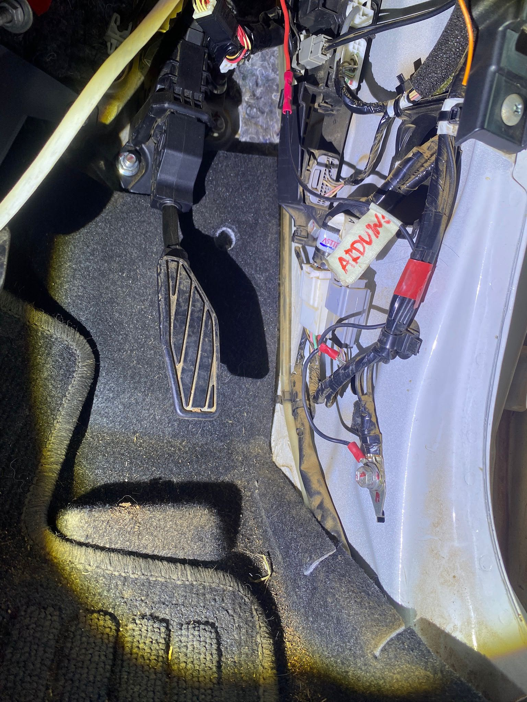

# Robustness Improvements, Known Issues and TODOs

This document collects the main improvements still required to make the vehicle-control system more robust, safer and easier to recover after faults.

---

## Quick Overview

| Priority | Item | Main Area |
|---|---|---|
| High | Disable steering correctly during EMERGENCY and recover cleanly afterwards | Steering / Safety |
| High | Implement robust restart and recovery handling | Full system |
| Medium | Add an I2C isolator to the Steering Board | Steering hardware |
| Medium | Implement physical mode-selection buttons | SteerfBoard |
| Low | Repair / replace temporary sensor-ground workaround | Vehicle wiring |

---

# 1. Steering Handling During EMERGENCY

## Current issue

The current EMERGENCY logic does not fully manage the Steering Board.

When the vehicle enters EMERGENCY mode, the longitudinal system moves to its safe state, but the steering subsystem is controlled independently through the direct USB connection.

A proper steering disable / recovery sequence is still missing.

A problem can appear when:

1. the vehicle enters EMERGENCY;
2. the physical emergency button is released;
3. the system is enabled again.

After this sequence, the vehicle can report a steering-related fault because the steering system is detected as disconnected or not correctly re-initialized.

## Required improvement

Implement an explicit steering state transition for EMERGENCY.

The final logic should define:

```text
NORMAL / AUTO
    ↓
EMERGENCY
    ↓
Steering safely disabled
    ↓
Emergency released
    ↓
Steering communication re-established
    ↓
Controller re-initialized
    ↓
Steering enabled only when ready
```

The recovery must ensure that the Steering Board, host serial bridge and vehicle steering electronics return to a known valid state before autonomous steering is enabled again.

This should also avoid re-enabling the steering controller with an old target still active.

**Priority: High**

---

# 2. Temporary Sensor Ground Connection

## Current issue

Because of a damaged / burnt PCB trace in the vehicle electrical system, the sensor ground could no longer be used through its intended path.

As a temporary workaround, the sensor ground is currently connected directly to the vehicle chassis using an external cable.

> **Temporary hardware workaround**

### Image

Add the photo of the temporary chassis-ground cable here:

```markdown

```

## Required improvement (not immediate, since for now is working)

The final system should:

- identify and document the original damaged ground path;
- repair or replace the damaged trace / connection where practical;
- verify ground continuity and voltage drop;
- remove the temporary external chassis-ground cable if a proper repair is completed;
- update the wiring documentation with the final grounding arrangement.

Any permanent solution should also be checked for ground-loop and electrical-noise problems.

**Priority: Low**

---

# 3. Steering Board I2C Isolation

## Current issue

The Steering Board uses I2C communication with its DAC.

Electrical noise in the vehicle can disturb this communication and reduce the robustness of the steering controller.

## Required improvement

Add an **I2C isolator** between the microcontroller and the steering-board I2C device(s).

The purpose is to electrically isolate the I2C communication path and reduce noise coupling from the vehicle electrical system.

The final implementation should verify:

- compatible logic voltage;
- I2C bus speed;
- SDA/SCL direction and isolator compatibility;
- correct pull-up placement on both isolated sides;
- isolated-side power requirements;
- stable DAC communication under vehicle operating conditions.

### Optional image

A future wiring diagram or photo can be added here:

```markdown

```

**Priority: Medium**

---

# 4. Physical Mode-Switching Buttons

## Current issue

SteerfBoard already defines physical button inputs for mode selection, but the current firmware does not actively use them.

The buttons are present in the hardware but still need to be connected and integrated into the control logic.

At present, the main mode is selected through the host / Jetson communication.

## Required improvement

Connect the physical mode-selection buttons and update the SteerfBoard firmware so that they are correctly handled.

The final behavior should clearly define:

```text
Physical button state
        +
Host state
        +
Emergency input
        ↓
Final vehicle mode
```

The implementation should specify:

- which button corresponds to each mode;
- whether buttons are active HIGH or active LOW;
- input pull-up / pull-down configuration;
- button debouncing;
- priority between physical buttons and host commands;
- priority of the emergency input over every other mode;
- behavior if an invalid combination of buttons is pressed.

The emergency input must remain the highest-priority safety condition.

**Priority: Medium**

---

# 5. Restart and Recovery Logic

## Current issue

The system currently needs a more explicit strategy for handling restarts.

A restart may affect only one component or several components, for example:

```text
ROS node restart
Serial bridge restart
Steering Board restart
SteerfBoard restart
AxelBrake restart
Brake Board restart
Jetson restart
```

Without a defined recovery sequence, different components may restart with stale commands, missing heartbeats or inconsistent operating states.

## Required improvement

Implement a system-level restart / recovery state machine.

After a restart, the system should not immediately resume autonomous actuation.

A safer general sequence is:

```text
Component restarts
      ↓
Outputs enter known safe state
      ↓
Communication links reconnect
      ↓
Required heartbeats are detected
      ↓
Sensors / controller state are initialized
      ↓
Old commands are discarded
      ↓
System reports READY
      ↓
Autonomous mode can be enabled again
```

The exact recovery sequence still needs to be defined for each board.

Important cases to handle include:

- reconnecting USB serial devices;
- restoring CAN heartbeat supervision;
- resetting PID state where required;
- preventing stale steering targets from being reused;
- ensuring the brake state is known;
- re-running homing if required by the Brake Board;
- deciding whether the vehicle must return to MANUAL after any restart;
- ensuring AUTO cannot resume until all required components are ready.

**Priority: High**

---
