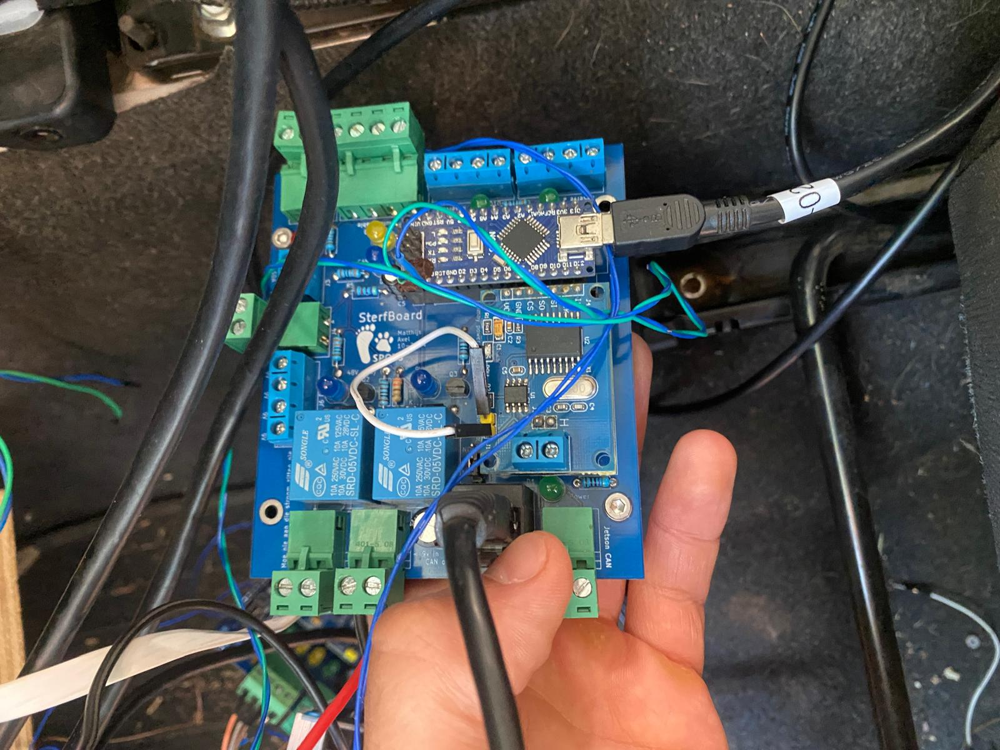
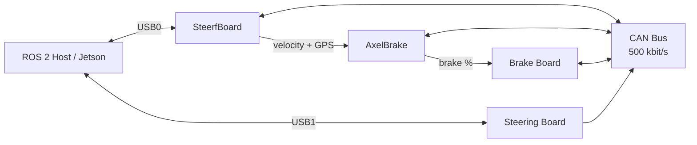
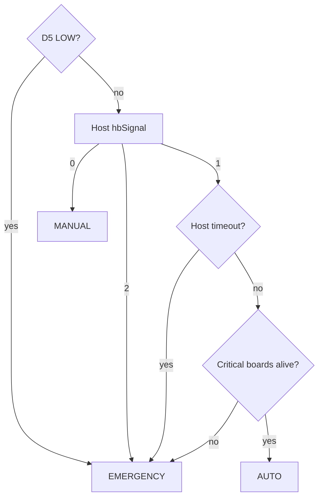
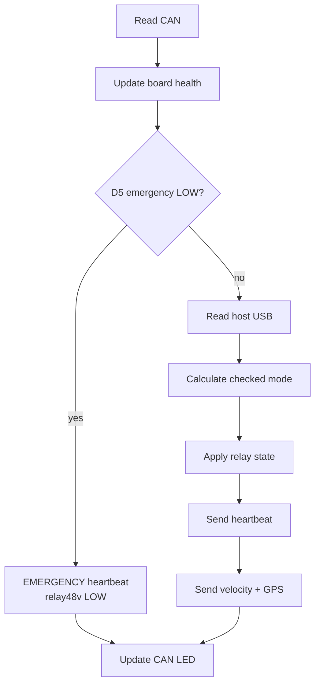

# SteerfBoard — Supervisory Controller and CAN Gateway

This README describes the main role and logic of the current **SteerfBoard** firmware.

SteerfBoard is the central supervisory Arduino between the ROS 2 host and the CAN-side vehicle controllers. Its main responsibilities are:

- receiving the host safety state and longitudinal commands;
- selecting MANUAL, AUTO or EMERGENCY;
- monitoring the physical emergency input;
- broadcasting the global mode over CAN;
- forwarding velocity and GPS data to AxelBrake;
- monitoring AxelBrake, Brake Board and Steering Board heartbeats;
- detecting missing critical boards;
- controlling the main relay output;
- returning compact feedback to the host.

In the current **2-USB architecture**, SteerfBoard no longer controls steering. Steering commands travel directly from the host to the Steering Board over USB1.

---

## ⚠️ IMPORTANT — D5 Emergency Input

**For normal operation, `eButton` on Arduino pin D5 must read HIGH. This should be activated by the physical button (Mode buttons) on the right of the steering wheel, but is still not implemented**

The firmware defines:

```cpp
const int eButton = 5;
pinMode(eButton, INPUT);
```

and checks it before the normal mode logic:

```cpp
if (digitalRead(eButton) == LOW) {
    digitalWrite(relay48v, LOW);
    sendHeartbeatMessage(EMERGENCY);
    return;
}
```

Therefore:

```text
D5 HIGH
    → normal operation

D5 LOW
    → EMERGENCY
    → relay48v LOW
    → EMERGENCY heartbeat sent
    → normal loop processing is skipped
```

**If the physical emergency button is disconnected, D5 must not be left floating. It needs a defined HIGH electrical level for normal operation.**

### Mode buttons

The firmware also defines:

```cpp
autoButton = D6
res1Button = D7
res2Button = D8
```

but **none of these three buttons are read by the current code**.

They do not currently select the mode.

Mode selection comes from the host:

```text
<H,0> → MANUAL
<H,1> → AUTO
<H,2> → EMERGENCY
```

So the current logic is:

```text
Normal mode selection → Host / Jetson
Emergency override    → D5 physical input
```

---

## Quick Navigation

- [1. System Role](#system-role)
- [2. Architecture](#architecture)
- [3. Main I/O](#main-io)
- [4. Host Serial Communication](#host-serial-communication)
- [5. Mode Logic](#mode-logic)
- [6. CAN Communication](#can-communication)
- [7. Board Supervision and Faults](#board-supervision-and-faults)
- [8. Relay Logic](#relay-logic)
- [9. Main Runtime Flow](#main-runtime-flow)
- [10. Current 2-USB Changes](#current-2-usb-changes)
- [11. Summary](#summary)

---

<a id="system-role"></a>

# 1. System Role

SteerfBoard is best understood as:

```text
Supervisor
+
Host ↔ CAN gateway
+
Safety coordinator
```

It does not directly control the throttle, brake motor or steering actuator.

Instead it coordinates the boards responsible for those tasks.

Its main data flow is:

```text
ROS 2 Host
    ↓ USB0
SteerfBoard
    ↓ CAN
AxelBrake
    ↓
Throttle / Brake demand
```

At the same time SteerfBoard sends the global operating mode to the CAN network and checks that the important boards remain alive.

---

<a id="architecture"></a>

# 2. Architecture



### Longitudinal path

```text
Host
  ↓
SteerfBoard
  ↓
AxelBrake
  ├→ accelerator
  └→ Brake Board
```

### Steering path

```text
Host
  ↓ USB1
Steering Board
```

SteerfBoard is no longer part of the steering-command path.

---

<a id="main-io"></a>

# 3. Main I/O

| Pin | Name | Current role |
|---:|---|---|
| D3 | `relay48v` | Main controlled relay output |
| D4 | `relay9v` | Secondary relay output |
| D5 | `eButton` | Physical emergency input |
| D6 | `autoButton` | Defined but currently unused |
| D7 | `res1Button` | Defined but currently unused |
| D8 | `res2Button` | Defined but currently unused |
| D9 | `canLED` | CAN activity LED |
| D10 | MCP2515 CS | CAN controller |
| A0 | `cubePWM` | Defined but not used by the current main logic |

The most important input is D5.

The three other button inputs are currently inactive in the control logic.

---

<a id="host-serial-communication"></a>

# 4. Host Serial Communication

SteerfBoard communicates with the host at:

```text
115200 baud
```

Two packet types are important.

---

## 4.1 Safety heartbeat

Format:

```text
<H,n>
```

| Value | Meaning |
|---:|---|
| `0` | Disarmed |
| `1` | Armed and command signal valid |
| `2` | Armed but command signal invalid |

This value is stored in:

```cpp
hbSignal
```

and drives the normal mode decision.

---

## 4.2 Vehicle command

Format:

```text
<steering_angle,steering_rate,velocity,acceleration,jerk,gps_velocity>
```

In the current architecture the host normally sends:

```text
<0.0,0.0,velocity,acceleration,jerk,gps_velocity>
```

because steering is handled through USB1.

SteerfBoard mainly forwards:

```text
velocity
acceleration
GPS velocity
```

to AxelBrake over CAN.

---

## 4.3 Host timeout

A valid heartbeat or valid six-field packet updates:

```cpp
lastAckTime
```

When the system is armed and valid, SteerfBoard allows:

```text
500 ms
```

without a new valid host message.

If that timeout is exceeded:

```text
AUTO → EMERGENCY
```

---

## 4.4 Feedback to the host

SteerfBoard returns:

```text
<velocitySetpoint, velocityFeedback, 0.0, 0.0>
```

The last two zero fields are retained for compatibility with the previous packet format.

---

<a id="mode-logic"></a>

# 5. Mode Logic

The firmware defines:

```text
MANUAL    = 0
AUTO      = 1
EMERGENCY = 2
```

Normal mapping:

```text
<H,0> → MANUAL
<H,1> → AUTO
<H,2> → EMERGENCY
```

However, AUTO is allowed only if the other safety conditions are valid.

---

## 5.1 MANUAL

```text
Host state → DISARMED

checkedMode → MANUAL
relay48v → LOW
CAN heartbeat → MANUAL
```

---

## 5.2 AUTO

```text
Host state → VALID_ARMED
host communication alive
critical boards alive

checkedMode → AUTO
relay48v → HIGH
CAN heartbeat → AUTO
```

---

## 5.3 EMERGENCY

EMERGENCY can be caused by:

```text
host sends <H,2>
D5 emergency input LOW
host communication timeout
critical CAN board missing
```

Main result:

```text
checkedMode → EMERGENCY
relay48v → LOW
CAN heartbeat → EMERGENCY
```

AxelBrake and Brake Board then perform their own emergency actions.

---

## 5.4 Mode flow



---

<a id="can-communication"></a>

# 6. CAN Communication

SteerfBoard uses:

```text
MCP2515
500 kbit/s
8 MHz oscillator
```

CAN IDs are shared through:

```cpp
can_ids.h
```

---

## 6.1 Messages sent

### `CAN_HB_STERFBOARD`

Sent every approximately:

```text
200 ms = 5 Hz
```

Contains:

```text
heartbeat interval
global mode
```

This is the main supervisory heartbeat.

---

### `CAN_VELOCITY_TARGET`

Sent to AxelBrake.

Contains:

```text
velocity
acceleration
```

---

### `CAN_GPS_VELOCITY`

Also sent to AxelBrake.

Contains:

```text
GPS velocity
```

The velocity/GPS messages are sent approximately every:

```text
20 ms = 50 Hz
```

---

## 6.2 Messages received

SteerfBoard receives heartbeat/status messages from:

```text
AxelBrake
Steering Board
Brake Board
```

These update:

```text
axelBrakeAlive
steeringAlive
brakeAlive
```

---

## 6.3 Steering CAN behavior

SteerfBoard still reads the Steering Board heartbeat for diagnostics.

However:

```text
SteerfBoard does NOT send steering commands anymore.
```

The current steering control path is:

```text
Host → USB1 → Steering Board
```

---

<a id="board-supervision-and-faults"></a>

# 7. Board Supervision and Faults

SteerfBoard checks how long it has been since the last heartbeat from each board.

Current timeout:

```text
heartbeat interval × 4
```

With the normal 200 ms heartbeat:

```text
≈ 800 ms
```

---

## 7.1 Critical boards

Current critical CAN boards:

```text
AxelBrake
Brake Board
```

The Steering Board is monitored but is not part of the current critical-board decision.

The code effectively checks:

```text
AxelBrake missing
OR
Brake Board missing
```

---

## 7.2 Fault latch

If a critical board disappears while AUTO is requested:

```text
board fault is latched
checkedMode becomes EMERGENCY
```

The latch can clear when:

```text
the vehicle is disarmed
```

or:

```text
all critical boards are healthy again
```

This prevents a missing-board event from being ignored as a temporary single-loop glitch.

---

## 7.3 Main safety inputs

SteerfBoard therefore combines:

```text
Host safety state
Host communication health
Physical emergency input
AxelBrake heartbeat
Brake Board heartbeat
```

to determine whether AUTO is allowed.

---

<a id="relay-logic"></a>

# 8. Relay Logic

SteerfBoard defines:

```cpp
relay48v = D3;
relay9v  = D4;
```

The main runtime-controlled output is `relay48v`.

---

## 8.1 Runtime behavior

| Mode | D3 `relay48v` |
|---|---|
| MANUAL | LOW |
| AUTO | HIGH |
| EMERGENCY | LOW |

The firmware uses:

```cpp
digitalWrite(relay48v, checkedMode == AUTO ? HIGH : LOW);
```

---

## 8.2 Physical polarity

The code tells us the Arduino output level, but not necessarily the physical relay state.

The hardware documentation should therefore confirm:

```text
D3 HIGH → relay/power physically ON or OFF?
D3 LOW  → relay/power physically ON or OFF?
```

This is particularly important for emergency behavior.

---

## 8.3 `relay9v`

At startup:

```cpp
digitalWrite(relay9v, LOW);
```

The current main loop does not subsequently change it.

Its detailed electrical purpose belongs in the hardware README.

---

<a id="main-runtime-flow"></a>

# 9. Main Runtime Flow

The main SteerfBoard loop follows this order:



The most important detail is that the **physical emergency input is checked before normal host processing**.

---

<a id="current-2-usb-changes"></a>

# 10. Current 2-USB Changes

The current code explicitly removes steering commands from SteerfBoard.

Previous architecture:

```text
Host
 ↓
SteerfBoard
 ↓ CAN
Steering Board
```

Current architecture:

```text
Host
 ↓ USB1
Steering Board
```

SteerfBoard now sends only the longitudinal CAN commands:

```text
velocity target
GPS velocity
```

while still receiving steering telemetry if the Steering Board is connected to CAN.

This is why steering is no longer considered a critical board in the SteerfBoard CAN fault check.

---

<a id="summary"></a>

# 11. Summary

SteerfBoard is the central supervisor of the CAN-side vehicle system.

Its logic can be reduced to:

```text
Host state + commands
        ↓
SteerfBoard
        │
        ├── determine MANUAL / AUTO / EMERGENCY
        ├── monitor emergency input
        ├── monitor critical boards
        ├── control relay48v
        ├── send mode heartbeat
        └── send velocity + GPS to AxelBrake
```

The key points are:

1. **D5 / `eButton` must read HIGH for normal operation.**
2. **D5 LOW immediately forces EMERGENCY.**
3. **If the physical button is disconnected, D5 must not be left floating.**
4. `autoButton`, `res1Button` and `res2Button` are currently unused.
5. Mode selection comes from the host `<H,n>` packet.
6. MANUAL = `0`, AUTO = `1`, EMERGENCY = `2`.
7. Host communication timeout can force EMERGENCY.
8. AxelBrake and Brake Board are the current critical CAN boards.
9. Missing critical-board heartbeat can force EMERGENCY.
10. SteerfBoard sends velocity and GPS information to AxelBrake.
11. SteerfBoard no longer sends steering commands.
12. Steering is controlled directly through USB1.
13. `relay48v` is HIGH only in AUTO at firmware level.

---
    → buttons, relays, wiring and power

can_ids.h
    → shared CAN identifiers
```
