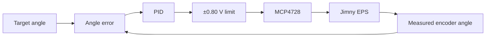
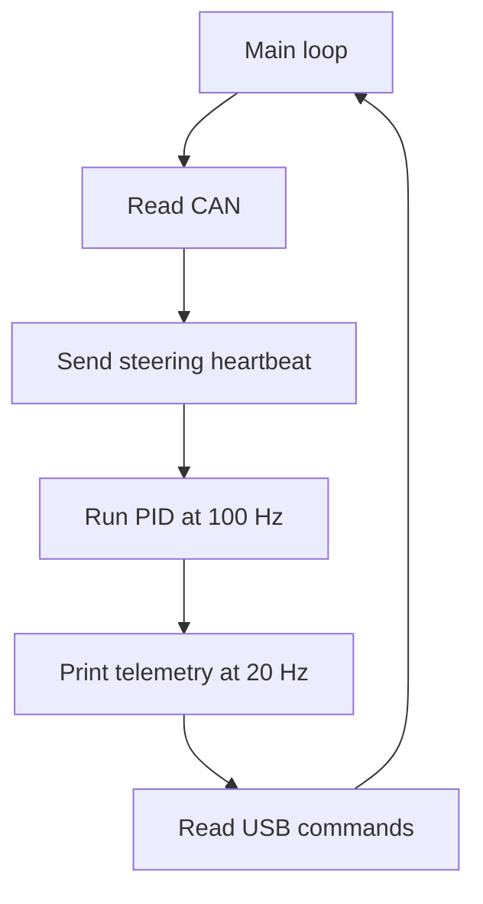

# Autonomous Steering Module: Engineering Log & Architecture

## System Objective
To achieve autonomous steering on the Suzuki Jimny, this module requires three integrated components:
1. **Actuator:** To physically manipulate the steering axis.
2. **Sensor:** To measure real-time wheel position.
3. **Local Controller:** To interface between the low-level hardware and the global autonomous system brain.

This document outlines the iterative development process, current system architecture, and immediate improvement points for incoming engineering teams.

---


## Quick Navigation

- [System Objective](#system-objective)
- [Phase 1: Actuation & Iterative Failures](#phase-1-actuation--iterative-failures)
- [Phase 2: The EPS Breakthrough](#phase-2-the-eps-breakthrough)
- [Phase 3: Position Sensing](#phase-3-position-sensing)
- [Phase 4: System Integration](#phase-4-system-integration)
- [Current Firmware — Steering Board Control Logic](#current-firmware--steering-board-control-logic)
- [Phase 5: Next Steps & Roadmap](#phase-5-next-steps--roadmap)

---

---

## Phase 1: Actuation & Iterative Failures
Actuating the steering mechanically proved difficult. The first two attempts failed due to mechanical constraints, leading us to our current electrical solution. 

*   **Iteration 1: Direct Column Drive** 
    Previous interns attached a motor-driven sprocket directly to the steering column via a chain. 
    *Result:* Failed. The motor output torque was insufficient to turn the column under load. 
    
    *(Note: This chain mechanism was later repurposed for the angle encoder, detailed in Phase 3).*

*   **Iteration 2: Steering Wheel Friction Drive** 
    After, they thought they could leverage the vehicle's native power steering, and mounted a large stepper motor directly to the steering wheel to drive it via friction.
    *Result:* Failed. The mechanism suffered from excessive slip and the mounting hardware was cumbersome to install and dismantle.
    

---

## Phase 2: The EPS Breakthrough
Instead of fighting the steering mechanics, we investigated the Jimny's native Electronic Power Steering (EPS). 

The EPS system uses a torque sensor on the steering column. When a driver turns the wheel, the sensor sends a proportional signal to the EPS ECU, which commands an assist motor. **Our solution: Spoof the torque sensor signal to make the EPS motor do the work for us.**


*Jimny native steering column and EPS architecture.*

### Signal Interception
We probed the native EPS torque sensor lines using an oscilloscope to characterize the signaling protocol. 

<p float="left">
  
  
</p>

The signals were straightforward analog voltages. We built a custom sniffer board using an Arduino Uno to tap into the signal wires and map the required voltage profiles for left and right actuation.


*Arduino-based signal sniffer schematic.*

**Captured Signal Profiles:**
<p float="left">
  
  
  
</p>

### EPS Actuation Proof of Concept
We built a prototype board combining an Arduino and a Digital-to-Analog Converter (DAC) to inject simulated voltage signals directly into the EPS ECU. 
*Result:* Success. The injected signals commanded the EPS to output enough torque to actuate the wheels while the vehicle was stationary on the ground (static dry-steering).


*DAC Injection Prototype.*

---

## Phase 3: Position Sensing
With actuation solved, we required real-time steering angle telemetry. 

Previous interns retrofitted the discarded chain-and-sprocket hardware from Iteration 1 to drive a rotary encoder. While this confirmed the system logic works, it introduces two major structural flaws that must be addressed in future iterations:
1. **Mechanical Hysteresis:** The heavy chain introduces significant slack, severely degrading measurement precision.
2. **Relative Measurement:** The current encoder is not absolute. The system requires manual calibration at every boot (either physically aligning the wheels dead-center, or running an automated sweep from lock-to-lock).

---

## Phase 4: System Integration
Following individual component validation, we designed and assembled the final local control board. This board integrates the DAC signal injection and the encoder telemetry, serving as the bridge to the global system brain.

<p float="left">
  
  
</p>
*Final integrated board design and physical installation.*


---

## Current Firmware — Steering Board Control Logic

The current steering firmware is:

```text
steer_try_serial_only.ino
```

The firmware implements the complete low-level steering loop on the local Arduino board:

```text
Host steering target
        ↓ USB Serial
Steering Arduino
        ↓
Target angle
        ↓
Encoder feedback
        ↓
PID controller
        ↓
Differential DAC command
        ↓
Jimny EPS torque-sensor interface
        ↓
Native EPS motor turns the steering
```

The board therefore does not directly drive a steering motor. It modifies the two analog signals presented to the Jimny EPS system so that the native power steering produces the required steering effort.

### Main firmware components

The code is divided into four main functional blocks:

1. **Quadrature encoder** — measures steering position.
2. **PID controller** — compares target and measured steering angle.
3. **MCP4728 DAC output** — generates the two analog EPS spoofing signals.
4. **USB Serial interface** — receives steering targets from the host.

CAN remains active for steering telemetry, but it is not the normal command path in the current configuration.

---

### Encoder and steering-angle calculation

The encoder is connected to:

```cpp
const int clkPin = 4;   // D4 = CHA
const int dtPin  = 5;   // D5 = CHB
```

Both channels use interrupts so that every quadrature transition can update the encoder counter.

The current conversion parameters are:

```cpp
encoderCountsPerRev = 4000;
sprocketGearRatio   = 2.5;
```

The measured steering angle is calculated from:

```text
encoder counts
      ↓
encoder revolutions
      ↓
gear-ratio correction
      ↓
steering angle in degrees
```

Conceptually:

```text
angle =
360 × encoder_counts
--------------------
4000 × 2.5
```

The firmware also counts invalid encoder transitions. These values are included in the debug telemetry and are useful for identifying encoder noise or missed/incorrect transitions.

Because the encoder is relative rather than absolute, the current system still depends on establishing the correct zero reference.

The Serial command:

```text
z
```

resets the current encoder position to zero.

---

### EPS DAC output

The steering board uses an **MCP4728 DAC** to generate the two analog voltage signals sent to the EPS interface.

The neutral values are:

```cpp
IDLE_A = 2.5200 V
IDLE_B = 2.4900 V
```

A differential command `delta` is applied in opposite directions:

```text
Output A = IDLE_A + delta
Output B = IDLE_B - delta
```

So:

```text
delta = 0
    → both signals remain close to their neutral voltages

positive delta
    → A increases
    → B decreases

negative delta
    → A decreases
    → B increases
```

This reproduces the differential behavior of the original EPS torque-sensor signals.

The firmware limits the differential command to:

```cpp
DELTA_LIMIT = 0.80 V;
```

and also clamps each DAC output to the valid DAC supply range.

This output limit is one of the main protections preventing the PID from requesting an arbitrarily large simulated torque-sensor signal.

---

### Local PID steering loop

The steering angle is controlled locally by the Arduino.

Current gains:

```cpp
Kp = 0.020;
Ki = 0.012;
Kd = 0.000;
```

The control loop runs every:

```cpp
controlPeriodMs = 10;
```

which corresponds to:

```text
100 Hz
```

The basic control flow is:



The proportional and integral terms are active in the current configuration.

The derivative gain is currently:

```text
Kd = 0
```

so the derivative term is effectively disabled.

The integral accumulator is constrained to:

```cpp
integralLimit = 40.0;
```

to reduce integral wind-up.

If a new steering target differs from the previous target by more than approximately:

```text
5°
```

the integral accumulator is reset.

This prevents a large integral term from the previous target from carrying directly into a substantially different steering command.

---

### Target limiting

Serial steering targets use:

```text
s<angle>
```

For example:

```text
s120.0
s-80.0
```

The firmware limits the received target to:

```text
-420° ... +420°
```

using:

```cpp
constrain(t, -420.0f, 420.0f);
```

The target-angle limit is therefore enforced locally on the steering Arduino even if the host sends a larger value.

The code also contains variables for a target slew-rate limiter:

```cpp
MAX_TARGET_RATE = 30.0; // deg/s
targetSlewed
```

but the actual slew-rate logic is currently commented out.

Therefore the active controller presently uses:

```text
raw target angle
```

rather than the rate-limited `targetSlewed` value.

---

### PID enable and disable behavior

The firmware starts with:

```cpp
pidEnabled = false;
serialDirectMode = true;
```

This means the board boots in USB direct-control mode, but the PID is initially disabled.

The host enables the controller using:

```text
e
```

When `e` is received:

1. Serial direct mode is enabled.
2. The PID is enabled.
3. The PID internal state is reset.
4. The target is aligned to the current measured angle.

This last step is important:

```cpp
targetAngleDeg = measuredAngleDeg;
```

It prevents the board from immediately moving toward an old or default target when the PID is enabled.

The command:

```text
d
```

disables the PID and resets the DAC differential output to zero.

Therefore:

```text
e → steering PID active
d → steering PID inactive, neutral DAC differential
```

The current host bridge performs:

```text
d
e
```

during startup before beginning normal steering commands.

---

### USB Serial command interface

The current firmware accepts the following main commands:

| Command | Function |
|---|---|
| `e` | Enable steering PID |
| `d` | Disable steering PID and neutralize output |
| `s<angle>` | Set steering target in degrees |
| `z` | Zero encoder position |
| `r` | Reverse encoder direction |
| `p` | Print one telemetry line |
| `kp<value>` | Change proportional gain |
| `ki<value>` | Change integral gain |
| `kd<value>` | Change derivative gain |

Normal vehicle operation mainly uses:

```text
d
e
s<angle>
```

The gain, zero and reverse commands are primarily useful during setup and debugging.

---

### Serial telemetry

The firmware prints a `DATA,...` line approximately every:

```text
50 ms
```

or:

```text
20 Hz
```

The line contains:

```text
time
target angle
slewed target
measured angle
angle error
DAC differential command
DAC A voltage
DAC B voltage
DAC codes
encoder count
PID state
P term
I term
D term
encoder ISR count
invalid encoder transitions
```

This telemetry is consumed by the host-side steering bridge and is also useful for debugging controller behavior.

---

### CAN behavior in the current firmware

The Steering Board still initializes the MCP2515 at:

```text
500 kbit/s
8 MHz oscillator
```

and periodically sends:

```text
CAN_HB_STEERING
```

The heartbeat contains two floats:

```text
deltaCmd
measuredAngleDeg
```

This allows the wider vehicle system to monitor steering telemetry.

However, normal steering control does **not** currently come from CAN.

The firmware contains legacy support for:

```text
CAN_HB_STERFBOARD
CAN_STEERING_TARGET
```

but these paths are only active when:

```cpp
serialDirectMode == false;
```

The current firmware explicitly sets:

```cpp
serialDirectMode = true;
```

during startup.

Therefore the active architecture is:

```text
USB Serial → steering commands
CAN        → steering telemetry / heartbeat
```

rather than CAN-based steering control.

---

### Main runtime loop

The Arduino continuously performs four main tasks:

```text
1. Read CAN messages
2. Run the steering PID every 10 ms
3. Send/print telemetry
4. Process USB Serial commands
```

A simplified view is:



The time-critical encoder counting is handled separately through interrupts.

---

### Current firmware limits and notes

A few implementation details are important when working with the current steering software:

- The encoder is **relative**, not absolute.
- The active steering target is limited to **±420°**.
- The DAC differential output is limited to **±0.80 V**.
- The local steering controller runs at **100 Hz**.
- The firmware boots in **Serial Direct Mode**.
- The steering PID is initially **disabled** until the host sends `e`.
- CAN steering commands are currently inactive in normal operation.
- CAN steering heartbeat/telemetry remains active.
- The target slew-rate limiter exists in the code but is currently commented out.
- `Kd` is currently zero, so the controller effectively operates as a PI controller.
- The firmware does not currently implement a dedicated USB/Serial command watchdog; an unexpected host or USB loss is therefore different from a controlled shutdown using `d`.

These points describe the present firmware behavior and should be considered when modifying the local controller or integrating a future absolute steering sensor.


---

## Phase 5: Next Steps & Roadmap
Immediate priorities for incoming interns center on safety, precision, and robustness:

*   **Mode-Switching Interlocks:** Implement automated, relay-driven mode switching (similar to the accellerator module). The system requires a fault-tolerant method to toggle between autonomous control, remote control, and direct manual override (driver in the cabin).
*   **Sensor Upgrade:** Eliminate the chain-drive entirely. Source and mount an absolute rotary encoder directly to the column, or reverse-engineer the vehicle's native CAN bus to extract existing steering telemetry.
*   **Hardware Hardening:** Replace prototype wiring with a permanent, vibration-resistant PCB and shielded wiring harness.
